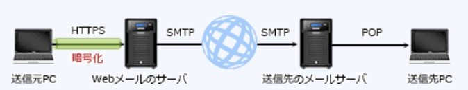

### 平成28年秋期問題

---
4.JYN(*Japan Vulnerability Notes*)

- A.**脆弱性対策情報などを提供するポータルサイト**  
日本で使用されているソフトウェアなどの脆弱性関連情報と対策情報を提供し、情報セキュリティ対策に資することを目的とする脆弱性対策情報ポータルサイト。脆弱性が確認された製品とバージョン、脆弱性の詳細や分析結果、製品開発者によって提供された対策や関連情報へのリンクなどで、対策にはパッチだけでなく回避策が掲載されることもある

- 情報システムに存在する脆弱性の深刻度を評価する手法  
CVSS(*Common Vulnerability Scoring System*)の説明

- 製品に存在する脆弱性に対して採番された識別子  
CVE(*Common Vulnerabilities and Exposures*)識別子の説明

- 組織内の情報セキュリティ問題を専門に扱うインシデント対応チーム  
CSIRT(*Computer Security Incident Response Team* : シーサート)の説明

---
6.情報セキュリティ対策を検討する際の手法の1つであるベースラインアプローチの特徴

- A.**基準とする望ましい対策と組織の現状における対策とのギャップを分析する**  
一般公開されている規格やガイドラインを参考にして、アンケートやチェックリストを作成し、組織の情報セキュリティ対策との差異を分析する手法。簡便な方法だが、大まかなチェックしかできず、質問表の品質によって結果が左右されやすい難点もある。基準となる規格類は情報セキュリティ管理基準、システム管理基準及び個人情報保護に関するガイドラインなどを目的に応じて選択する

- 現場担当者の経験や考え方によって検討結果が左右されやすい  
リスク分析者の知識と経験によって分析を行う、非公式アプローチの特徴

- 情報資産ごとにリスクを分析する  
組織の情報資産・脅威・脆弱性を洗い出し整理・統合総合して分析を行う、詳細リスク分析の特徴

- 複数のアプローチを併用して分析作業の効率化や分析精度の向上を図る  
組織や分析対象の状況に合わせて幾つかの手法を組み合わせる、組合せアプローチの特徴

---
7.組織の所属者全員に利用者IDが発行されるシステムがある。利用者IDの発行・削除は申請に基づき行われているが、申請漏れや申請内容のシステムへの反映漏れがある。資料の組合せのうち、突き合わせて確認することによって、退職者に発行されていた利用者IDの削除漏れが最も確実に発見できるもの

- A.**利用者IDと発行されている者の一覧・組織の現在の所属者の名簿**  
利用者IDが発行されている者を順番にチェックし、現在の組織の所属者名簿に存在しなければ削除漏れと判断できる

- 組織の現在の所属者の名簿・退職に伴う利用者IDの削除申請書  
退職者は現在の所属者名簿から除外されているため、2つの資料を比較しても無意味

- 退職者の一覧・組織の現在の所属者の名簿  
所属者名簿と退職者の一覧は最新の情報で、2つの資料に同じ人が登録はされていないため比較は無意味

- 利用者IDと発行されている者の一覧・退職に伴う利用者IDの削除申請書  
削除申請されたにも関わらずシステムから削除されていない利用者IDを発見できるが、削除申請がされていない場合は削除漏れを見逃してしまうため不適切

---
8.JIS Q 27000におけるリスク評価

- A.**リスクが受容可能か否かを決定するために、リスク分析の結果をリスク基準と比較するプロセス**  
情報セキュリティマネジメントシステムに係る用語を定義したJIS規格。リスク分析の成果および組織の状況を考慮して確定されたリスク基準に基づき、どのリスクへの対応が必要か、対応の実践の優先順位はどうするかについて意思決定を手助けすることが目的

- リスクの発見、認識及び記述を行うプロセス  
リスク特定の説明

- リスクの特質を理解し、リスクレベルを決定するプロセス  
リスク分析の説明

- 対策を講じることによって、リスクを修正するプロセス  
リスク対応の説明(リスクアセスメントには含まれない)

---
9.JIS Q 31000 : 2010における、残留リスクの定義

- A.**リスク対応後に残るリスク**  
リスクマネジメントに関する原則及び一般的な指針を示すJIS規格。「特定されていないリスクが含まれることがある」「保有リスクとしても知られている」と定義されている

- 監査手続を実施しても監査人が重要な不備を発見できないリスク  
発見リスクの説明

- 業務の性質や本来有する特性から生じるリスク  
固有リスクの説明

- 利益を生む可能性に内在する損失発生の可能性として存在するリスク  
投機リスクの説明

---
15.SIEM(*Security Information and Event Management*)の機能

- A.**サーバやネットワーク機器などのログデータを一括管理、分析して、セキュリティ上の脅威を発見し、通知する**  
OS、DB、アプリケーション、ネットワーク機器など多様なソフトウェアや機器が出力する機器が出力する大量のログデータを分析し、異常時に管理者に通知したり対策を知らせたりする仕組み。セキュリティ情報・イベント管理と訳される

- 機密情報を自動的に特定し、機密情報の送信や出力など、社外への持出しに関連する操作を検知しブロックする  
DLP(*Data Loss Prevention*)の機能

- 情報システムの利用を妨げる事象を管理者が登録し、各事象の解決・復旧までを管理する  
CSIRT(*Computer Security Incident Response Team*)の機能

- ネットワークへの侵入を試みるパケットを検知し、通知する  
IDS(*Information Detection System* : 侵入検知システム)の機能

---
17.次の電子メールの環境を用いて、秘密情報を含むファイルを電子メールに添付して社外の宛先の利用者に送信したい。その際のファイルの添付方法、及びその添付方法を使う理由  
・電子メールは、Webブラウザから利用できる電子メールシステム(Webメール)を用いて送信する  
・WebブラウザとWebメールのサーバとの通信はHTTP over TLS(HTTPS)で行う  
・社外の宛先ドメインのメールサーバはSMTPとPOP3を使用している  
・IP層以下は暗号化していない

- A.**WebブラウザからWebメールのサーバまでの通信は暗号化されるが、その後の通信が暗号化されないこともあるので、ファイルを暗号化してメールに添付する**  
HTTP通信が行われるのはWebブラウザからWebメールのサーバまでの間なので、電子メールの暗号化が保障される範囲もこの区間に限られる。Webメールのサーバから相手のメールサーバへの送信にはSMTP、相手のメールサーバからのメール受信にはPOPが使用されているが、2つのプロトコルには暗号化の機能はなくデータを平文でやり取りする。SMTP区間とPOP区間で通信を盗聴された場合には秘密情報の漏洩につながる

- WebブラウザからWebメールのサーバまでの通信が暗号化されているので、ファイルは平文のままでメールに添付する  
Webメールのサーバより後の通信経路上において情報漏洩の恐れがあるためファイルを暗号化すべき

- Webブラウザから宛先の利用者がメールを受信するPCまで、全ての通信は暗号化されるので、ファイルは平文のままでメールに添付する  
暗号化が保障されているのはWebブラウザとWebメールサーバの間

- Webメールのサーバから宛先ドメインのメールサーバまでの通信は暗号化されないが、サーバ間の通信はBase64形式でエンコードすれば盗聴できないので、ファイルはBase64形式でエンコードしてメールに添付する  
電子メールのデータを規則に従って64種の英数字の組合せ(64進数)に変換する方式で、暗号化の技術ではない。元のデータに戻すのは容易なので盗聴されると情報漏洩につながる

---
23.内閣は、2015年9月にサイバーセキュリティ戦略を定め、その目的達成のための施策の立案及び実施に当たって、五つの基本原則に従うべきとした。その基本原則に含まれるもの

- A.**サイバー空間が一部の主体に占有されることがあってはならず、常に参加を求める者に開かれたものでなければならない**  
`開放性`についての記述

`情報の自由な流通の確保` : サイバー空間においては、発信した情報が、その途中で不当に検閲されず、また、不正に改変されずに、意図した受信者へ届く世界が創られ、維持されるべきである  
`自律性` : インターネットが育んだ自律性を尊重し、各者の主体的な管理を基調として悪意のある行動を抑止していく  
`多様な主体の連携` : 政府に限らず、重要インフラ事業者、企業、個人といったサイバー空間に関係する全てのステークホルダが、サイバーセキュリティに係るビジョンを共有し、それぞれの役割や責務を果たし、また努力する必要がある

- サイバー空間上の脅威は、国を挙げて対処すべき課題であり、サイバー空間における秩序維持は国家が全て代替することが適切である  
政府・企業・個人の連携によって実現されるべきと定めている

- サイバー空間においては、安全確保のために、発信された情報を全て検閲すべきである  
不当に検閲されるような事があってはならないと定められている

- サイバー空間においては、情報の自由な流通を尊重し、法令を含むルールや規範を適用してはならない  
`法の支配`が確立されるべきと定めている。サイバー空間に法令を含むルールや規範が適用され、国際的な法の支配が確立されるべきである

---
24.スクリプトキディ(*Script Kiddy*)の典型的な行為に該当するもの

- A.**技術不足なので新しい攻撃手法を考え出すことはできないが、公開された方法に従って不正アクセスを行う**  
自身でコンピュータウイルスを作成する技術がなく、インターネット上で公開されている既存のウイルスやクラックツールを使用して不正アクセスを試みる初心者クラッカーのこと

- PCの利用者がWebサイトにアクセスし、利用者IDとパスワードを入力するところを後ろから盗み見して、メモをとる  
ショルダーハッキング行為に該当する

- 顧客になりすまして電話でシステム管理者にパスワードの再発行を依頼し、新しいパスワードを聞き出すための台本を作成する  
ソーシャルエンジニアリング行為に該当する

- スクリプト言語を利用してプログラムを作成し、広告や勧誘などの迷惑メールを不特定多数に送信する  
自身でプログラムを作成する技術はない

---
28.なりすましメールでなく、EC(電子商取引)サイトから届いたものであることを確認できる電子メール

- A.**デジタル署名の署名者のメールアドレスのドメインがECサイトのものであり、署名者のデジタル証明書の発行元が信頼できる組織のものである**  
デジタル証明書には送信元組織の公開鍵が含まれていて、対応する秘密鍵を持つのはデジタル証明書の発行を受けた組織のみ。電子メールに付されているECサイトのデジタル署名を検証する事で送信者の正当性を確認できる。  
電子メールの情報は、本文・メールヘッダの差出人・メールアドレス・メールサーバ名などを送信者が任意に設定できるようになっている

- 送信元メールアドレスがECサイトで利用されているアドレスである
- 送信元メールアドレスのドメインがECサイトのものである  
送信者が任意で設定可能な項目なので偽装されている可能性がある

- 電子メール本文の末尾にテキスト形式で書かれた送信元の連絡先に関する署名のうち、送信元の組織を表す組織名がECサイトのものである  
メール本文は送信者が任意で設定可能な項目なので、偽装されている可能性がある

---
30.情報セキュリティ評価のための国際標準で、コモンクライテリア(*Common Criteria*)と呼ばれるもの

- A.**ISO / IEC 15408**  
情報技術の製品及びシステムのセキュリティ特性を評価するための標準を定めた国際規格

- ISO 9001  
品質マネジメントシステムに対する要求事項を定めた国際規格

- ISO 14004  
環境マネジメントの実施についての一般指針を定めた国際規格

- ISO / IEC 27005  
情報セキュリティリスクマネジメントの指針をまとめた国際規格

---
31.プロバイダ責任制限法において、損害賠償責任が制限されるプロバイダの行為に該当するものはどれか。利用者とはプロバイダに加入してサービスを利用している者とする

- A.**利用者の電子掲示板への書込みが、他人の権利を侵害しているとは知らずに放置した**  
インターネットでのウェブページや電子掲示板などへの投稿のように不特定多数の者が閲覧する通信について、プロバイダ等の損害賠償責任および、通信で損害を被った者に与えられる、発信者情報の開示請求権を定めた法律。プロバイダ等に損害賠償責任が生じない範囲を明確化することによって、問題のある情報に対する適切かつ迅速な対応を促すことを目的としている。以下のケースではプロバイダ等は責任を負わない  
・他人の権利が侵害されていることを知らなかった(知ることができなかった)場合の不作為  
・他人の権利が侵害されているという十分な根拠をもとにした当該記事の削除、又は送信の停止  
・権利を侵害された者からの削除申請があり、そのことを発信者に連絡したにも拘らず、7日以外に反論が無かったために行った当該記事の削除、又は送信の停止

- 契約書に記載した利用者の個人情報を、本人の同意を得ずに関連会社に渡した  
個人情報保護法で規制される行為

- 他のプロバイダに移転する利用者に対して、不当に高い違約金を請求した  
消費者契約法で規制される行為

- 利用者の送信メールの内容を盗聴し、それを興味本位で他人に伝えた  
電気通信事業法で規制される行為

---
32.刑法の電子計算機使用詐欺罪が適用される違法行為

- A.**インターネットを経由して銀行のシステムに虚偽の情報を与え、不正な振込や送金をさせる**  
財産の損失に関係するデジタルデータに変更を与える犯罪行為で、2種類が処罰対象  
1.業務に使用される他人のコンピュータに偽の情報や指令を与えて、金銭的データを増減させる行為。預金残高や送金データを操作する、プリペイドカードの残度数を操作するなどの行為  
2.財産権に関わる偽のデータを他人のコンピュータで使用する行為。偽装したプリペイドカードを使用するなどの行為

- いわゆるねずみ講方式による取引形態のWebページを開設する  
無限連鎖講の防止に関する法律における違法行為となる。金品等を騙し取った場合は詐欺罪が適用される

- インターネット上に、実際よりも良品と誤認させる商品カタログを掲載し、粗悪な商品を販売する  
景品表示法における違法行為となる

- 企業のWebページを不法な手段で改変し、その企業の信用を傷つける情報を流す  
電子計算機損壊等業務妨害罪が適用される

---
33."特定個人情報ファイル"の取扱いのうち、国の個人情報保護委員会が制定した"特定個人情報の適正な取扱いに関するガイドライン(事業者編)"で、認められているもの

- A.**従業員の個人番号を含む源泉徴収票を、業務委託先の税理士に作成させる**  
個人番号関係事務の委託を受けた事業者は、個人番号関係事務を行うことが認められている。マイナンバー(個人情報)を扱う事業者が、内容にマイナンバーを含む情報(特定個人情報)の適正な取り扱いを確保するための具体的な指針を定めたもの

- 個人番号関係事務を行う必要がなくなり、かつ、法令による保存期間を経過した場合は、暗号化した上で保管する  
関連事務に用いる必要がなくなり、所管法令で定められている保存期間を経過した場合には原則として、個人番号をできるだけ速やかに廃棄・削除しなければならない

- 事業者内の誰でも容易に参照できるよう、事務取扱担当者を限定せず従業員全員にアクセス権を設定する  
特定個人情報ファイルの利用範囲を限定するために、アクセス制御を含む適切な安全管理措置を講じなくてはならない

- 従業員の個人番号を利用して営業成績を管理する  
マイナンバー法では個人番号の利用範囲を社会保障、税及び災害対策に関する特定の事務に限定している。事業者は、社員の管理のために、個人番号を社員番号として利用してはならない。事業者が個人番号を利用するのは主として、源泉徴収票及び社会保障の手続書類に従業員等の個人番号を記載して行政機関等及び健康保険組合等に提出する場合

---
35.不正アクセス禁止法による処罰の対象となる行為

- A.**不正アクセスを行う目的で他人の利用者ID、パスワードを取得したが、これまでに不正アクセスは行っていない**  
インターネットなどのネットワーク通信における不正アクセスとそれを助長する行為を規制する法律。不正アクセス目的で他人のID・パスワードを取得する、業務その他正当な理由による場合を除いて、他人のID・パスワードを第三者に提供する、不正アクセス目的で不正に取得された他人のID・パスワードを保管する行為が禁止されている

- 推測が容易であるために、悪意のある攻撃者に侵入される原因となった、パスワードの実例を、情報セキュリティに関するセミナの資料に掲載した  
他人のID・パスワードを第三者に提供することは原則禁止だが、業務その他正当な理由がある場合は対象から除外される。セキュリティ教育が目的で、典型的なパスワードを紹介しているだけなので処罰対象外

- ネットサーフィンを行ったところ、意図せずに他人の利用者IDとパスワードをダウンロードしてしまい、PC上に保管してしまった  
他人のID・パスワードを取得・保管することになっても、取得が不正な手段(意図的)ではなく、かつ不正アクセス目的の保管でなければ処罰対象にはならない

- 標的とする人物の親族になりすまし、不正に現金を振り込ませる目的で、振込先の口座番号を指定した電子メールを送付した  
認証が必要なページに不正ログインしたわけではないため、不正アクセス禁止法の対象外。刑法の詐欺罪で処罰される

---
36.準委任契約の説明

- A.**善管注意義務を負って作業を受託する契約**  
委託契約(請負契約)と同様に別組織に業務を委託する契約だが、仕事の完成を契約の目的とする請負契約と異なり、委託された仕事の実施自体を目的とする契約形態。受託者は善良な管理者の注意をもって委任事務を処理する義務を負うものの、仕事の完成についての義務は負わない。業務分析やIT戦略のコンサルティングなど成果物が特定されていない状況で結ばれる

||請負契約|準委任契約|
|-|-|-|
|契約目的|仕事の完成|仕事の遂行|
|成果物の完成責任|あり|なし|
|受託者の義務・責任|仕事の完成・瑕疵担保責任|報告技雨・善管注意義務|
|著作権の帰属|受託者|受託者|

- 成果物の対価として報酬を得る契約
- 成果物を完成させる義務を負う契約  
請負契約の説明

- 発注者の指揮命令下で作業を行う契約  
労働者派遣契約の説明

---
37.JIS Q 27001に準拠してISMSを運用している場合、内部監査について順守すべき要求事項

- A.**監査プログラムには前回までの監査結果を考慮しなければならない**  
ISMSを運用している組織次の2点の確認を目的として、定期的にISMSの現在の状況について内部監査を行う必要がある  
・ISMSに関して組織が規定した要求事項及びJIS Q 27001の要求事項に適合しているか  
・ISMSが有効に実施され、維持されているか

- 監査員にはISMS認証機関が認定する研修の修了者を含まなければならない  
審査機関によって行われる維持審査・更新審査の説明。内部監査人は基本的に組織内から選ぶが、場合によっては外部の専門家を利用可能

- 監査責任者は代表取締役が任命しなければならない  
内部監査人の客観性と公平性を確保するという記述はあるが、代表取締役が任命する旨の規定はない

- 監査範囲はJIS Q 27001に規定された管理策に限定しなければならない  
管理策だけでなく関連するプロセスについても監査対象にする

---
40.情報セキュリティ監査基準(平成20年)に関する記述

- A.**情報セキュリティ監査の判断の尺度には原則として、"情報セキュリティ管理基準"を用いることとしている**  
情報セキュリティ監査の実施に当たっては、情報セキュリティ管理基準を監査上の判断の尺度として用い、監査対象が情報セキュリティ管理基準に準拠しているかどうかという視点で行われることを原則としている

監査人が情報セキュリティ監査を実施するに当たって、守らなければならない事項をまとめた基準。情報セキュリティ監査人の行為規範であり、監査人としての適格性や監査業務上の普遍的な遵守事項を規定した「一般基準」、監査の流れや監査体制を規定した「実施基準」、監査報告およびフォローアップについて規定した「報告基準」の三部構成となっている。  
監査人が情報セキュリティ監査をする際には、本基準を監査人の行為規範とし、姉妹編である情報セキュリティ管理基準に規定された管理策に準拠しているかどうかという視点で監査を行うことが原則となる

- "情報セキュリティ監査基準"は情報セキュリティマネジメントシステムの国際規格と同一の内容で策定され、更新されている  
情報セキュリティ管理基準の特徴

- 情報セキュリティ監査人は、他の専門家の支援を受けてはならないとしている  
情報セキュリティ監査の目的達成上必要かつ適切と判断される場合には他の専門職による支援を考慮しなければならない

- 情報セキュリティ監査は高度な技術的専門性が求められるので、監査人に独立性は不要としている  
監査人は、監査対象に対して外観上及び精神上の独立性が要求される

---
41.システムの移行テストを実施する主要な目的

- A.**確実性や効率性の観点で、既存システムから新システムへの切替え手順や切替えに伴う問題点を確認する**

- 既存システムのデータベースのコピーを利用して、新システムでも十分な性能が得られることを確認する  
性能テストの説明

- 既存のプログラムと新たに開発したプログラムとのインタフェースの整合性を確認する  
システム結合テストの説明

- 新システムが要求されたすべての機能を満たしていることを確認する  
機能テストの説明

---
42.あるデータセンターでは、受発注管理システムの運用サービスを提供している。次の事象において、インシデントに該当するもの  
・夜間バッチ処理において、注文トランザクションデータから注文書を出力するプログラムが異常終了した。異常終了を検知した運用担当者から連絡を受けた保守担当者は、緊急出社してサービスを回復し、後日、異常終了の原因となったプログラムの誤りを修正した

- A.**プログラムの異常終了**  
突発的に生じるシステムの異常終了や構成機器の障害発生などのように、サービスの中断やサービス品質の低下につながるような事象を指す。サービスに対する計画外の中断・サービスの品質低下・又は顧客へのサービスにまだ影響していない事象を定義されており、サービス停止の直接の原因がインシデントに当たる

---
43.メールサーバのディスクに障害が発生して多数の電子メールが消失した。消失した電子メールの復旧を試みたが、2週間ごとに行っている磁気テープへのフルバックアップしかなかったので、最後のフルバックアップ以降1週間分の電子メールが回復できなかった。そこで、今後は前日の状態までには復旧できるようにしたい。対応策として適切なもの

- A.**2週間ごとの磁気テープへのフルバックアップに加え、毎日、磁気テープへの差分バックアップを行う**  
障害発生時にはフルバックアップを適用した後に、差分バックアップを適用する事で前日の状態までに回復させる事が可能

- 電子メールを複数のディスクに分散して蓄積する  
同じデータを複数のディスクに複製配置するのであれば障害対策になるが、分散するだけでは障害が発生した方のディスクに記録されたデータはフルバックアップ時の状態までにしか復旧できない

- バックアップ方法は今のままとして、メールサーバのディスクをミラーリングするようにし、信頼性を高める  
データの消失は避けられるが、バックアップから回復する手順が用意されていないため不適切

- 毎日、メールサーバのディスクにフルバックアップを行い、2週間ごとに、バックアップしたデータを磁気テープにコピーして保管する  
バックアップは回復対象とは別の媒体に記録しないと意味がない。メールサーバのディスクに記録されているバックアップはディスク障害によって消失してしまうため、直前までの回復を行うことができない
