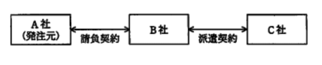
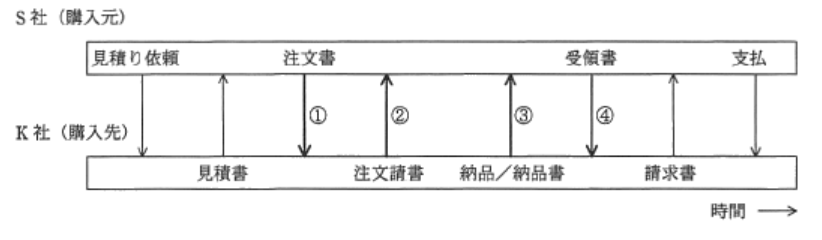

### 予想問題11

---
1.著作権法の保護の対象となるもの

- A.**パソコンの取扱説明書**  
知的財産権の中でも文化・芸術に関するものにおいて、創作者を保護するための権利。著作権法第10条の3には、例外の記述がある  
`プログラム言語` : プログラムを表現する手段として文字その他記号及び体系を指す。プログラム言語によってつくられたプログラム(ソースコード)は保護対象  
`規約` : 特定のプログラムにおけるプログラム言語の用法についての特別の約束  
`解法(アルゴリズム)` : プログラムにおける電子計算機に対する指令の組合せの方法

- パソコン本体の色や形状  
文化・芸術に係るものではないため保護対象外

---
3.*Unicode*の説明

- A.**多国籍文字を扱うために、日本語や中国語などの形の似た文字を同一コードに割り当てて2バイトの文字コードで表現する**  
世界の主要な言語で使われている文字を共通の文字集合で表現することを目指した文字コード体系で、1文字を2バイト以上で表現する

- ANSI(米国標準規格協会)で定めた、7ビットの文字コード体系である  
ASCIIコードの説明

- JIS(日本エ業規格)で定めた文字コード体系であり、英数字とカタカナを扱う8ビットのコードと、全角文字を扱う16ビットのコードがある  
シフトJISの説明

- 拡張UNIXコードとも呼ばれ、全角文字と半角カタカナ文字を2バイト又は3バイトで表現する  
EUC(*Extend Unix Code*)の説明

---
8.著作権法に関する記述

- A.**写真集に掲載された写真を無断で複製して自宅の居間に飾ることは、私的使用になるので著作権の侵害にはならない**  
自身や家族など限られた範囲内で利用するために著作物を複製することは、私的利用のための複製として、著作権法上でも許可されている

- インターネット上に流れる情報は有形な複製物を介さずに流通するので、著作物の複製に関する規定は適用されない  
著作権を侵害する自動公衆送信を受信して行うデジタル方式の録音・録画に対しても複製に関する規定がある

- 絵画などのアナログ情報をコンピュータ処理によってデジタル情報に変換する行為は、情報の質を変化させるので、著作権法でいう複製には該当しない  
著作物の録画・録音、印刷や写真にしたりスキャナによって電子的に読み取ることも複製行為に該当する

- 他人の著作物を無断で個人のホームページに掲載しても、だれからも参照されていなければ、権利の侵害にはならない  
HPに掲載された著作物は誰もが自由にダウンロード・受信できる状態になるため、著作者の公衆送信権を侵害する行為になる

---
9.A, B, C社開発要員がプロジェクトチームを組んでソフト開発業務を実施する時、違法な行為

- A.**B社の担当者がC社の要員に業務の割り振りや作業スケジュールの指示を行う**  
派遣契約では、派遣元の要員は派遣先の指揮命令の下で作業に従事することになる

- A社の担当者がB社の要員に直接作業指示を行う  
請負契約では、受注側の要員は受注側の指揮命令の下で業務を行う。A社はB社の要員に直接作業指示を行うことはできない

- A社のリーダーがプロジェクトチーム全員の作業指示を行う  
A, B社は請負契約。B社は成果物を完成させる責任があり、その方法は問われないので、A社のプロジェクトの下で作業を行う必要はない

- B社の担当者が業務の進捗によってC社の要員の就業条件の調整を行う  
B, C社に所属している要因との間に雇用関係はない。派遣元企業に所属する要因との就業条件は派遣元企業が行う

---
10.S社が備品を購入する時、購入先のK社と図の手順で取引を行っている。取引手順の中で、売買契約が成立するのはどの時点か。取引の内容は見積書以降の取引手順を通じて変わらないものとする

- A.**2**  
民法では、売買契約は双方(売主 - 買主)の合意があった時に成立するとされている。買主からの申込の意思表示が注文書、売主の承諾の意思表示が注文請書になるので売買契約が成立するのは、購入元が購入先からの注文請書を受理した時点となる。ネット通販の場合でも同様、売主からの注文承諾メールなどが読み取り可能な状態で注文者に届いた時点で売買契約が成立する

---
11.著作権の帰属に関する説明で適切なもの。著作権に関する特段の契約や取り決めはないとする

- A.**原稿がない即興の講演であっても著作権は、講演者に帰属する**  
原稿やイラストのような紙媒体だけでなく、講演会等における講演会等における講演や即興演奏された音楽なども著作物になる。  
著作権は、言語・音楽・絵画・建築・図形・映画・写真・コンピュータプログラムなどの表現形式によって自らの思想・感情を創作的に表現したものに認められる、それらの創作物の利用を支配することを目的とする権利で、著作権法は、著作物や著作者の権利を保護するための法律

- 映画の著作権は、その原作者だけに帰属する  
制作・監督・演出・特撮・美術等を担当してその映画の著作物の全体的形成に創作的に寄与した者が著作物になると定められている(16条)

- 憲法や法令、裁判所の判決の著作権は、国や地方公共団体に帰属する  
憲法や法令、裁判所の判決も著作物だが、著作権法上の権利の目的にはならないとされている(13条)ので、権利が地方公共団体に帰属することもない

- 新聞連載小説の著作権は、原作者ではなく新聞社に帰属する  
新聞掲載小説の著作権は、原作者に帰属する

---
12.コンピュータプログラムなどの著作物に関する記述

- A.**著作物を作成するために用いるプログラム言語や規約は、著作権法による保護の対象外である**  
著作物を作成するために用いるプログラム言語・規約・アルゴリズムは保護対象外としている

- 共同開発によるプログラムの著作権は、開発費用を負担した割合に従って権利が帰属する  
2人以上の者が共同して創作した著作物であって、各人の寄与を分離して個別的に利用できないものを共同著作物と呼ぶ。複数人の著作権者の準共有となるため、契約等に別段の定めがある場合を除き、各人の権利割合は等しくなる

- 著作権は、プログラムには認められるが、データベースについては認められていない  
著作権法ではDBの著作物を定義している。情報の選択や体系的な構成によって創作性を有していればDBについても著作権が認められる

- 著作権法では、プログラム及びプログラムを作成するためのノウハウを保護の対象としている  
現実に創作されたモノを保護対象とする法律なので、作成のためのノウハウやアイディアは保護の対象外
