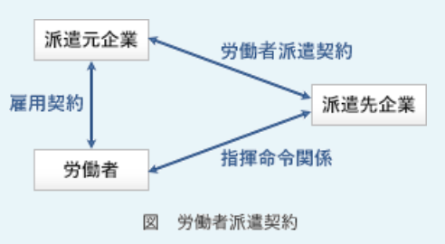

### 予想問題12

---
1.不正競争防止法で保護されるもの

- A.**秘密として管理している事業活動用の非公開の顧客名簿**  
事業者間の公正な競争等を確保するため、営業秘密侵害・原産地偽装・コピー商品の販売などの不正競争を規制する法律。第2条6項では、保護の対象となる営業秘密について、秘密として管理されている生産方法、販売方法その他の事業活動に有用な技術上又は営業上の情報であって、公然と知られていないものをいう、と規定している。営業秘密と認められるためには、3要件を満たす必要がある  
・秘密として管理されていること(`秘密管理性`)  
・事業活動に有用な技術上又は経営上の情報であること(`有用性`)  
・公然と知られていないこと(`非公知性`)

- 特許権を取得した発明  
特許法の保護対象

- 頒布されている独自の開発手順書  
非公知性を満たさないため営業秘密に該当しない

- 秘密としての管理を行っていない、自社システムを開発するために重要な設計書  
秘密管理性を満たさないため営業秘密に該当しない

---
2.発注者と受注者の間でソフトウェア開発における請負契約を締結した。ただし、発注者の事業所で作業を実施することになっている。この場合、指揮命令権と雇用契約に関して、適切なもの

- A.**指揮命令権は発注者になく、受注者に所属する作業者は、新たな雇用契約を発注者と結ぶことなく、発注者の事業所で作業を実施する**  
請負人がある仕事を完成することを約束し、発注者がその仕事の結果に対してその報酬を支払うことを内容とする労務供給契約。雇用契約・指揮命令関係とも受注者と受注者の従業員の間にある

---
3.不正アクセス禁止法において、処罰の対象となる行為

- A.**Webサイトで使用している他人のID・パスワードを無断で第三者に教える行為**  
本人の許可なく他人にパスワードやアカウント情報を提供する行為は、不正アクセスを助長する行為に当たり不正アクセス禁止法における処罰の対象。特定可能であるコンピュータにアクセスするための情報を電子掲示板に書き込む行為なども助長行為に含まれる。主に以下の3つの行為を指している  
・アクセス制御機能を持つコンピュータにネットワークを介してアクセスし、他人のIDやパスワードで本来制限されている機能を利用可能にする  
・アクセス制御機能を持つコンピュータにネットワークを介してアクセスし、不正な手段(セキュリティホールへの攻撃・コンピュータウィルス等)で本来制限されている機能を利用可能な状態にする行為  
・他のコンピュータ(認証サーバ等)によってアクセス制御がされているコンピュータにネットワークを介してアクセスし、不正な手段で本来制限されている機能を利用可能な状態にする行為

- 個人が開設しているアクセス制御機能のないWebサイトに対する侵害行為  
アクセス制御機能がないWebサイトへの侵害は不正アクセス行為に該当しない。他のコンピュータの機能や効用を阻害して人の業務を妨害する行為は、電子計算機損壊等業務妨害罪の処罰対象

- コンピュータウイルスを添付した電子メールをメールサーバに送信する行為  
アクセス制御を回避しているわけではないので、不正アクセス行為には該当しない。電子計算機損壊等業務妨害罪に当たる可能性がある

- ネットワーク接続されていないスタンドアロンのコンピュータに対する侵害行為  
ネットワークに接続されていないコンピュータに対する侵害は、ネットワークを通じて行われていないので不正アクセス行為に該当しない

---
4.ソフトウェアパッケージのライセンス契約形態のうち、サイトライセンスを説明したもの

- A.**特定の企業や団体などにある複数のコンピュータでの使用を一括して認める**  
企業や学校など特定の施設(サイト)内に限り複数のコンピュータへの使用権を認めるライセンス形態。1本のソフトウェアで1つのコンピュータへの使用権が与えられる通常のライセンス契約と比較して、1ライセンスあたりの単価が低く抑えられるため、同一の施設に同じソフトウェアを大量導入するときに利用される

- 特定のサーバにインストールし、そのクライアントでの使用を認める  
サーバライセンスの説明

- 特定のコンピュータ又は一定数のコンピュータでの使用を認める
- 特定のユーザ又は一定数のユーザに使用を認める  
ボリュームライセンスの説明

---
7.請負契約を締結していても、労働者派遣とみなされる受託者の行為

- A.**休暇取得のルールを発注者側の指示に従って取り決める**  
受託先(受託者)の従業員が指揮命令のもとで業務に従事する労働契約。受託者と受託者が雇用している従業員の間に指揮命令関係があるので、始業(就業)・休憩時間、勤務日など勤務形態に関するルールは発注者ではなく受託者自らが自社の従業員への指示を行う。契約上は業務受託の形式をとっていても、実態は受託先従業員が委託元の責任者の指揮命令で業務にあたるという労働者派遣のような状態を艤装請負と呼ぶ

---
8.デジタルテレビ、DVDレコーダなどで使われている、音声や映像を転送するインターフェイス規格

- A.**HDMI(*High - Definition Multimedia Interface*)は、音声と映像を合わせて送受信する規格である**  
PCとディスプレイの接続標準規格であるDVIを基に音声伝送機能や著作権保護機能(デジタルコンテンツ等の不正コピー防止)、色差伝送機能を加えるなどAV家電向けに改良したデジタル家電向けのインタフェース。非圧縮デジタル形式の音声と映像を伝達し音質・画質とも理論的には劣化しないという特徴があり、これがRCA端子やD端子と異なる

- D端子は、デジタル映像信号に直接対応した規格である  
映像機器のアナログ映像信号を伝送するために規格された日本独自の接続端子

- IEEE1394は、PCを介して映像などを送受信する規格である  
ホストとなる機器を必要としない。機器同士を接続することでデータ転送が可能

- S端子は、コンポーネント映像信号に対応した規格である  
コンポーネント映像信号に対応していない。コンポジット塩蔵信号を信号と輝度の2系統に分離して伝送する規格

---
9.派遣契約に基づいて就労している派遣社員に対する派遣先企業の対応のうち、適切なものはどれか。就業条件などに特段の取決めはないものとする

- A.**グループウェアのメンテナンスを行うために、自社社員と同様に作業を直接指示した**  
派遣元企業と派遣先企業が締結する労働者派遣契約には、業務の内容・就業場所・派遣期間・就業日・就業時間・休憩時間などが定められる。派遣労働者は労働者派遣契約の範囲内で働くことになり、派遣先には労働者派遣契約に反することのないように適切な措置を講じる義務がある。労働者派遣契約に反する指示や許可は、労働者派遣法違反にあたる行為

- 営業情報システムのメンテナンスを担当させている派遣社員から、直接に有給休暇の申請があり、業務に差し障りがないと判断して、承認した  
休日は派遣元企業の定めに従う。派遣先企業が休日を定めることは不適切

- 生産管理システムへのデータ入力を指示したところ、入力ミスによって、欠陥製品ができたので、派遣元企業に対して製造物責任を追及した  
派遣先企業の指揮命令のもとで業務に従事することになるので、作業ミスによる損失の責任は派遣先企業にある

- 販売管理システムのデータ処理が定時に終了しなかったので、自社社員と同様の残業を行うよう指示した  
派遣労働者の就業時間は、派遣元企業の定めに従う。派遣先企業が残業を指示することは不適切

---
11."JIS Q 9001:2000(ISO 9001:2000)品質マネジメントシステム - 要求事項"の規定に関する記述

- A.**内部監査においては、内部目的のためにその組織自身又は代理人が、品質マネジメントシステムの規格要求事項への適合性を監査する**  
顧客の要求する品質を満たした製品・サービスを安定的に供給するための、品質管理や品質保証の仕組みについて国際標準化機構(ISO)が定めた世界共通の規格

- 組織の品質方針については、組織の経営者ではなく、供給者が定め、文書化する  
経営陣が設定をする

- 組織は、製品が規格要求事項に適合することを確実にする手段として、品質マネジメントシステムを確立し、文書化してISOに報告する  
規定はされているが、ISOへの報告義務はない

- 内部監査は、監査される活動の状況及び重要性に基づいて予定を立て、監査される活動の直接責任者を含めたチームで行う  
監査員の選定及び監査の実施においては、監査プロセスの客観性及び公平性を確保すること、監査員は自らの仕事は監査しないこと、とされている

---
12.サイバーセキュリティ基本法において、サイバーセキュリティの対象として規定されている情報の説明

- A.**電磁的方式によって、記録・発信・伝送・受信される情報に限られる**  
日本国におけるサイバーセキュリティに関する施策の推進にあたっての基本理念、及び国及び地方公共団体の責務等を明らかにし、サイバーセキュリティ戦略の策定その他サイバーセキュリティに関する施策の基本となる事項を定めた法律。サイバーセキュリティとは、情報の安全性・信頼性を確保するために必要な措置が講じられ、適切に維持されていること、と規定されている

---
13.刑法における、コンピュータウイルスに関する罪となるもの

- A.**他人が作成したウイルスを発見し、後日これを第三者のコンピュータで動作させる目的で保管した**  
`正当な理由がなく他人のコンピュータで実行させる目的で、`ウイルスのプログラムやウイルスのソースコード等が記載された電磁的記録・媒体を作成・提供・保管した場合に罰せられる

- 自分に送られてきたウイルスに感染した電子メールを、それとは知らずに他者に転送した  
他人のコンピュータで実行させる目的はないので罪にならない

- ウイルス対策ソフトの開発、試験のために、新しいウイルスを作成した
- 自分に送られてきたウイルスを発見し、ウイルスであることを明示してウイルス対策組織へ提供した  
正当な目的・理由があるので罪にならない

---
14.労働者派遣法において派遣先の責任として定められているもの

- A.**派遣契約内容を派遣労働者を指揮命令する者やその他の関係者に周知すること**  
派遣先は派遣先責任者を選任し、労働者派遣法の規定・労働者派遣契約の内容・派遣元から通知を受けた派遣労働者の情報について派遣労働者の業務遂行を指揮命令する者や関係者に周知させる義務を負う

- 雇用関係終了後の雇用に関する制限を行わないこと
- 労働者の希望や能力に応じた就業の機会を確保すること
- 労働者の教育訓練の機会を確保すること  
派遣元事業主の講ずべき措置

---
15.新製品の開発に当たって生み出される様々な成果のうち、著作権法による保護の対象となるもの

- A.**機能を実現するために必要なソフトウェアとして作成されたプログラム**  
知的財産権は、産業財産権と著作権に分類される。これ以外は産業財産権の法律で保護される

- 機能を実現するために考え出された独創的な発明  
特許法の保護対象

- 新製品の形状、模様、色彩など、斬新な発想で創作されたデザイン  
意匠法の保護対象

- 新製品発表に向けて考え出された新製品のトレードマーク  
商標法の保護対象

---
16.UCS(*Universal multiple - octet coded Character Set*) - 2(*Unicode*)を説明したもの

- A.**すべての文字を2バイトで表現するコード体系であり、多くの国の文字体系に対応できる**  
ISO 10646で制定されている世界統一文字コード規格。1文字を2バイトで表現するので、最大65536文字を割り当てられる。ただ世界中の文字を表現するのに65536種では足りないため、1文字を4バイトで表現し、最大21億文字を割り当てることができるUCS - 4が定義されている

- JISから派生したコード体系であり、英数字は1バイト、漢字は2バイトで表現する  
シフトJISの説明

- 主にUNIXで使用するコード体系であり、英数字は1バイト、漢字は2バイトで表現する  
EUC(*Extended Unix Code*)の説明

- すべての文字を1バイトで表現するコード体系である  
全ての文字を2バイトで表現することを目指した文字コード体系

---
17.特定電子メール(広告・宣伝といった鋭利m句的に送信される電子メール)の送信者の義務となっている事項

- A.**電子メールの送信拒否を連絡する宛先のメールアドレスなどを明示する**  
氏名や名称、電子メールアドレスなどの表示義務がある

- A.**電子メールの送信同意の記録を保管する**  
同意が得られた受信者にだけ送信することが認められている。受信者から同意があったことを証明する記録を保存しなければならない

- 電子メールの送信を外部委託せずに自ら行う  
自ら行うことは義務ではない

---
18.コーポレートガバナンスの説明

- A.**企業の目的に適合した経営が行われるように、経営を統治する仕組みのこと**  
企業統治とも呼ばれ、企業の経営について利害関係者が監視・規律することで、収益力の強化と不祥事を防ぐという2つの目的を達成するための仕組み

- 企業が企業活動を行う上で守るべき道徳や価値規範のこと  
企業倫理の説明

- 企業のメンバーが共有する価値観、思考・行動様式・信念などのこと  
経営理念の説明

- 企業も社会を構成する一市民としての義務を負うべきとする考え方のこと  
CSR(*Corporate Social Responsibility*)の説明

---
19.不正競争防止法で保護される、自社にとっての営業秘密に該当するものはどれか。いずれの場合も情報はファイリングされており、ファイルには秘密であることを示すラベルを貼ってキャビネットに施錠保管し、閲覧者を限定して管理しているものとする

- A.**新製品開発に関連した、化学実験の未発表の失敗データ**  
有用性と非公知性・秘密管理性となり3要件を全て満たす

事業者間の公正な競争と国際約束の的確な実施を確保するため、不正競争の防止を目的として設けられた法律。営業秘密とされるには次の3つの要件を満たすことが求められる  
`有用性` : 生産方法、販売方法その他の事業活動に有用な技術上又は営業上の情報であること  
`有用性` : 公然と知られていないこと  
`秘密管理性` : 組織内で秘密として管理されていること

- 専門家、研究者の学会で発表した、自社研究員の重要レポート  
発表されているので非公知性を満たさない

- 特許公報に基づき調査した、他社の特許出願内容  
広く世間に知られた事実なので非公知性を満たさない

- 不正に取得した、他社の重要顧客リスト  
不正に取得した情報は営業秘密とされない。営業秘密を不正に取得した場合には不正競争防止行為とされ罰せられる

---
20.著作者の了解を得ずに以下の行為を行った場合、著作権法に照らして適法な行為

- A.**購入したCDの楽曲を自分のPCにコピーし、PCで毎日聴いている**  
データのバックアップなどの目的で複製を作る行為など、私的利用の範囲での複製を認めている

- 購入したCDの楽曲を自分のホームページからダウンロードできるようにしている
- 自社製品に関する記事が掲載された雑誌のコピーを顧客に配布している
- 録画したテレビドラマを動画共有サイトにアップロードしている  
自分以外の不特定多数の人が自由に利用できる状態なので、著作権法的には違法行為

---
21.ソフトウェアやデータに瑕疵がある場合に、製造物責任法の対象となるもの

- A.**ROM化したソフトウェアを内蔵した組込み機器**  
ソフトウェアは無体物で対象外だが、欠陥がある部品(ソフトウェア)を含むハードウェアに欠陥があるものとされるため対象となる

製造物の安全性上の欠陥により消費者側に被害が生じた際に製造業者の損害賠償の責任について定めることで、被害者の保護を目的とした法律。サービス・不動産・未加工のものは、この定義上の製造物には含まれず欠陥があっても製造物責任法の対象外。同じくコンピュータプログラムのような無体物も動産ではないため対象外となるが、欠陥があるプログラムを組み込んだハードウェア(製造物)の使用によって損害が生じた場合は、その動産であるハードウェアに欠陥があるものとして製造物責任法の対象。欠陥による被害が製造物自体の被害に留まった場合、適用外となり民法による救済対象となる

- アプリケーションがCD - ROMに入ったソフトウェアパッケージ  
無形物なので対象外

- 利用者がOSをインストールしたPC  
インストールによってPCが破損しても、通常そのPC以外にまで危険性が及ぶとは考えにくいので、この場合は製造物責任法ではなく民法の適用対象

- 利用者によってネットワークからダウンロードされたデータ  
無体物なので対象外

---
22.偽装請負となるもの

- A.**請負契約の要員と発注者の社員が混在しているチームで、発注者側の責任者が業務の割振り、指示を行う**  
労働者に対する業務の遂行方法に関する指示その他の管理を自ら行うこと、という基準に反している

- 請負契約の要員が業務で使用するコンピュータや開発ツールなどは請負業者側で調達し管理する  
自己の責任と負担で準備し、調達する機械、設備若しくは器材又は材料若しくは資材により業務を処理すること、という基準に適合している

- 請負契約の要員が発注先の事務所で業務を行う場合の規律、服装などの管理は、請負業者側で行う  
労働者の服務上の規律に関する事項についての指示その他の管理を自ら行うこと、という基準に適合している

- 請負契約の要員の時間外労働、休日労働は、業務の進捗状況などを見て請負業者の責任者が決める  
労働者の労働時間を延長する場合又は労働者に休日労働させる場合における指示その他の管理を自ら行うこと、という基準に適合している

---
23.労働者派遣法に基づいた労働者の派遣において、労働者派遣契約関係が存在する事業者

- A.**派遣元事業主と派遣先事業主**  

---
24.製造物責任法によって責任を問われるケース

- A.**取扱説明書に従った使い方をしていても過熱してやけどするなどの危険がある製品を販売した**  
予想される使用状態において安全性を欠いているので製造物責任法上の責任が問われるケース。製造物の欠陥により消費者側に被害が生じた際に製造業者の損害賠償の責任について定めることで、被害者の保護を目的とした法律。設計上の問題や製造上の問題、取扱説明書の記述に不備がある場合なども欠陥に該当する

- 再販売価格を維持することを条件に小売店に製品を販売した  
独占禁止法第二条第九項第四号(再販売価格の拘束)に該当する

- 実際には無い機能をもっていると誤解される広告をして製品を販売した  
不当景品類及び不当表示防止法上の責任が問われるケース

- 兵器として転用可能な製品を担当省庁の許可なしにテロ支援の懸念がある国家に販売した  
武器のみならず軍事転用可能な品物などの輸出には担当省庁の許可を得る必要がある。規定しているのは外国為替及び外国貿易法と、輸出貿易管理令

---
25.JANコード中にデータとして組み込まれている情報

- A.**商品の製造会社**  
商品識別コード・バーコード規格の1つで、13桁と8桁のタイプがある。格納パターンは2種類あり、国コード(日本は49, 45)・メーカコード・商品コード・チェックディジット(最後1桁)の順で記録されている

---
26.個人情報保護法における、個人情報だけを全て挙げたもの

- A.**購入した職員録に載っている取引先企業の役職と社員名**  
所属する企業名・役職・氏名が分かれば個人を特定できる。生存する個人に関する情報であって、当該情報に含まれる氏名・生年月日その他の記述等により特定の個人を識別できるものが該当する

- A.**電話帳に載っている氏名と住所、電話番号**  
氏名と住所が分かれば個人を特定できる

- A.**取引先企業担当者の名刺データベース**  
名刺の情報から個人を特定できる

- 記号や数字だけからなるハンドルネームを集めたファイル  
ハンドルネームだけでは個人の特定はできないので個人情報ではない

---
27.特段の措置を取らずになされた個人情報取扱事業者の行為のうち、個人情報保護法に照らして適法な行為

- A.**開設しているWebサイトの問合せページで自社製品販売促進ダイレクトメール送付可否欄に可と記入した依頼者の氏名及び住所を、自社の製品販売促進用ダイレクトメール発送先住所録に登録した**  
個人情報の適正な取扱いに関し基本的な事項を定め、国及び地方公共団体の責務等を明らかにするとともに、個人情報を取り扱う事業者の遵守すべき義務等を定めることにより、個人情報の有用性に配慮しつつ、個人の権利利益を保護することを目的とする法律。  
「事業者が個人情報を取り扱う際は利用目的を明らかにし、あらかじめ本人の同意を得ないで、その特定された利用目的の達成に必要な範囲を超えて、個人情報を取り扱ってはならない」とされている。また「利用目的を変更する場合には、変更前の利用目的と相当の関連性を有すると合理的に認められる範囲を超えて行ってはならない」とも定められている。本人の同意を得て個人情報を収集し、利用目的が同じの場合は適法

---
28.標準化規格と対象分野の組み合わせ

- A.**IEEE 802.3 : LAN**  
コンピューターネットワークの規格の1つ。世界中のオフィスや家庭で一般的に使用されているLANで最も使用されている技術規格(*Ethernet*)

- A.**ISO 9001 : 品質マネジメント**  
品質管理に関する国際規格。企業や自治体などあらゆる組織に適用可能で、顧客の要求する品質を満たした製品・サービスを安定的に供給するための、品質管理と品質保証の仕組みを提供している

- A.**ISO 14001 : 環境マネジメント**  
環境マネジメントに関する国際規格。環境マネジメントとは、組織自らが設けた「環境方針」に従って、環境負荷軽減のためのPDCAサイクルを確立する仕組みを設け、その仕組みを継続的に改善する活動のこと。この規格に適合した体制を構築していることを、審査登録機関と呼ばれる第三者機関が審査・登録することを制度化している

---
29.刑法の電子計算機使用詐欺罪が適用される違法行為

- A.**インターネットを経由して銀行のシステムに虚偽の情報を与え、不正な振込や送金をさせる**

- インターネット上にいわゆるねずみ講方式により取引形態のWebページを開設する  
無限連鎖講の防止に関する法律における違法行為。金品等を騙し取った場合には詐欺罪が適用される

- インターネット上に、実際よりも良品と誤認させる商品カタログを掲載し、粗悪な商品を販売する  
景品表示法における違法行為

- 企業のWebページを不法な手段で変造し、その企業の信用を傷つける情報を流す  
電子計算機破損等業務妨害罪が適用される

---
31.労働基準法において、時間外及び休日の労働を認めるために規定されていること

- A.**労使の協定を書面で締結し、行政官庁に届け出ること**  
労働基準法第36条に基づき「使用者とその事業場の労働者の過半数で組織する労働組合又は事業場の労働者の過半数の代表者とが時間外労働、休日労働について協定を書面で締結し、これを行政官庁に届け出た場合」(いわゆる36協定)に時間外労働が許されるという条文がある

---
32.インターネットを利用した新たなビジネスモデルを保護する法律

- A.**特許法**  
物や技術の発明を保護するだけでなく、ビジネス方法に係る発明も保護の対象となる。ビジネスモデルに係る発明は「ビジネスモデル特許」と呼ばれ、一般にはより狭義の、コンピュータ・ソフトウェアを使ったビジネス方法に係る発明に与えられる特許という意味で用いられる

- 意匠法  
工業上の利用性があり、製品の価値や魅力を高める形状・デザインを保護する法律

- 商標法  
商品の名称やロゴマークなどを保護する法律

- 著作権法  
知的財産権の中でも文化・芸術に関するものにおいて、著作者が自身の著作物を独占的に扱う権利を保護する法律

---
35.著作権法に照らして適法な行為

- A.**経済白書の記載内容を説明の材料として、出所を明示してWebページに転載する**  
著作物(思想または感情を創作物に表現したもの)や、著作者の権利を保護する法律。著作物には文芸、学術、音楽、美術のほかにプログラムやDBも含まれる。政府が発行している白書の類には禁転載の記載はない

- ある自社製品のパンフレットで使用しているスポーツ選手の写真を、撮影者に無断で、ほかの自社製品のパンフレットに使用する  
契約上特段の取り決めがなければ、撮影者への著作権侵害行為に該当する

- 新聞の写真をスキャナで取り込んで、提案書に記載する  
新聞社への著作権侵害行為

- ユーザ団体の研究会のように限られた対象者に対し、雑誌の記事をコピーして配布する  
転載した物を公開する対象が限られていても違法行為

---
36.不正競争防止法の不正競争に該当するもの

- A.**取引先から入手した情報が他社の営業秘密に当たるものであることを知っていながら、自社で使用した**  
事業者間の公正な競争及びこれに関する国際約束の的確な実施を確保するため、不正競争の定義や罰則について定められた法律。他社の営業秘密であることを知りながら、使用・開示する行為は不正競争に該当する

- 競争関係にある他社の信用の低下につながる、反社会的な行為を公表した  
公表の目的は反社会的な行為を社会に広く知らせるためで、不正の利益を得たり保有者に損害を加える目的ではないので違反ではない

- 自社で使っているドメイン名が、偶然他社のドメイン名と類似していた  
不正の利益を得る目的で、または他人に損害を加える目的で、他人の特定商品等表示のドメインを取得・使用した場合は不正競争に該当するが、偶然とされているので違反ではない

- 新聞に記載されていた掃除用具開発の着想を参考にして、オリジナルな文房具を開発した  
他人の商品の形態をコピーした商品の販売などは不正競争に該当するが、着想を参考にしただけなので違反ではない

---
37.コンピュータ不正アクセス対策基準に適合しているもの

- A.**組織のセキュリティ方針を文書化し、定期的に研修を開催する**  
コンピュータ不正アクセスによる被害の予防・発見・再発防止などについて、組織及び個人が実行すべき対策を取りまとめたもの。システムユーザ基準、システム管理者基準、ネットワークサービス事業者基準、ハードウェア・ソフトウェア供給者基準から構成される  
`システムユーザ基準` : システムを利用する者が実施すべき対策についてまとめたもの  
`システム管理者基準` : システムユーザの管理並びにシステム及びその構成要素の導入・維持・保守等の管理を行う者が、実施すべき対策についてまとめたもの  
`ネットワークサービス事業者基準` : ネットワークを利用して、情報サービス及びネットワーク接続サービスを提供する事業者が実施すべき対策についてまとめたもの  
`ハードウェア・ソフトウェア供給者基準` : ハードウェア及びソフトウェア製品の開発・製造・販売等を行う者が、実施すべき対策についてまとめたもの

- 監視効率を向上させるために全てのネットワークを相互接続する  
システムの利用形態等に応じて、ネットワークを分離することとしているため、セキュリティ面から不適切な事例

- 業務上必要な場合は、利用者IDを個人間で共有して使用できる  
IDの共有は不適切

- システム管理者が、全ての権限をもつ利用者IDを常に使用できる  
権限は必要最小限に設定するとしていることから、不適切な事例

---
38.ユーザから請負うソフトウェア開発を下請業者に委託する場合、下請代金支払遅延等防止法で禁止されている行為

- A.**下請業者に委託する業務内容は決まっているが、ユーザとの契約代金が未定なので、下請代金の取決めはユーザとの契約決定後とする**  
親事業者による下請け業者に対する優越的地位の濫用行為を取り締まるために制定された法律。親事業者の下請事業者に対する取引を構成に行わせることで、下請業者の利益を保護することを目的としている。親事業者が予め下請代金を決定しないで発注し、納品後に価格を交渉・決定することは、一般に、下請事業者は「取引をしない」という選択肢を失っている中で下請代金を交渉することとなるため、下請事業者にとって非常に不利な取引方法となる。このようなことのないよう、下請法では、親事業者に対してあらかじめ協議の上、取り決めた下請代金の額を記載した発注書面を交付することが義務付けられている

- 交通費などの経費については金額を明記せず、実費負担とする旨を発注書面に記載する  
具体的な金額を記載することが困難なやむを得ない事情がある場合には、具体的な金額を定めることとなる算定方法を記載することも認められている

- 発注書面を交付する代わりに、下請業者の承諾を得て、必要な事項を記載した電子メールで発注を行う  
発注書面の交付の代わりに電子メールなどの情報通信の技術を利用する方法で提供することが認められている

- ユーザの事情で下請予定の業務内容の一部が未定なので、その部分及び下請代金は別途取り決める  
親事業者は下請事業者に対して製造委託等をした場合、直ちに書面を交付しなければならない。ただし、業務内容が未定の業務については別途取り決めることで法律上の問題はない

---
40.著作権法によるソフトウェアの保護範囲に関する記述

- A.**ソースプログラムとオブジェクトプログラムの両方とも著作権法によって保護される**

- アプリケーションプログラムは著作権法によって保護されるが、OSなどの基本プログラムは権利の対価がハードウェアの料金に含まれるので、保護されない  
`OSは著作権法で保護される`

- アルゴリズムやプログラム言語は、著作権法によって保護される  
著作物に対する法律による保護は、その著作物を作成するために用いるプログラム言語、規約及び解法に及ばない、と規定されているため、`アルゴリズムやプログラム言語は保護対象外`

- アルゴリズムを記述した文書は著作権法で保護されるが、プログラムは保護されない  
アルゴリズムは保護対象外だが、記述をした文書・プログラムは著作権法で保護される

---
42.コンピュータに使われている文字符号の説明

- A.**ASCII符号はアルファベット、数字、特殊文字及び制御文字からなり、漢字に関する規定はない**  
2進数7桁で表現できる128種類に英数字や記号、改行やタブなどの制御文字などを割り当てた文字コード

- EUCは文字符号の世界標準を作成しようとして考案された16ビット以上の符号体系であり、漢字に関する規定はない  
*Unicode*の説明

- Unicodeは文字の1バイト目で漢字かどうかが分かるようにする目的で制定され、漢字とASCII符号を混在可能にした符号体系である  
SJIS(*Shift_JIS*)の説明

- シフトJIS符号はUNIXにおける多言語対応の一環として制定され、ISOとして標準化されている  
EUC(*Extended UNIX Code*)の説明

---
43.A社がシステム開発を行うにあたり、外部業者B社を利用する場合の契約に関する記述

- A.**請負契約によるシステム開発では、特に契約を定めない限り開発されたプログラムの著作権はB社に帰属する**  
請負契約では、特段取り決めがない場合は著作物の権利は受託側に帰属する

- 委託契約ではB社に成果物の完成責任がないので、A社がB社の従業員に対して直接指揮命令権を行使できる  
委託契約では、B社の従業員はB社の指揮命令の下で業務に従事する

- 請負契約、派遣契約によらず、いずれの場合のシステム開発でも、B社にはシステムの完成責任がある  
請負契約では完成責任が生じるが、派遣契約では完成責任はない

- 派遣契約では、開発されたプログラムに重大な欠陥が発生した場合、B社に瑕疵担保責任がある  
B社の従業員がA社の指揮命令の下で作業することになり、完成物の欠陥の責任は指揮命令を行ったA社にある

---
45.著作権法によるプログラムの保護に関する記述

- A.**他人の著作物であるプログラムを購入し、自社のパソコンでより効果的に利用するために改変を加えることができる**  
著作物の改変は著作物の同一性保護権を侵害することになるが、購入したプログラムを自社の環境に適用させるためや、より効果的に利用するために必要な改変は認められている

- 特に許可されていない場合、バックアップが目的であっても、購入したプログラムを複製すると著作権法違反となる  
私的利用の範囲でバックアップコピーをとることは認められている。ただし元のプログラムを売却・廃棄した場合にはバックアップも廃棄しなくてはならない

- プログラムの著作権を侵害して作成された複製物を使用する場合、複製物を取得したときに侵害の事実を知らなくても、使用時点で知っていれば、著作権法違反となる  
取得時点で侵害の事実を知らなかった場合には、複製されたプログラムの使用は著作権侵害にはならない

- プログラムは、そのアルゴリズムも含め、著作権法によって著作物として保護される  
アルゴリズム・規約・プログラム言語の3つは著作権法の保護対象外と定義されている

---
46.個人情報保護法では個人情報取扱事業者に対して安全管理措置を講じることを求めている。経済産業分野のガイドラインでは、安全管理措置は技術的安全管理措置、組織的安全管理措置、人的安全管理措置、物理的安全管理措置に分類している。このうち、人的安全管理措置の具体例

- A.**安全管理に対する従業員の役割及び責任についての周知や教育の実施**  
人的安全管理措置の事例。従業員に対する、業務上秘密と指定された個人データの非開示契約の締結や教育・訓練等を行うこと

- 安全管理に対する規程と従業員による体制の整備  
組織的安全管理措置の事例。安全管理について従業員の責任と権限を整備運用し、実施状況を確認すること

- 個人データを取り扱う情報システムへの従業員ごとのアクセス制御  
技術的安全管理措置の事例。個人データ及びそれを取り扱う情報システムへのアクセス制御・不正ソフトウェア対策・情報システムの監視等・個人データに対する技術的な安全管理措置

- 従業員の入退出管理や個人データを記録した媒体の施錠管理  
物理的安全管理措置の事例。入退室の管理、個人データの盗難の防止等の措置

---
47.準委任契約の説明

- A.**善管注意義務を負って作業を受託する契約**  
通常の委託契約(請負契約)と同様に委託先に業務を依頼することは同様だが、仕事の完成を契約の目的とする請負契約と異なり、業務(依頼された仕事)の実施自体を目的とする契約形態。業務分析やIT戦略のコンサルティングなど、作業や事務の遂行を約束する契約であり、仕事の完成は約束されないが、委託元の求めに応じて報告の義務がある

- 成果物の対価として報酬を得る契約
- 成果物を完成させる義務を負う契約  
請負契約の説明

- 発注者の指揮命令下で作業を行う契約  
労働者派遣契約の説明

---
50.経済産業省が策定した、ソフトウェア管理ガイドライン

- A.**ソフトウェアの違法複製などを防止するために、法人・団体などがソフトウェアを使用するに当たって実施すべき事項を取りまとめたもの**  
ソフトウェアの違法複製を防止するため、法人・団体などを対象として、ソフトウェアを使用するに当たって実行されるべき事項をとりまとめたもの。ソフトウェア管理責任者、ソフトウェアユーザといった対象ユーザごとに実施すべき事項を、管理方法や管理体制といった点から具体的に取りまとめている
