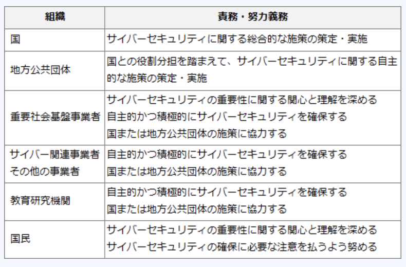

### 予想問題13

---
1.裁量労働制の説明

- A.**特定の専門業務や企画業務において、労働時間は、実際の労働時間に関係なく、労使間であらかじめ取り決めた労働時間とみなす**  
仕事の具体的な内容や出勤・退社の時間を従業員に委ね、実際の労働時間に関係なく労使協定によって定めた労働時間を働いたものとみなされる労働制度。デザイナーや記事の取材や編集を行う業務など労働時間と利益が必ずしも一致するわけではない特定の職種についてのみ採用することが法律で認められている

- 企業が継続雇用の前提として、従業員に対して他社でも適用する技術・能力の維持責任を求める一方、企業も従業員の能力開発を積極的に支援する  
CDP(*Career Development Program*)の説明

- 従業員1人当たりの労働時間を短縮したり仕事の配分方法を見直したりするなど、労働者間で労働を分かち合うことで雇用の維持・創出を図る  
ワークシェアリングの説明

- 能力主義と実績主義の徹底、経営参加意識の醸成、業績向上へのインセンティブなどを目的に、職務と能力、業績を基準に報酬を決める  
成果・能力主義の説明

---
2.セキュリティ対策に関連する標準、規格に関する記述

- A.**インターネットの各種技術の標準化を進めている任意団体IETF(*Internet Engineering Task Force*)は技術仕様をRFCとして発行しており、セキュリティ分野にはRADIUSやLDAPの仕様がある**  
TCP / IPなどのようにインターネット上で開発される技術や仕様などを標準化する組織。標準化が行われた規格はRFCとしてインターネット上に公開され誰もが自由に閲覧できるようになっている

- JIS Q 27002は、製品やシステムのセキュリティ機能及び実装のレベルを技術面から評価する基準である  
組織の情報セキュリティマネジメントシステムの仕様を定めた規格

- JIS X 5070は、セキュリティ組織から設備管理に及ぶ運用管理全体の規約を定めた実践規範であり、アクセス制御も評価対象とする  
情報技術の製品及びシステムのセキュリティ特性を評価するためのJIS規格

- JIS X 5731 - 8(ITU - T X.509)は、XML文書の暗号化とデジタル署名関連の規格であり、Web関連技術におけるHTTPやHTMLの標準化を行う任意団体W3Cが任意団体IETFと協力して定めたものである  
公開鍵証明書の標準形式や証明書パス認証アルゴリズムなどを定めたもの

---
6.個人情報取扱事業者が個人情報を第三者に渡した事例のうち、個人情報保護法において、本人の同意が必要なもの

- A.**フランチャイズ組織の本部から要請を受けたので、加盟店側が収集した顧客の個人情報を渡した**  
取得の際には個人情報の利用目的を通知し、その利用目的を超えて取り扱ってはならないと個人情報保護法では定められている。例外はあるが、本人の同意を得ずに個人データを第三者に提供してはならない

- 警察から捜査令状に基づく情報提供を求められたので、従業員の個人情報を渡した  
国の機関若しくは地方公共団体又はその委託を受けた者が法令の定める事務を遂行することに対して協力する必要がある場合であって、本人の同意を得ることにより当該事務の遂行に支障を及ぼすおそれがあるため、同意は不要

- 児童虐待のおそれのある家庭の情報を、児童相談所、警察、学校などで共有した  
公衆衛生の向上又は児童の健全な育成の推進のために特に必要がある場合であって、本人の同意を得ることが困難であるため、同意は不要

- 暴力団などの反社会的勢力情報や業務妨害行為を行う悪質者の情報を企業間で共有した  
人の生命・身体又は財産の保護のために必要がある場合であって、本人の同意を得ることが困難であるため、同意は不要

---
8.JANコードを構成している項目の組み合わせ

- A.JANコードの構成 : **メーカコード**  
13桁の標準タイプと8桁の短縮タイプがある

- A.商品アイテムコード : **チェックディジット**  
最後の1桁が光学式読取機(OMR)の読み取り間違いを検出するため

---
10.製造業者の責任に関して、製造物責任法(PL法)に定められているもの

- A.**製造物を顧客に引き渡した時における科学又は技術水準では発見できない内容の欠陥であれば、その製造業者の損害賠償責任は問われない**  
製造物の欠陥により人の生命、身体又は財産に係る被害が生じた際に製造業者の損害賠償の責任について定めることで、被害者の保護を目的とした法律。  
製造物をその製造業者等が引き渡した当時の科学・技術条件では、その欠陥があることを認識することができなかったことを製造業者が証明できれば、賠償責任を免責される

- 顧客の財産に関する損害については、製造業者は製造物を顧客に引き渡した時から永久に損害賠償責任を負う  
損害賠償の請求権は、顧客に引き渡した時から10年を経過したら時効により消滅する

- 製造物の欠陥原因が部品メーカの製造した部品であった場合、完成品メーカの設計どおりに製造し納品した部品であっても、部品メーカに損害賠償責任がある  
製品が部品や原材料として製造された場合、その欠陥がその完成品の製造業者が行った設計に関する指示に従ったことにより生じ、かつその欠陥が生じたことにつき過失がない時は、賠償責任を免責される

- 製造物を輸入して販売している販売業者は、製造業者ではないので、その製造物によって顧客が財産上の損害を被っても、損害賠償責任は問われない  
製造物の製造・加工・輸入又は販売に係る形態その他の事情からみて、当該製造物にその実質的な製造業者と認めることができる氏名等の表示をした者は製造業者に該当するため、損害賠償責任を負う

---
13.商品の販売業務を行う労働者の就業形態のうち、販売業務を行う会社と雇用関係のある者

- A.**アルバイト**  
契約期間が有限であり、通常の労働者の1週間の所定労働時間に比べて短い労働者。一般に学業や別会社の正社員などの本業がある人を指すことが多い

- A.**契約社員**  
正社員とは別の労働条件の下に、給与額や雇用期間など個別の労働契約を結んで働く常勤社員

- A.**パートタイマ**  
1週間の所定労働時間が通常の労働者の1週間の所定労働時間に比べて短い労働者

- 派遣社員  
就業先企業ではなく登録した人材派遣会社と雇用契約を結び、人材派遣会社から仕事の紹介を受け、企業に派遣され就業する社員。派遣先企業と雇用契約先は異なる

---
14.JIS Q 27001:2006 におけるISMSの確立に必要な事項1 - 3の順序関係のうち、適切なもの  
1.適用宣言書の作成  
2.リスク対応のための管理目的及び管理策の選択  
3.リスクの分析と評価

- A.**3, 2, 1**  
1.ISMS取得への準備 - 基本方針の定義 : 認証に向けて組織の体制作りをしたり、ISMSの適用範囲を決める。情報セキュリティ活動の方向性・法令・義務などを考慮して、ISMS基本方針を定義する  
2.リスクアセスメントの実施 : リスクアセスメントを行い、洗い出されたリスクを識別・`分析・評価する`  
3.リスク対応の選択 : リスクに対しての適切な`対応策を選択する`  
4.経営陣の承認を得る : 残った残留リスクと、ISMS導入・運用について経営陣の承認を得る  
5.`適用宣言書の作成` : 管理目的及び管理策・基準書・規定類などから構成される適用宣言書を作成する

---
17.サイバーセキュリティ基本法の説明

- A.**国民に対し、サイバーセキュリティの重要性につき関心と理解を深め、その確保に必要な注意を払うよう努めることを求める規定がある**  
日本国におけるサイバーセキュリティに関する施策の推進にあたっての基本理念、及び国及び地方公共団体の責務等を明らかにし、サイバーセキュリティ戦略の策定その他サイバーセキュリティに関する施策の基本となる事項を定めた法律

- サイバーセキュリティに関する国及び情報通信事業者の責務を定めたものであり、地方公共団体や教育研究機関についての言及はない  
地方公共団体の責務や教育研究機関の責務にも言及されている

- サイバーセキュリティに関する国及び地方公共団体の責務を定めたものであり、民間事業者が努力すべき事項についての規定はない  
重要社会基盤事業者、サイバー関連事業者及びその他の事業者の責務についても言及されている

- 地方公共団体を"重要社会基盤事業者"と位置づけ、サイバーセキュリティ関連施策の立案・実施に責任を負うと規定している  
立案・実施に責任を負うのは国と規定されている。"重要社会基盤事業者"は道路・鉄道・上下水道・送電網・港湾・ダム・通信施設などの「国民生活及び経済活動の基盤であって、その機能が停止し、又は低下した場合に国民生活又は経済活動に多大な影響を及ぼすおそれが生ずるものに関する事業を行う者」と定義されているため、重要社会基盤事業者 = 地方公共団体ではない

---
18.企業のWebサイトに接続してWebページを改ざんし、システムの使用目的に反する動作をさせて業務を妨害する行為を処罰の対象とする法律

- A.**刑法**  
電子計算機損壊等業務妨害により処罰の対象となる。DoS攻撃によるサービス妨害・メールボムによるメールサーバ妨害・業務で使用するコンピュータやデータの破壊などが処罰の対象となる

- 特定商取引法  
訪問販売・通信販売・電話勧誘販売取引・連鎖販売取引などのトラブルの起きやすい7つの取引(特定商取引)が公正に行われるためのルールを定めることで、購入者等の利益を保護する法律

- 不正競争防止法  
事業者間の公正な競争等を確保するため、営業秘密侵害・原産地偽装・コピー商品の販売などの不正競争を規制する法律

- プロバイダ責任制限法  
特定通信による情報流通によって権利の侵害があった場合、その通信の提供者の損害賠償責任および発信者情報の開示請求をする権利を定めた法律

---
19.プロバイダ責任制限法によって、プロバイダの対応責任の対象となり得る事例

- A.**書込みサイトへの個人を誹謗中傷する内容の投稿**  
インターネットでのウェブページや電子掲示板などへの投稿のように不特定多数の者が閲覧する通信について、プロバイダ等の損害賠償責任および、それらの通信で損害を被った者に与えられる発信者情報の開示請求権を定めた法律

- ハッカーによるコンピュータへの不正アクセス  
不正アクセス禁止法で規制される

- 不特定多数の個人への宣伝用の電子メールの送信  
迷惑メールを規制するために施行された、特定電子メール法で規制される

- 本人に通知した目的の範囲外での個人情報の利用  
個人情報保護法で規制される

---
20.品質に関するマネジメントシステムの規格

- A.**JIS Q 9001**  
組織の品質マネジメントシステムの要求事項を定めた国際標準規格のJIS版

- JIS Q 14001  
組織の環境マネジメントシステムの要求事項を定めた国際標準規格のJIS版

- JIS Q 15001  
組織の個人情報保護マネジメントシステムの要求事項を定めた国際標準規格のJIS版

- JIS Q 27001  
組織の情報セキュリティマネジメントシステムの要求事項を定めた国際標準規格のJIS版
