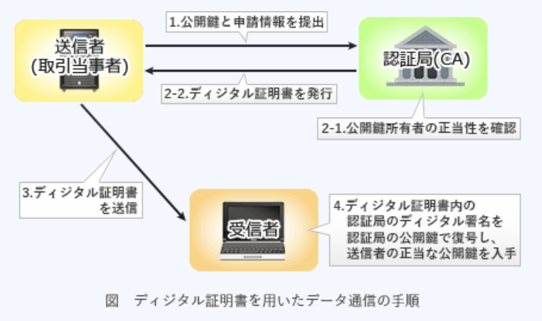
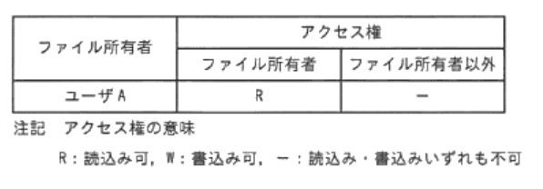
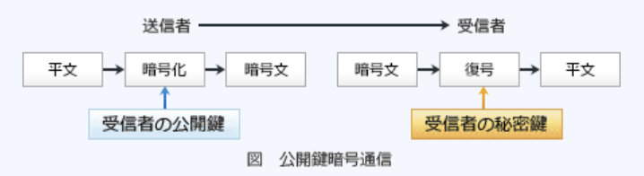

### 予想問題1

---
2.情報セキュリティ基本方針の説明

- A.**情報セキュリティに関する組織の取組み姿勢を示したものであり、組織のトップによって承認され、公表される**

情報セキュリティポリシーは、基本方針(ポリシー)、対策基準(スタンダード)、実施手順(プロシージャ)の3階層の文書構成をとるのが一般的とされている。  
`基本方針` : 組織の経営者が、情報セキュリティに本格的に取り組むという姿勢を示し、情報セキュリティの目標と、目標を達成するために企業がとるべき行動を社内外に宣言するもの。なぜセキュリティが必要か(Why)について規定し、何をどこまで守るのか(対象範囲)、誰が責任者かを明確にする。また、業界標準・該当する法令・政府規制への準拠を宣言する場合がある  
`対策基準` : 基本方針で作成した目的を受けて、何を実施しなければならないか(What)について記述する。組織的に情報セキュリティ対策を行うためのルール集で、人事規程や就業規程などの企業の構成員が守るべき規程類に相当する。実際に守るべき規程を具体的に記述し、適用範囲や対象者を明確にする  
`実施手順` : 対策基準で定めた規程を実施する際に、どのように実施するか(How)について記述する。マニュアル的な位置づけの文書であり、詳細な手順を記述する

基本方針や対策基準は組織の最終的な意思決定者である経営者レベルが関与し、情報セキュリティの全社的な組織であるセキュリティ委員会などで策定・承認・見直しも行う

- 1度決められた情報セキュリティ基本方針は、ビジネス環境や技術が変化しても変更すべきでない  
環境変化に合わせて定期的な見直しが必要となる

- セキュリティビジネスを拡大するための重点的な取組みについて、株主や一般に広く公開されるものである  
情報セキュリティマネジメントを確立するために取り組む姿勢を、社内外に宣言するもの

- 組織のセキュリティの考え方に基づいて、具体的なセキュリティ施策について述べたものである  
情報セキュリティの`実施手順`の説明

---
3.情報セキュリティの機密性を直接的に高めることになるもの

- A.**機密情報のファイルを暗号化し、漏えいしても解読されないようにする**  
データの暗号化は`予防・抑制`に該当するために直接的にシステムの機密性向上につながる。`予め十分な情報セキュリティを施す`ことで問題発生を未然に防ぐ対策や機能(ユーザ認証・予防保守の実施・データの暗号化・セキュリティパッチの適用など)

機密性(*Confidentiality*)は情報セキュリティマネジメントの概念の一要素で、許可された正規のユーザだけが情報にアクセスできる特性を示す。`予防・抑制`は不正アクセス等の発生確率を直接低減させることができるが、`検知・追跡`・`回復`は事後対策なので異常発生の確率を低くすることに直接的にはつながらない

- 1日の業務の終了時に機密情報のファイルの操作ログを取得し、漏えいの痕跡がないことを確認する  
- 機密情報のファイルにアクセスするときに、前回のアクセス日付が適正かどうかを確認する  
ログの解析、前回のアクセスが正常かどうかの検証は、`検知・追跡`に該当する。`不正アクセスなどの発生を速やかに発見・通知`し、その原因を特定するための情報を取得・保全する対策や機能(ログの取得 / 解析・システムのリアルタイム監視・監視カメラの設置など)

- 機密情報のファイルはバックアップを取得し、情報が破壊や改ざんされてもバックアップから復旧できるようにする  
バックアップデータの出力・保存は`回復`に該当する。不正アクセスや改ざんなどによって損なわれた`システムを正常な状態に復旧する`対策や機能(バックアップデータの出力・ログの出力・障害発生時の対応手順の策定など)

---
9.クロスサイトスクリプティングに関する記述

- A.**Webサイトの運営者が意図しないスクリプトを含むデータであっても、利用者のブラウザに送ってしまう脆弱性を利用する**  
動的にWebページを生成するアプリケーションのセキュリティ上の不備を意図的に利用し、サイト間を横断して悪意のあるスクリプトを混入させる攻撃。クッキー値が盗まれ利用者が被害に遭う・サイト利用者の権限でWebアプリケーションの機能を利用される・Webサイト上に偽の入力フォームが表示され、フィッシングにより利用者が個人情報を盗まれるなどの影響を受ける可能性がある

- Webページの入力項目にOSの操作コマンドを埋め込んでWebサーバに送信し、サーバを不正に操作する  
OSコマンドインジェクション攻撃の説明

- 複数のWebサイトに対して、ログインIDとパスワードを同じものに設定するという利用者の習性を悪用する  
リスト型の不正ログイン攻撃の説明

- 利用者に有用なソフトウェアと見せかけて、悪意のあるソフトウェアをインストールさせ、利用者のコンピュータに侵入する  
トロイの木馬の説明

---
15.SSL(*Secure Sockets Layer*)の機能に関する記述

- A.**WebブラウザとWebサーバ間の通信を暗号化する**  
通信の暗号化、デジタル証明書を利用した改ざん検出、ノード認証を含む統合セキュアプロトコル。トランスポート層で動作するので上位のアプリケーション層をプログラムから意識することなく利用できる。HTTPにSSLを適用したHTTPSは、インターネット上でクレジットカード情報などの機密情報を通信する手段として使われている

- Webサイトの利用者認証のためのワンタイムパスワードを生成する  
通常SSLでは、サーバだけが証明書を提示し、公開鍵暗号方式によってクライアントがその正当性を確認する認証が行われる

- 許可されていないWebサイトへの通信を防止(フィルタリング)する  
コンテンツフィルタリングの説明

- ネットワークを介して感染するウイルスを検知する  
ゲートウェイ型アンチウイルスソフトの説明

---
16.無線LANの暗号化方式

- A.**WPA2**(*Wi-Fi Protected Access 2*)  
無線LANのセキュリティプロトコルWPAの脆弱性を改善した次期バージョン。暗号化アルゴリズムがWEP, WPAで使用されていた脆弱性のあるRC4からNIST標準のAESに変更され、解読攻撃に対する耐性が高められている

- ESSID(*Extended Service Set Identifier*)  
無線LAN802.1Xシリーズにおいて、混信を避けるためにアクセスポイントと端末に設定する識別子

- HTTPS  
WebサーバとWebブラウザがデータを安全に送受信するために、SSL / TLSプロトコルによって生成されるセキュアな接続上でデータのやり取り(HTTP通信)を行う方式

- POP3  
ユーザ側に実装されているメールソフトがメールサーバから自身のメールを取り出す処理において使用するメール受信用プロトコル

---
17.所属するグループ及び個人の属性情報によって、人事ファイルへのアクセスをコントロールするシステムがある。人事部グループの属性情報と、そこに所属する4人の個人の属性情報が次の条件の場合、人事ファイルを参照又は更新可能な人数の組合せ  
1.属性情報は3ビットで表される  
2.各ビットは、左から順に参照、更新、追加・削除に対応し、1が許可、0が禁止を意味する  
3.グループの属性情報は、個人の属性情報が登録されていない場合にだけ適用される  
4.グループと個人の属性情報は次の通りとする  

|属性        |属性情報|
|-----------|-------|
|人事部グループ|110   |
|Aさん       |100    |
|Bさん       |110    |
|Cさん       |001    |
|Dさん       |未登録  |

- A.**参照可能な人数 : 3, 更新可能な人数 : 2**  
Dさんは未登録のため、人事部の設定を適用する。参照は1ビット目、更新は2ビット目を参照する

---
19.組織で策定する情報セキュリティポリシーに関する記述

- A.**組織内の複数の部門で異なる情報セキュリティ対策を実施する場合でも、情報セキュリティ基本方針は組織全体で統一させるべきである**  
情報セキュリティポリシーはシステムや部門毎に制定される者ではなく、企業全体として目標とするレベルを定義するもの

企業や組織として一貫したセキュリティ対策を行うために、技術的対策だけでなく、利用・運用面、管理面、組織体制をも含めた、企業や組織のセキュリティ方針と対策の基準を示したもの。  
組織の経営者がセキュリティの最高責任者として「情報セキュリティに本格的に取り組む」という姿勢を示し、情報セキュリティの目標と、その目標を達成するために企業がとるべき行動を社内外に宣言する

- 情報セキュリティ基本方針だけでなく、情報セキュリティに関する規則や手順の策定も経営者が行うべきである  
規則や手順・マニュアルなどの実施基準は情報システム毎、あるいは部門毎に作成・管理され、各部門の部門長が承認者であることが一般的

- 情報セキュリティ基本方針だけでなく、情報セキュリティに関する規則や手順も社外に公開することが求められている  
社外に公開することを求められるのは基本方針のみ

- 情報セキュリティに関する規則や手順は組織の状況にあったものにすべきであるが、最上位の情報セキュリティ基本方針は業界標準の雛形をそのまま採用することが求められている  
業界の雛形を利用するのは問題ないが、企業それぞれの独自の部分については業務内容に合う内容にすることが求められる

---
21.ISMSにおけるセキュリティリスクへの対応のリスク移転・リスク回避・リスク受容・リスク低減のうち、リスク回避に該当する事例

- A.**リスクの大きいサービスから撤退した**  
`リスク回避`に該当する。リスク源を除去して、リスクの発現確率をゼロにすること

- セキュリティ対策を行って、問題発生の可能性を下げた  
`リスク低減`に該当する。リスクの発現確率やリスクが現実化した時の損失を低下させること

- 問題発生時の損害に備えて、保険に入った  
`リスク移転(共有)`に該当する。保険への加入やリスク業務のアウトソーシングなどにより、他者にリスクを移転・分散すること

- リスクが小さいことを確認し、問題発生時は損害を負担することにした  
`リスク受容`に該当する。あえて何の対策も取らない。発生頻度・損害も小さいリスクに対して選択される

---
22.情報セキュリティ対策を、技術的・人的・物理的セキュリティ対策に分類する時、物理的セキュリティ対策に該当するもの

- A.**ノートPCを保管するときに施錠管理する**  
`物理的セキュリティ対策`に該当する。外部からの侵入・盗難・自然災害などから情報システムや情報資産を物的に保護するための対策

- 従業員と守秘義務契約を結ぶ  
`人的セキュリティ対策`に該当する。人による誤り・盗難・不正行為などの人的リスクを軽減するための対策

- 電子メール送信時にデジタル署名を付与する
- パスワードの変更を定期的に促す  
`技術的セキュリティ対策`に該当する。ソフトウェア・データ・ネットワークなどにセキュリティ対策技術を適用することで、情報システムや情報資産を保護する対策

---
23.組織の活動に関する記述で、ISMSの特徴で適切なもの  
a.一過性の活動でなく改善と活動を継続する  
b.現場が主導するボトムアップ活動である  
c.導入及び活動は経営層を頂点とした組織的な取組みである  
d.目標と期限を定めて活動し、目標達成によって終了する

- A.**a, c**  
- a : 新たな脅威に対応するため、絶えずPDCAサイクルによる見落としと改善が求められる  
- b : ISMSは、企業や組織のトップが情報セキュリティポリシーを策定し、それの基本方針に基づき具体的な実施手順や運用規則が策定されていくトップダウンの活動  
- c : 組織のトップがリーダーシップを発揮し、組織的に情報セキュリティを管理する取組み。JIS Q 27001では、導入やセキュリティ組織におけるトップマネジメントの責任が明記されている  
- d : 見直しと改善を継続しながら運用される

---
27.ウイルス対策ソフトに関する記述で適切なもの  
a.USBメモリから感染するタイプのウイルスを検知できるものがある  
b.定期的にウイルス対策ソフトとウイルス定義ファイルの更新を行っていても、ウイルスを検知できないことがある  
c.ボットウイルスを検知できるものがある  

- A.**a, b, c**  
- a : 昨今USBワームが流行したこともあり、最近のウイルス対策ソフトにはこれらのウイルスを検出する機能が実装されている  
- b : ウイルス定義ファイルは、既に発見されたウイルスのパターンコードを記録したファイル。未知のウイルスに対しては最新の状態になっていたとしても検出できない

---
29.電子商取引において、取引当事者から独立している第三者機関である認証局が発行するもの

- A.**取引当事者の公開鍵に対するデジタル証明書**  
公開鍵基盤における認証局(CA)の役割は、取引当事者(ショッピングサイトや企業)とのデータ通信のときに使われる公開鍵が、`正当な送信者のものであること`を証明するデジタル証明書を発行すること。  
1.取引当事者は、認証局に公開鍵を提出して証明書の発行を依頼する  
2.認証局は、提出された申請情報に基づき、公開鍵所有者の正当性を審査し、デジタル証明書を発行する(デジタル証明書には、認証局のデジタル署名が付加されている)  
3.送信者(取引当事者)は、受信者に対してデジタル証明書を送信する  
4.受信者は、デジタル証明書を認証局の公開鍵で復号し、証明書中の送信者の情報と認証局の署名を確認すると同時に送信者の公開鍵を入手する

---
30.ファイル`aaa`は表の通りにアクセス権が設定されている。ユーザBがファイル`aaa`をコピーしてファイル`bbb`を作成できるようにする時、ファイル`aaa`へのアクセス権に関する記述のうち適切なもの

- **"ファイル所有者以外"のアクセス権にR(読込み可)を追加する**  
ユーザAが所有者であるファイル`aaa`は、ファイル所有者(ユーザA)だけが読込み権限がある状態。  
ファイル所有者以外のユーザBがコピーできるようにするには、まずユーザBがファイル`aaa`を読み込む必要があるので、“ファイル所有者以外”のアクセス権にR(読込み可)を追加する。コピー後に作成されるファイル`bbb`は、ファイルaaaとは別のファイルになるためこのケースでは書込み権限に関しては特に関係ない

---
33.データの送信側は受信側の公開鍵で暗号化し、受信者は自身の秘密鍵で復号することによって実現できる対策

- A.**通信経路上でのデータの盗聴防止**  
公開鍵と秘密鍵という対の2種類の鍵を用いるのは公開鍵暗号方式。送信者が`受信者の公開鍵`を使用して平文を暗号化し、受信者は`自身の秘密鍵`で暗号文を復号する。  
公開鍵は不特定多数の第三者が利用できる状態になっているので、暗号化と送信は誰でもできるが、暗号化されたメッセージを正しく復号できるのは秘密鍵を持つ受信者という仕組み。もし暗号文を通信経路上で盗聴されても秘密鍵がなければ復号できないのでデータ(平文)を見られることはないので、通信経路上での安全性が確保される

- 送信者のなりすまし防止  
送信者のなりすましは見破れない。デジタル署名(公開鍵暗号方式の応用)を利用すれば可能

- 通信経路上での伝送エラーの発生防止  
公開鍵暗号方式で暗号化しても伝送エラーを回避はできない

- 伝送経路上で改ざんされた部分のデータ復元  
途中でデータが改ざんされてしまっても復元はできない。一部が改ざんされると復号自体が正しく行われない

---
34.公開鍵基盤(PKI)において認証局(CA)が果たす役割

- A.**公開鍵が被認証者のものであることを示す証明書を発行する**  
インターネットにおける暗号化通信において、`Webサーバの正当性を証明するサーバの証明書を発行する`のが認証局の役割。Webサーバは公開鍵の正当性を証明するために認証局に予め登録しておき、認証局からデジタル署名(証明書)の発行を受ける。クライアントがこのWebサーバに接続したときにWebサーバはクライアントに認証局のデジタル署名を送信し、クライアントはその証明書が本物であることを確認する。これによってWebサーバの正当性が第三者機関によって証明されることになる

---
37.アドウェア(*Adware*)に関する記述

- A.**PCの画面上に広告を表示させる**  
ユーザの使用中に広告が表示されるソフトウェアの総称。企業が提供する本格的なソフトウェアを無料で使用できる代わりに広告が表示されたり、機能を利用する代わりにソフトウェア作者が広告収入を得たりするなどの種類がある。ただ、ユーザの知らないところで個人情報を収集したり、目障りで有用でない内容のポップアップ広告を過度に表示するなど悪質なものもあるため問題となっている

- ネットワークで接続されたコンピュータ間を、自己複製しながら移動する  
ワームの説明

- ネットワークを介して、他人のPCを自由に操ったり、パスワードなど重要な情報を盗んだりする  
ボットの説明

- ワープロソフトや表計算ソフトのデータファイルに感染する  
マクロウイルスの説明

---
39.システムの利用者認証技術に関する記述

- A.**認証のために1度しか使えないパスワードのことをワンタイムパスワードという**  
認証を受ける度に異なるパスワードを入力するのでパスワードの盗難や不正利用されるリスクが少なくセキュリティ面で優れている

- 1度の認証で、許可されている複数のサーバやアプリケーションなどを利用できる仕組みをチャレンジレスポンス認証という  
シングルサインオンの説明

- 指紋や声紋など、身体的な特徴を利用して本人認証を行う仕組みをシングルサインオンという  
バイオメトリクス認証の説明

- 特定の数字や文字の並びではなく、位置についての情報を覚え、認証時には画面に表示された表の中で、自分が覚えている位置に並んでいる数字や文字をパスワードとして入力する方式をバイオメトリクス認証という  
マトリクス認証の説明

---
40.Webサイトの脆弱性を利用した攻撃である、クロスサイトスクリプティング(*Cross Site Scripting* : XSS)に関する記述

- A.**Webページに、ユーザーの入力データをそのまま表示するフォーム又は処理がある時、第三者が悪意あるスクリプトを埋め込むことでクッキーなどのデータを盗み出す**  
動的にWebページを生成するアプリケーションのセキュリティ上の不備を意図的に利用し、サイト間を横断して悪意のあるスクリプトを混入させることでユーザを攻撃する方法

- サーバとクライアント間の正規のセッションに割り込んで、正規のクライアントに成りすますことで、サーバ内のデータを盗み出す  
セッションハイジャックの説明

- データベースに連携しているWebページのユーザー入力領域に悪意あるSQLコマンドを埋め込み、サーバ内のデータを盗み出す  
SQLインジェクションの説明

- 電子メールを介して偽のWebサイトに誘導し、個人情報を盗み出す  
フィッシングの手口の説明

---
42.公衆回線を、あたかも専用回線のように利用できるようにするために使われる技術

- A.**VPN**(*Virtual Private Network*)  
多数の加入者が共用する公衆回線で接続された拠点間の通信において、認証及び暗号化と復号によって仮想的な専用回線を構築し、通信の安全性を確保する技術。公衆回線を利用するので専用回線を敷設するより低コスト化が可能

---
43.ISMSの情報セキュリティ方針に関する記述

- A.**情報セキュリティ方針は、トップマネジメントが確立しなければならない**  
組織が情報セキュリティに対してどのように取り組むかという基本的な考え方・方針を明文化したもので、目的・対象範囲・組織体制・罰則などが含まれる。ISMSの管理策では、情報セキュリティ基本方針について次のように記述されている  
・情報セキュリティのための方針群は、これを定義し、管理層が承認し、発行し、従業員・関連する外部関係者に通知しなければならない  
・情報セキュリティのための方針群は、予め定めた間隔で、又は重大な変化が発生した場合に、それが引き続き適切、妥当かつ有効であることを確実にするためにレビューしなければならない

- 情報セキュリティ方針は、社外に公表してはならない  
外部関係者に通知し、必要に応じて利害関係者が入手可能であることが求められる

- 1度制定した情報セキュリティ方針は変更できない  
有効性・妥当性を維持するために定期的な改善を求められる

- 個人情報や機密情報を扱わない従業者には、情報セキュリティ方針を周知しなくてもよい  
全従業員に対して周知させる必要がある

---
44.企業内ネットワークからも、外部ネットワークからも論理的に隔離されたネットワーク領域であり、そこに設置されたサーバが外部から不正アクセスを受けたとしても、企業内ネットワークには被害が及ばないようにするためのもの

- A.**DMZ**(*DeMilitarized Zone* : 非武装地帯)  
公開サーバなどの外部からアクセスされる可能性のある情報資源を設置するためのファイアウォールの中でも外でもない中間的なエリア。外部からの接続が社内ネットワークに直接繋がらないようになるのでセキュリティが高まる

- DNS(*Domain Name System*)  
数字の羅列で人間にとって覚えにくいIPアドレスをドメイン名・ホスト名に変換する仕組み

- DoS(*Denial of Service*)  
通常ではあり得ない数のリクエストをサーバに送信することでサーバやネットワーク回線を過負荷状態にし、サーバのシステムダウンや応答停止などの障害を引き起こさせる攻撃手法

- SSL(*Secure Sockets Layer*)  
通信の暗号化、デジタル証明書を利用した改ざん検出・ノード認証を含む統合セキュアプロトコル

---
47.ネットワークにおいて、外部からの不正アクセスを防ぐために内部ネットワークと外部ネットワークの間に置かれるもの

- A.**ファイアウォール**  
パケットフィルタリング機能を持ち、主に外部から内部のネットワークに接続しようとするパケットの送信元と送信先をチェックし、通信を許可するかどうか判断するソフトウェア

- DNSサーバ  
IPアドレスとドメイン名を関連づけるサーバ

- サーチエンジン  
キーワードを入力することでユーザが求めている情報をWeb上から検索し一覧を表示してくれるサービス

- スイッチングハブ(レイヤ2スイッチ)  
OSI基本参照モデルのデータリンク層で動作する。機器のMACアドレスを認識しパケットの送信先を決めて通信を行う

---
48.情報セキュリティ基本方針、又は情報セキュリティ基本方針と情報セキュリティ対策基準で構成されており、企業や組織の情報セキュリティに関する取組みを包括的に想定した文書

- A.**情報セキュリティポリシー**  
組織の経営者が最終的な責任者となり、`情報セキュリティに本格的に取り組む`という姿勢を示し、情報セキュリティの目標と、その目標を達成するために企業がとるべき行動を社内外に宣言する文書。ポリシーにいは、情報資産をどのような脅威から、どのようにして守るかについての基本的な考え方と、情報セキュリティを確保するための体制・組織・運用などが包括的に規定される

- 情報セキュリティマネジメントシステム  
組織の情報セキュリティを管理するための仕組み

- ソーシャルエンジニアリング  
技術的な方法ではなく人の弱みに付け込んで、パスワードなどの機密情報を不正に取得する方法の総称

- リスクアセスメント  
リスクマネジメントにおける、`リスクの特定`から`リスクの評価`までの一連の活動

---
49.データ通信における暗号化技術に関する記述

- A.**電子商取引などで使用されるデジタル署名には、公開鍵暗号の技術が使われている**  
送信者は`自身の秘密鍵`でメッセージダイジェストを暗号化し、受信側は`送信者の公開鍵`で復号し、データが改ざんされていないことを確かめる

- 公開鍵暗号方式を使用してデータを暗号化する通信では、暗号化するための鍵を、どのように安全に配送するか工夫する必要がある  
公開鍵暗号では、共通鍵暗号のように鍵の事前配送は必要ない

- データを暗号化して通信することによって、データの破壊や改ざんを防ぐことができる  
暗号化技術では、通信データの破壊や改ざんを防ぐことはできない。データの内容を第三者に盗聴されるのを防いだり、通信経路上での改ざんを検知したりすることを可能にする技術

- 不特定多数とのデータにおいては、公開鍵暗号よりも共通鍵暗号が適している  
共通鍵暗号では、通信相手の数だけ鍵のペアが必要だが、公開鍵暗号では1人が不特定多数と通信する場合の鍵のペア数は常に1つなので、鍵の管理が簡単なだけ公開鍵暗号の方が適していると言える

---
50.情報セキュリティマネジメントのリスクアセスメントにおける、情報価値・脅威・脆弱性及びリスクの大きさの関係

- A.**リスクの大きさは、資産価値・脅威及び脆弱性の大きさによって決まる**  
`脅威` : システム又は組織に危害を加える事故の潜在的原因  
`脆弱性` : 脅威によって影響を受ける内在する弱さ  
`リスク` : ある脅威が脆弱性を利用して損害を与える可能性  
リスクは、脅威と脆弱性が結びつくことで生じ、守るべき情報資産の価値が高いほどリスクが大きくなる。リスクの大きさは`発生確率 * 損害の大きさ`で評価されるが、発生確率は`脅威と脆弱性`によって決まり、損害の大きさは`資産価値`で決まるので、リスクの大きさは、`資産価値・脅威・脆弱性`の3要素の関係で評価される
