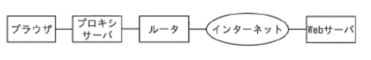
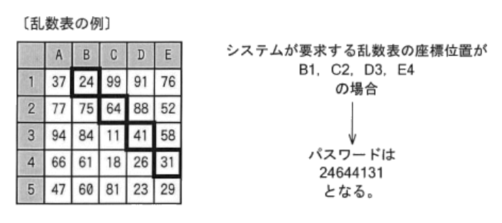
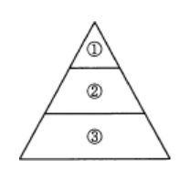
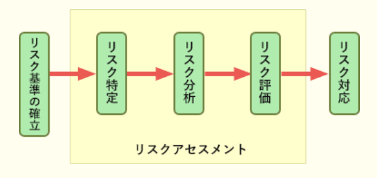

### 予想問題2

---
1.ISMS(*Information Security Management System*)に関する記述

- A.**ISMSを構築する組織は、保護すべき情報資産を特定し、リスク対策を決める**  
ISMSは情報セキュリティマネジメントシステムの管理・運用に関する仕組みでJIS Q 27001(ISO / IEC 27001)の基となった規格。  
ISMSを構築・運用する組織は、リスクアセスメントで特定されたセキュリティリスクを防止・軽減するために、適切なリスク対策を決めなければならない

- ISMSのマネジメントサイクルは、セキュリティ事故が発生した時点で開始し、セキュリティ事故が収束した時点で終了する  
PCDAサイクルに基づき、セキュリティ事故の有無に関係なく継続的改善を行う

- ISMSの構築、運用は、組織全体ではなく、必ず部門ごとに行う  
ISMSは組織全体、事業所単位、部門単位、事業やサービス単位で構築・運用できる

- 情報セキュリティ方針は、具体的なセキュリティ対策が記述されたものである  
組織の情報セキュリティに対する基本的な方針・考え方を明文化したもの。具体的な対策は、情報セキュリティ実施手順に記述される

---
2.フィッシング(*phishing*)対策

- A.**Webサイトなどで、個人情報を入力する場合は、SSL接続であること、及びサーバ証明書が正当であることを確認する**  
サーバ証明書は、第三者機関が電子情報の発信サーバ主の情報を証明するもの。Webサイトのドメインおよびサーバ証明書を確認することで、なりすましを防止できます。さらに、SSLによりクライアント - サーバ間の情報を暗号化することで通信経路での盗聴も防ぐことができる

- A.**キャッシュカード番号や暗証番号などの送信を促す電子メールが届いた場合は、それが取引銀行など信頼できる相手からのものであっても、念のため、複数の手段を用いて真偽を確認する**  
メールヘッダの送信者情報は容易に偽装が可能なので、信頼できる電話番号への直接の問合せなどにより確認をする必要がある

銀行やクレジットカード会社、ショッピングサイトなどの有名企業を装ったメールを送付し、個人情報を不正に搾取する行為。メール本文内のハイパーリンクをクリックさせることで、本物そっくりな偽のWebサイトに誘導し、設置してある入力フォームに入力した情報などの個人情報を不正に収集するインターネットを用いた詐欺の一種

- 電子商取引サイトのログインパスワードには十分な長さと複雑性をもたせる  
ユーザ自身が入力した情報を盗むため、ログインパスワードの強度は対策にならない

---
3.ペネトレーションテストの説明

- A.**システムに対して、実際に攻撃して侵入を試みることで、セキュリティ上の弱点を発見する**  
ネットワークに接続されているシステムに対して、実際にさまざまな方法で侵入を試みることで脆弱性の有無を検査するテスト。代表ではOSやサーバソフトウェアに対して実施されるものと、Webアプリケーションに対して実施されるものがあり、実施に関してもセキュリティスキャナなどの市販製品やフリーソフトなどを活用することで多岐にわたる項目について効率的な実施が可能

- システムに対して、通常以上の高い負荷をかけて、正常に機能するかどうかを確認する  
負荷テスト / ラッシュテストの説明

- プログラムを変更したときに、その変更によって想定外の影響が現れていないかどうかを確認する  
リグレッションテスト / 退行テストの説明

- 利用者にシステムを実際に使ってもらうことで、使いやすさを確認する  
運用テストの説明

---
5.送信する電子メールの本文と添付ファイルを暗号化し、宛先に指定した受信者だけが内容を読むことができるようにしたい。このとき使用する技術として、最も適切なもの

- A.**S / MIME**(*Secure / Multipurpose Internet Mail Extensions*)  
電子メールを盗聴や改ざんなどから守るために開発された技術。公開鍵暗号技術を使用して認証・改ざん検出・暗号化などの機能を電子メールソフトに提供するもの。利用には送受信側の双方にデジタル証明をインストールしなければならないが、メールソフト間でエンドツーエンドの暗号化通信を行うため、メール内容の秘匿ができる

- APOP  
メール受信の際のパスワード送信を暗号化することで安全性を高めたプロトコル

- IMAP  
メールをクライアントのメールソフトではなくメールサーバ上で管理することで、複数の端末が利用する場合のメール状態の一元管理やメールの選択受信などの機能を実現したメールプロトコル

- SSL  
通信の暗号化・デジタル証明書を利用した改ざん検出・ノード認証を含む統合セキュアプロトコル。SMTP通信をSSLの通信路上で行った場合でも暗号化される範囲はクライアントから発信元メールサーバまでで、インターネット上は平文で流れる

---
7.コンピュータウイルスに関する記述  
・OSやアプリケーションの、`a`を突くようなウイルスの感染予防には、ウイルス定義ファイルを最新に保つことや`b`が必要である

- A.**a : 脆弱性**  
脅威は`情報システムに悪い影響を与える要因`、脆弱性は`組織や情報システムに内在する欠点や弱点`のこと。情報資産の損害は、脅威が脆弱性に付け込むことで発生すると考えることができるので、脅威であるウイルス感染が付け込むのはOSやアプリケーションの脆弱性

- A.**b : OS、アプリケーションにセキュリティパッチをあてること**  
ソフトウェアの公開後に発見されたセキュリティ上の弱点を除去するために無償で配布される修正プログラムであるセキュリティパッチを適用することで、セキュリティホールを塞ぐことが重要

---
10.リスクマネジメントに含まれる4つのプロセスを実施する順番

- A.**リスク特定, リスク分析, リスク評価, リスク対応**  
`リスク特定` : リスクを発見・認識・記述するプロセス  
`リスク分析` : リスクの特質を理解し、リスクレベルを決定するプロセス  
`リスク評価` : リスク及び / 又は大きさが、受容可能か又は許容可能かを決定するために、リスク分析の結果をリスク基準と比較するプロセス  
`リスク対応` : リスクを修正する。リスク分析・リスク評価の結果明らかになったリスクに対して対応方法を講じる。リスクの大きさ・顕在化の可能性・情報 / 資産の重要度・予算などを踏まえて最適な対応策をとることが重要

---
11.電子メールを介したウイルスの被害に遭わないために注意すべきこと

- A.**信用できる人からの電子メールであっても、添付ファイルのウイルスチェックを行う**  
メールを送信するタイプのウイルスが激増しており、このタイプのウイルスに感染すると、送信者の知らない間にウイルス付きのメールを送信してしまうことがある。送信者情報だけで信頼せずに疑わしい添付ファイルに対してはウイルスチェックを行うことが大切

- A.**添付ファイルの種類が音声や画像などの非実行ファイルであっても、ウイルスチェックを行う**  
テキストファイル(.txt)や画像ファイル(.jpg)等の、安全なファイル形式に偽装した添付ファイルを送りつけるウイルスが発見されている。見た目に惑わされずにウイルスチェックを行うことが適切

- 不審な電子メールは、メールソフトのプレビュー機能で内容の安全性を確認してから閲覧する  
見知らぬ相手先から送信されたメールの添付ファイルは、安全を確認することが難しく、ほとんどのケースが自分に必要ないもの。悪意のあるHTMLメールなどによって、メールを閲覧しただけでウイルスに感染する可能性もある。不審なメールは開かずに削除するのが適切な対処

---
12.図の構成でHTPSプロトコルを用いてブラウザとWebサーバで通信を行う時、通信内容が暗号化される区間

- A.**ブラウザとWebサーバ間**  
HTTPS(*HTTP over SSL / TLS*)は、WebサーバとWebブラウザがデータを安全に送受信するために、SSL / TLSプロトコルによって生成されるセキュアな接続上でデータのやり取り(HTTP通信)を行う方式。  
HTTPプロトコルは、平文のままで情報をやり取りするため個人情報の送信や電子決済などセキュリティが重要となる通信に使うことは危険が伴う。SSL / TLSから提供される通信の暗号化・ノードの認証・改ざん検出などの機能を使用することで、HTTPS通信ではなりすましや盗聴による攻撃から通信を保護することができるようになっている。  
HTTPS通信では、WebブラウザとWebサーバ間にSSL / TLSの通信路が直接作成されるので、その間の全ての区間で通信内容が暗号化されることになる

---
15.セキュリティ対策の目的のうち、適切なアクセス権を設定することで効果があるもの

- A.**情報漏洩を防ぐ**  
正当な利用者のみがアクセスできるので、攻撃による情報漏洩のリスクを低減できる

- A.**不正利用者による改ざんを防ぐ**  
利用者に余分な権限を持たせないことで、改ざんのリスクのリスクを低減できる

- DoS攻撃から守る  
サーバに不正侵入することなしに行われる攻撃なので効果はない。ファイアウォールなどによる攻撃パケットの破棄が有効

- ショルダハッキングを防ぐ  
アクセス権の設定は論理的な防御なので、盗み見などによる情報漏洩は防げない。プライバシーフィルタの使用が有効

---
19.ボット(*bot*)への感染防止対策で、適切でないもの

- A.**ハードディスクを暗号化する**  
ノートPCの盗難や紛失への対策なので、ボット感染防止には不適切

- マルウェア対策ソフトを導入する
- 不審なWebサイトの閲覧を控える
- 見知らぬ差出人からの電子メールの添付ファイルは容易に開かない  
多数のPCに感染して、ネットワークを通じた指示に従ってPCを不正に操作することで一斉攻撃などの動作を行うプログラムのこと。メールの添付ファイルの実行、不正なWebページの参照、不正なサイトへの誘導、不正アクセス、バックドア、ファイル交換ソフトの利用、IM(インスタントメッセンジャ)サービスの利用などの経路でPCに感染する。感染したコンピュータを操って、迷惑メールの大量配信や特定サイトの攻撃等の迷惑行為を行ったり、コンピュータ内の情報を盗み出すスパイ活動などを行ったりするなどの被害をもたらす。上記の他にも、下記のような対策が有効  
・`ブラウザ等のインターネットオプションの有効利用`  
・`スパムメールなどの、甘い誘いのリンクはクリックしない`  
・`インターネット接続でのルータの利用や、ファイアウォールの導入と正しい設定・運用`  
・`コンピュータ上のOSやアプリケーションを最新状態にしておく`

---
20.次の認証方式の特徴  
・利用者には予め乱数表が渡されている  
・乱数表に印刷された数字は利用者ごとに異なる  
・システムが要求する乱数表の座標位置に記載された数字をパスワードとして入力する  
・正しいパスワードの入力が確認できた場合に認証が成功する

- A.**盗聴したパスワード利用による、なりすましの防止に有効である**  
システムが要求する座標位置は毎回異なるので、正しいパスワードは毎回異なるため、盗聴したパスワードを悪用した不正アクセスを防げる

- システムが要求する乱数表の座標位置が同じでも、パスワードは毎回異なる  
乱数表は利用者ごとに固定なので、座標位置が同じであれば要求するパスワードは常に同じ

- 知識による認証の一種である  
持ち物による認証に分類される。知識による認証は、ペットの名前や親の旧姓など、本人しか知り得ない情報をパスワードとして利用する方法

- 乱数表を他人に渡しても安全である  
乱数表を持っていることで本人を認証する方法なので、他人に渡せば不正に使用される可能性がある

---
25.情報セキュリティの文書を詳細化の順に上から並べた場合の、当てはまる用語の組み合わせ

- A.**基本方針, 対策基準, 実施手順**  
`基本方針` : 組織の経営者が、情報セキュリティに本格的に取り組むという姿勢を示し、情報セキュリティの目標と、目標を達成するために企業がとるべき行動を社内外に宣言するもの。なぜセキュリティが必要か(Why)について規定し、何をどこまで守るのか(対象範囲)、誰が責任者かを明確にする。また、業界標準・該当する法令・政府規制への準拠を宣言する場合がある  
`対策基準` : 基本方針で作成した目的を受けて、何を実施しなければならないか(What)について記述する。組織的に情報セキュリティ対策を行うためのルール集で、人事規程や就業規程などの企業の構成員が守るべき規程類に相当する。実際に守るべき規程を具体的に記述し、適用範囲や対象者を明確にする  
`実施手順` : 対策基準で定めた規程を実施する際に、どのように実施するか(How)について記述する。マニュアル的な位置づけの文書であり、詳細な手順を記述する

---
26.1度の認証で、許可されている複数のサーバやアプリケーションなどを利用できる仕組み

- A.**シングルサインオン**  
ユーザ認証を1度受けるだけで許可された複数のサーバへのアクセスについても認証する技術。*Cookie*を使うもの、リバースプロキシ型やSAMLを使用したものなどがある

- スマートカード  
ICカードとも呼ばれ、内部に集積回路を組み込みデータを記録できるようにしたカードのこと

- バイオメトリクス認証  
人間の身体的な特徴や行動の特性など、個人に固有の情報を用いて本人の認証を行う方式。身体的特徴を用いた方式では指紋・虹彩や静脈など、行動的特徴を用いた方式では筆跡やキーストロークなどを用いたものがある

- ワンタイムパスワード  
1度しか使用しない使い捨てのパスワード。同じパスワードは2度と使えないため、盗聴などのリスクに対しての安全度を高めることが可能

---
30.社内のISMS活動の一環として、サーバのセキュリティについて監査を行うことになった。最初に実施することとして適切なもの

- A.**監査の計画書を作成する**  
監査計画の作成は実地調査に先立って実施される

`監査計画の策定` : 監査対象システム、監査の目的などを明確にするために監査計画書を作成する  
`予備調査` : 対象となるシステムの概要を掴むために被監査部門の管理者への聞き取りや資料の確認を行う  
`本調査` : 監査計画書で設定した監査項目を具体的に調査し、優良点や問題点を把握する。得た情報は監査報告の根拠となる監査証拠として保存しておく  
`システム監査報告書の作成` : システム監査の結果・指摘事項・改善事項などを書類にまとめる  
`監査報告会` : システム監査報告書に基づき、監査の依頼者に監査結果の報告を行う  
`フォローアップ` : 改善の状況を確認し、改善活動を支援する

- サーバのセキュリティ設定を見直す  
監査後の改善活動で実施されること

- 全てのサーバの監査用ログの所在を確認する  
予備調査で実施されること

- 脆弱性検査ツールを利用して、サーバの脆弱性を確認する  
本調査で実施されること

---
33.迷惑メール対策についての記述  
迷惑メールに困っていたAさんは、その対策として、自分の受信したメールアドレスを`a`に登録し、電子メールの受信は`a`に登録しているメールアドレスから送信されたものだけを`b`することにした

- A.**a : ホワイトリスト**
- A.**b : 許可**  
ホワイトリストはデフォルトでは全て拒否する状態で、許可するものだけをルールとして登録する。登録したアドレスからのみ受信を行いたいので、ホワイトリストを用いてデフォルトは拒否、登録したアドレスだけを許可して受信するルールを設定することが適切

---
37.Webブラウザの利用方法のうち、セキュリティリスクが軽減する利用方法

- A.***JavaScript*を無効にする**  
Webページの閲覧時に、*JavaScript*で記述された悪意のあるスクリプトが実行されなくなるのでセキュリティリスクは低減する。ただし、ほとんどのWebサイトでWebページを便利にしようという目的で使われているので、コンテンツや一部機能が制限されるか利用できなくなる可能性がある

- IDとパスワードをWebブラウザに記憶させる  
他人がそのコンピュータを使用した場合に、不正ログインされやすくなってしまい、セキュリティリスクは増加する

- 管理権者権限でPCにログインし、Webブラウザを利用する  
管理者権限では機能の制限が少ない状態でアプリケーションが実行される。もしOSやブラウザの脆弱性を利用した悪意のあるプログラムが管理者権限で実行されてしまった場合、機能制限がないだけにコンピュータやネットワーク上のすべてのユーザや、システムの根幹部分に影響が及ぶ可能性があるなど、セキュリティリスクは増加します

---
38.ファイルサーバの運用管理に関する記述で、セキュリティ対策で有効なもの

- A.**アクセスする利用者のパスワードを複雑かつ十分な長さに設定する**  
パスワードクラックなどを防ぐため有効

- A.**許可されたIPアドレスのPCだけからアクセスできるように設定する**  
外部からの攻撃などの不正アクセスを予防するために有効

- A.**サーバのアクセスログを取得し、定期的に監査する**  
不正アクセスや内部不正の発生を検知でき、被害の拡大を防ぐことができるので有効

- ゲストユーザにもサーバへアクセスできる権限を与える  
アクセス権を与える範囲を広げると利便性は向上するが、安全性は低下する

---
39.不正プログラムの一種であるトロイの木馬の特徴

- A.**有用なソフトウェアに見せかけて配布された後、システムの破壊や個人情報の詐取など悪意ある動作をする**  
実行形式のプログラム(.exe)を被害者が実行することで動作を開始し、一見通常の動作をしているように見せかけ、裏ではOSの設定変更・パスワードの窃盗・外部からの遠隔操作の踏み台になるなどの悪意のある動作を秘密裏に行うウイルス

- アプリケーションソフトのマクロ機能を利用してデータファイルに感染する  
マクロウイルスの説明

- 新種ウイルスの警告メッセージなどの偽りのウイルス情報をチェーンメールで流す  
騒動を起こすために人為的に流された情報はデマウイルスと呼ばれる

- ネットワークを利用して、他のコンピュータに自分自身のコピーを送り込んで自己増殖する  
ワームの説明。トロイの木馬には自己増殖機能はない

---
41.PDCAモデルに基づいてISMSを運用している組織において、始業時の手順に従って業務用PCに適用されていないセキュリティパッチの有無を確認し、必要なパッチを適用している。この活動の該当するPDCAサイクル

- A.**D**(*Do*)  
*Plan*(計画), *Do*(実行), *Check*(評価), *Act*(見直し・改善)を繰り返すことで業務を継続的に改善する手法。始業時の手順という定められた計画(*Plan*)に従ってセキュリティ対策を実行している

---
42.情報セキュリティのリスクマネジメントにおいて、リスクの重大さを決定するために、算定されたリスクを与えられた基準と比較するプロセス

- A.**リスク評価**  
リスク及び / 又は大きさが、受容可能か又は許容可能かを決定するために、`リスク分析の結果をリスク基準と比較する`プロセス

`リスク特定` : リスクを発見・認識・記述するプロセス  
`リスク分析` : リスクの特質を理解し、リスクレベルを決定するプロセス  
`リスク対応` : リスクを修正する。リスク分析・リスク評価の結果明らかになったリスクに対して対応方法を講じる。リスクの大きさ・顕在化の可能性・情報 / 資産の重要度・予算などを踏まえて最適な対応策をとることが重要

---
44.
