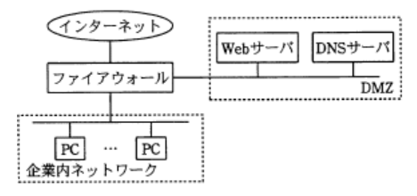

### 予想問題4

---
3.2つの通信主体X - Y間で、次の手順の情報交換を行う認証  
(1) : Yは、任意の情報を含む文字列(チャレンジ)をXへ送信する  
(2) : Xは、あらかじめX - Y間で定めた規則に基づき、受け取った文字列から新たな文字列(レスポンス)を生成し、Yへ返送する  
(3) : Yは、返送されてきた文字列(レスポンス)が正しいことを確認する

- A.**YがXを認証する**  
Yは、返送されてきたレスポンス文字列とチャレンジをXと同じ規則で変換した文字列を比較することでXが正当な通信相手であることを認証できる。X側にYから送られてくる情報は任意の文字列だけなので、XがYを認証する手立てはない

---
8.利用者情報を管理するデータベース(利用者データベース)がある。利用者データベースを検索し，検索結果を表示するアプリケーションに与えるデータベースのアクセス権限としてセキュリティ管理上適切なものはどれか。権限の範囲は次のとおり  
`参照権限` : 利用者DBのレコードの参照が可能  
`更新権限` : 利用者DBへのレコードの登録・変更・削除が可能  
`管理者権限` : 利用者DBのテーブルの参照・登録・変更・削除が可能

- A.**参照権限**  
セキュリティ上アクセス権限は、情報資産にアクセスする人間・プロセス・プログラム等に対して、常に必要最低限の権限のみを付与するという「最小権限の原則」の考え方に基づいて設定する必要がある。  
DBにアクセスするアプリケーションは、DBの内容を参照して検索結果を表示するだけの目的なので、登録・変更・削除の権限は必要ない。最小権限の原則をもとに考えると、このアプリケーションに与える権限は参照権限のみとするのが適切

---
17.図のネットワーク構成で、Webページの閲覧だけを社外に提供する。攻撃を防止するためにファイアウォールのIPパケットフィルタリングを設定する場合、フィルタリングルールでインターネットからDMZへのパケットの通過を禁止できないプロトコル

- A.**HTTP**(*Hyper Text Transfer Protocol*)  
WebサーバとWebブラウザがデータを送受信するのに使われるプロトコル。Webページの閲覧はHTTPを介して行われる。HTTPの通過を禁止するとWebページの閲覧ができなくなってしまうため、HTTPの通過は禁止できない

パケットフィルタリングは、パケットのヘッダ情報に含まれる、宛先 / 送信元のIPアドレスおよび宛先 / 送信元ポート番号をみて通過の可否を決定する手法。HTTPやSMTPなどのように、標準的に使用されるプロトコルには0 ~ 1023番の既定のポート番号が割り当てられているため、パケットフィルタリングルールに対象のプロトコルが使用するポート番号を追加することで、そのサービス宛ての通信パケットの通過を制御することが可能

- FTP(*File transfer Protocol*)  
ネットワーク上でファイル転送を行うための通信プロトコル。Webページの閲覧には無関係なので通過を禁止できる

- SMTP(*Simple Mail Transfer Protocol*)  
インターネット環境において、クライアントからサーバにメールを送信したり、サーバ間でメールを転送するのに用いられるプロトコル。Webページの閲覧には無関係なので通過を禁止できる

- SNMP(*Simple Network Management Protocol*)  
TCP / IPネットワーク上でネットワーク上の機器の情報を収集して、監視や制御を行うためのプロトコル。Webページの閲覧には無関係なので通過を禁止できる

---
18.ユーザが共通に使えるプログラムの不正な実行によるデータの改ざんや破壊を防止する管理手段

- A.**ファイルへのアクセス権限の設定**  
利用権限をもたないユーザにはプログラムやデータへのアクセス権を与えないことで不正利用を防止できる

- システムアクセスログの採取  
不正な利用を検知できるが、防止はできない

- ソースプログラムと実行プログラムの比較  
改ざんの検知はできるが、防止はできない

- ソースプログラムの保管場所の分散  
複製を保存することで破壊や改ざんへの耐性は高まるが、防止はできない
