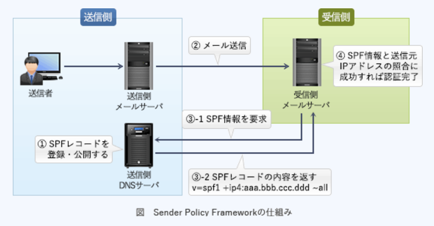

### 予想問題6

---
1.SMTP - AUTH認証

- A.**クライアントがSMTPサーバにアクセスするときにユーザ認証を行い、許可されたユーザだけから電子メールを受け付ける**  
SMTPには、  
1.送信処理と転送処理を同一の仕組みで扱っている  
2.メールの投稿をするユーザを認証する仕組みがない  
3.メールの投稿をするユーザーを認証する仕組みがない  
4.暗号化機能が標準で実装されていないため通信経路上を平文のメッセージが流れる  
などの脆弱性があり、特に1, 2の原因によって複数のメールサーバの第三者中継を利用した迷惑メールの温床となっていた。  
SMTP-AUTHは、メール投稿にあたってユーザ認証の仕組みがないSMTPにユーザー認証機能を追加した方式。使用するにはメールサーバとクライアントの双方が対応していなければならないが、メール送信するときに「ユーザー名とパスワード」「チャレンジレスポンス」などで認証を行い、認証されたユーザのみからのメール送信を許可することで不正な送信要求を遮断

- PASSコマンドの引数で用いられるパスワードをハッシュ値にして、その値でユーザ認証を行う  
APOP(*Authenticated POP*)の説明

- SMTPサーバへ電子メールを送信する前に電子メールを受信し、そのパスワード認証が行われたクライアントのIPアドレスに対して、一定時間だけ電子メールの送信を可能にする  
*POP before SMTP*の説明

- サーバはCAの公開鍵証明書をもち、クライアントから送信されたCAの署名付きクライアント証明書の妥当性を確認する  
DKIM(*DomainKeys Identified Mail*)の説明

---
2.NISTの定義によるクラウドサービスモデルのうち、クラウド利用企業の責任者がセキュリティ対策に関して、表の1, 2の責務を負うが、3 ~ 5の責務を負わないもの  
1.アプリケーションに対して、データのアクセス権限と暗号化の設定を行う  
2.アプリケーションに対して、セキュアプログラミングと脆弱性診断を行う  
3.DBMSに対して、修正プログラム適用と権限設定を行う  
4.OSに対して、修正プログラム適用と権限設定を行う  
5.ハードウェアに対して、アクセス権限と物理セキュリティ確保を行う

- A.**PaaS**(*Platform as a Service*)  
サービスの形で提供されるプラットフォーム。利用者に提供される機能は、クラウドのインフラストラクチャ上にユーザが開発または購入したアプリケーションを実装することであり、そのアプリケーションはプロバイダがサポートするプログラミング言語・ライブラリ・サービス・ツールを用いて生み出されたものである。ユーザは基盤にあるインフラストラクチャを、ネットワーク・サーバ・OS・ストレージであれ、管理したりコントロールしたりすることはない。ユーザは`自分が実装したアプリケーションと、場合によってはそのアプリケーションをホストする環境の設定についてコントロール権を持つ`

- HaaS(*Hardware as a Service*)  
IaaSと同義

- IaaS(*Infrastructure as a Service*)  
サービスの形で提供されるインフラストラクチャ。利用者に提供される機能は、演算機能・ストレージ・ネットワークその他の基礎的コンピューティングリソースを配置することであり、ユーザはOSやアプリケーションを含む任意のソフトウェアを実装し走らせることができる。ユーザは基盤にあるインフラストラクチャを管理したりコントロールしたりはないが、`OS・ストレージ、実装されたアプリケーションに対するコントロール権を持ち、場合によっては特定のネットワークコンポーネント機器(例えばホストファイアウォール)についての限定的なコントロール権を持つ`

- SaaS(*Software as a Service*)  
サービスの形で提供されるソフトウェア。利用者に提供される機能は、クラウドのインフラストラクチャ上で稼動しているプロバイダ由来のアプリケーション。クライアントの様々な装置から、ウェブブラウザのようなシンクライアント型インタフェイス(例えばウェブメール)、またはプログラムインタフェイスのいずれかを通じてアクセスする。ユーザは`基盤にあるインフラストラクチャを、ネットワーク・サーバ・OS・ストレージであれ、各アプリケーション機能ですら、管理したりコントロールしたりすることはない`。ユーザ固有のアプリケーションの構成の設定は例外

---
3.セキュリティ対策で利用するCRL(*Certificate Revocation List* : 証明書失効リスト)に記載されるデータ

- A.**有効期間内に失効したデジタル証明書のシリアル番号**  
公開鍵基盤(PKI)において失効した(信用性のない)公開鍵証明書のリスト。信用性がなくなる失効理由は、秘密鍵の漏洩・紛失、証明書の被発行者の規則違反などで、どれも認証の役に立たなくなったということが共通している。PKIを使用したアプリケーションが証明書の有効性を検証するために使われている

---
5.SPF(*Sender Policy Framework*)を利用する目的

- A.**メール送信のなりすましを検知する**  
SMTP接続してきたメールサーバのIPアドレスを基に、正規のサーバから送られた電子メールかどうかを検証する技術。受信メールサーバ側にて電子メールの送信元ドメインが詐称されていないかを検査できる。SPFで送信元IPアドレスの認証を行う手順は以下の通り  
1.送信側は、送信側ドメインのDNSサーバのSPFレコード(又はTXTレコード)に正当なメールサーバのIPアドレスやホスト名を登録し、公開しておく  
2.送信側から受信側へ、SMTPメールが送信される  
3.受信側メールサーバは、受信側ドメインのDNSサーバを通じて、`MAIL FROM`コマンドに記載された送信者メールアドレスのドメインを管理するDNSサーバに問い合わせ、SPF情報を取得する  
4.SPF情報との照合でSMTP接続してきたメールサーバのIPアドレスの確認に成功すれば、正当なドメインから送信されたと判断する

---
6.パケットフィルタリング型ファイアウォールのフィルタリングルールを用いて、本来必要なサービスに影響を及ぼすことなく防げるもの

- A.**外部に公開していないサービスへのアクセス**  
対象サービスを提供しているポートへの通信を遮断することで、必要なサービスに影響を与えず不正アクセスを防ぐことが可能。  
通過するパケットのIPアドレス(送信元 / 宛先)やポート番号・通信の方向などの情報をもとに中継の可否を判断する方式。パケットのペイロード(データ部分)に関してはチェックしない

- サーバで動作するソフトウェアのセキュリティの脆弱性を突く攻撃  
脆弱性をもつサーバを宛先IPアドレスとする通信を遮断することで攻撃を防ぐことができるが、正当な処理要求までも遮断してしまう

- 電子メールに添付されたファイルに含まれるマクロウイルスの侵入
- 電子メール爆弾などのDoS攻撃  
電子メールを転送するSMTP(TCP / 25)への通信を遮断することで攻撃は防げるが、必要なメールも同時に遮断してしまう

---
7.公開鍵基盤とハッシュ関数を利用したメッセージのデジタル署名の手法

- A.**受信者は、ハッシュ関数を用いてメッセージからハッシュ符号を生成し、送信者の公開鍵で復号したハッシュ符号と比較する**  
デジタル署名は、メッセージ => ハッシュ化 => 送信者の秘密鍵で復号化の手順で生成され、受信者は公開鍵で復号、メッセージのハッシュ値と比較することで検証を行う

1.送信者は、平文をハッシュ関数で圧縮したメッセージダイジェスト(ハッシュ符号)を`送信者の秘密鍵で暗号化`し、平文と一緒に送信する  
2.受信者は、受信したメッセージダイジェストを`送信者の公開鍵で復号`し、受信した平文をハッシュ関数で圧縮したものと比較する  
3.1つの平文からハッシュ関数によって生成されるメッセージダイジェストは常に同じなので、送信者から送られてきたメッセージダイジェストと、受信側でハッシュ化したメッセージダイジェストが同じなら、通信内容が改ざんされていないことが証明される

- 受信者は、送信者の公開鍵とハッシュ関数を用いてハッシュ符号を復号し、メッセージを得る  
送信されてきたデジタル署名は、送信者の秘密鍵で暗号化されているので、それと対になる送信者の公開鍵で復号してハッシュ符号を取り出す。ハッシュ符号にハッシュ関数をかけても元のメッセージには戻せない

- 送信者は、自分の公開鍵とハッシュ関数を用いてメッセージからハッシュ符号を生成し、メッセージとともに送信する  
送信者が、メッセージのハッシュ符号を生成する時に使用するのはハッシュ関数。メッセージとともに送信するのは、ハッシュ符号を`自身の秘密鍵で暗号化したデジタル署名`

- 送信者は、ハッシュ関数を用いて送信者の秘密鍵のハッシュ符号を生成し、メッセージとともに送信する  
ハッシュ符号は、`メッセージをハッシュ関数で固定長の文字列に圧縮したもの`で、秘密鍵をハッシュ化したものではない。ハッシュ符号を平文のまま送ることもない
