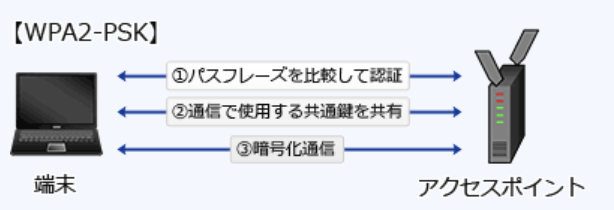

### 予想問題6

---
1.SMTP - AUTH認証

- A.**クライアントがSMTPサーバにアクセスするときにユーザ認証を行い、許可されたユーザだけから電子メールを受け付ける**  
SMTPには、  
1.送信処理と転送処理を同一の仕組みで扱っている  
2.メールの投稿をするユーザを認証する仕組みがない  
3.メールの投稿をするユーザーを認証する仕組みがない  
4.暗号化機能が標準で実装されていないため通信経路上を平文のメッセージが流れる  
などの脆弱性があり、特に1, 2の原因によって複数のメールサーバの第三者中継を利用した迷惑メールの温床となっていた。  
SMTP-AUTHは、メール投稿にあたってユーザ認証の仕組みがないSMTPにユーザー認証機能を追加した方式。使用するにはメールサーバとクライアントの双方が対応していなければならないが、メール送信するときに「ユーザー名とパスワード」「チャレンジレスポンス」などで認証を行い、認証されたユーザのみからのメール送信を許可することで不正な送信要求を遮断

- PASSコマンドの引数で用いられるパスワードをハッシュ値にして、その値でユーザ認証を行う  
APOP(*Authenticated POP*)の説明

- SMTPサーバへ電子メールを送信する前に電子メールを受信し、そのパスワード認証が行われたクライアントのIPアドレスに対して、一定時間だけ電子メールの送信を可能にする  
*POP before SMTP*の説明

- サーバはCAの公開鍵証明書をもち、クライアントから送信されたCAの署名付きクライアント証明書の妥当性を確認する  
DKIM(*DomainKeys Identified Mail*)の説明

---
2.NISTの定義によるクラウドサービスモデルのうち、クラウド利用企業の責任者がセキュリティ対策に関して、表の1, 2の責務を負うが、3 ~ 5の責務を負わないもの  
1.アプリケーションに対して、データのアクセス権限と暗号化の設定を行う  
2.アプリケーションに対して、セキュアプログラミングと脆弱性診断を行う  
3.DBMSに対して、修正プログラム適用と権限設定を行う  
4.OSに対して、修正プログラム適用と権限設定を行う  
5.ハードウェアに対して、アクセス権限と物理セキュリティ確保を行う

- A.**PaaS**(*Platform as a Service*)  
サービスの形で提供されるプラットフォーム。利用者に提供される機能は、クラウドのインフラストラクチャ上にユーザが開発または購入したアプリケーションを実装することであり、そのアプリケーションはプロバイダがサポートするプログラミング言語・ライブラリ・サービス・ツールを用いて生み出されたものである。ユーザは基盤にあるインフラストラクチャを、ネットワーク・サーバ・OS・ストレージであれ、管理したりコントロールしたりすることはない。ユーザは`自分が実装したアプリケーションと、場合によってはそのアプリケーションをホストする環境の設定についてコントロール権を持つ`

- HaaS(*Hardware as a Service*)  
IaaSと同義

- IaaS(*Infrastructure as a Service*)  
サービスの形で提供されるインフラストラクチャ。利用者に提供される機能は、演算機能・ストレージ・ネットワークその他の基礎的コンピューティングリソースを配置することであり、ユーザはOSやアプリケーションを含む任意のソフトウェアを実装し走らせることができる。ユーザは基盤にあるインフラストラクチャを管理したりコントロールしたりはないが、`OS・ストレージ、実装されたアプリケーションに対するコントロール権を持ち、場合によっては特定のネットワークコンポーネント機器(例えばホストファイアウォール)についての限定的なコントロール権を持つ`

- SaaS(*Software as a Service*)  
サービスの形で提供されるソフトウェア。利用者に提供される機能は、クラウドのインフラストラクチャ上で稼動しているプロバイダ由来のアプリケーション。クライアントの様々な装置から、ウェブブラウザのようなシンクライアント型インタフェイス(例えばウェブメール)、またはプログラムインタフェイスのいずれかを通じてアクセスする。ユーザは`基盤にあるインフラストラクチャを、ネットワーク・サーバ・OS・ストレージであれ、各アプリケーション機能ですら、管理したりコントロールしたりすることはない`。ユーザ固有のアプリケーションの構成の設定は例外

---
3.セキュリティ対策で利用するCRL(*Certificate Revocation List* : 証明書失効リスト)に記載されるデータ

- A.**有効期間内に失効したデジタル証明書のシリアル番号**  
公開鍵基盤(PKI)において失効した(信用性のない)公開鍵証明書のリスト。信用性がなくなる失効理由は、秘密鍵の漏洩・紛失、証明書の被発行者の規則違反などで、どれも認証の役に立たなくなったということが共通している。PKIを使用したアプリケーションが証明書の有効性を検証するために使われている

---
5.SPF(*Sender Policy Framework*)を利用する目的

- A.**メール送信のなりすましを検知する**  
SMTP接続してきたメールサーバのIPアドレスを基に、正規のサーバから送られた電子メールかどうかを検証する技術。受信メールサーバ側にて電子メールの送信元ドメインが詐称されていないかを検査できる。SPFで送信元IPアドレスの認証を行う手順は以下の通り  
1.送信側は、送信側ドメインのDNSサーバのSPFレコード(又はTXTレコード)に正当なメールサーバのIPアドレスやホスト名を登録し、公開しておく  
2.送信側から受信側へ、SMTPメールが送信される  
3.受信側メールサーバは、受信側ドメインのDNSサーバを通じて、`MAIL FROM`コマンドに記載された送信者メールアドレスのドメインを管理するDNSサーバに問い合わせ、SPF情報を取得する  
4.SPF情報との照合でSMTP接続してきたメールサーバのIPアドレスの確認に成功すれば、正当なドメインから送信されたと判断する

---
6.パケットフィルタリング型ファイアウォールのフィルタリングルールを用いて、本来必要なサービスに影響を及ぼすことなく防げるもの

- A.**外部に公開していないサービスへのアクセス**  
対象サービスを提供しているポートへの通信を遮断することで、必要なサービスに影響を与えず不正アクセスを防ぐことが可能。  
通過するパケットのIPアドレス(送信元 / 宛先)やポート番号・通信の方向などの情報をもとに中継の可否を判断する方式。パケットのペイロード(データ部分)に関してはチェックしない

- サーバで動作するソフトウェアのセキュリティの脆弱性を突く攻撃  
脆弱性をもつサーバを宛先IPアドレスとする通信を遮断することで攻撃を防ぐことができるが、正当な処理要求までも遮断してしまう

- 電子メールに添付されたファイルに含まれるマクロウイルスの侵入
- 電子メール爆弾などのDoS攻撃  
電子メールを転送するSMTP(TCP / 25)への通信を遮断することで攻撃は防げるが、必要なメールも同時に遮断してしまう

---
7.公開鍵基盤とハッシュ関数を利用したメッセージのデジタル署名の手法

- A.**受信者は、ハッシュ関数を用いてメッセージからハッシュ符号を生成し、送信者の公開鍵で復号したハッシュ符号と比較する**  
デジタル署名は、メッセージ => ハッシュ化 => 送信者の秘密鍵で復号化の手順で生成され、受信者は公開鍵で復号、メッセージのハッシュ値と比較することで検証を行う

1.送信者は、平文をハッシュ関数で圧縮したメッセージダイジェスト(ハッシュ符号)を`送信者の秘密鍵で暗号化`し、平文と一緒に送信する  
2.受信者は、受信したメッセージダイジェストを`送信者の公開鍵で復号`し、受信した平文をハッシュ関数で圧縮したものと比較する  
3.1つの平文からハッシュ関数によって生成されるメッセージダイジェストは常に同じなので、送信者から送られてきたメッセージダイジェストと、受信側でハッシュ化したメッセージダイジェストが同じなら、通信内容が改ざんされていないことが証明される

- 受信者は、送信者の公開鍵とハッシュ関数を用いてハッシュ符号を復号し、メッセージを得る  
送信されてきたデジタル署名は、送信者の秘密鍵で暗号化されているので、それと対になる送信者の公開鍵で復号してハッシュ符号を取り出す。ハッシュ符号にハッシュ関数をかけても元のメッセージには戻せない

- 送信者は、自分の公開鍵とハッシュ関数を用いてメッセージからハッシュ符号を生成し、メッセージとともに送信する  
送信者が、メッセージのハッシュ符号を生成する時に使用するのはハッシュ関数。メッセージとともに送信するのは、ハッシュ符号を`自身の秘密鍵で暗号化したデジタル署名`

- 送信者は、ハッシュ関数を用いて送信者の秘密鍵のハッシュ符号を生成し、メッセージとともに送信する  
ハッシュ符号は、`メッセージをハッシュ関数で固定長の文字列に圧縮したもの`で、秘密鍵をハッシュ化したものではない。ハッシュ符号を平文のまま送ることもない

---
8.無線LAN環境におけるWPA2-PSKの機能

- A.**アクセスポイントに設定されているのと同じSSIDとパスワード(*Pre-Shared Key*)が設定されている端末だけを接続させる**  
無線LANの暗号化方式の規格であるWPA2のうち個人宅やスモールオフィスなどの比較的小規模なネットワークで使用されることを想定したパーソナルモード(PSKモード)。アクセスポイントと端末間で事前に8文字から63文字の`パスフレーズ`(*Pre-Shared Key*)を共有しておき、そのパスフレーズとSSIDによって端末の認証を行う

- アクセスポイントに設定されているSSIDを共通鍵とし、通信を暗号化する  
SSIDはアクセスポイントの識別名であり暗号化鍵としては使用されない

- アクセスポイントは、IEEE 802.11acに準拠している端末だけに接続を許可する  
端末の認証はパスワードによって行われる

- アクセスポイントは、利用者ごとに付与されたSSIDを確認し、無線LANへのアクセス権限を識別する  
無線LANでは、アクセスポイントと同じSSIDをもつ端末としか通信できないようになっているが、これはWPA2ではなく無線LANの規格IEEE 802.11の機能

---
9.ISMSにおけるリスク分析の方法の1つであるベースラインアプローチ

- A.**公表されている基準などに基づいて一定のセキュリティレベルを設定し、実施している管理策とのギャップ分析を行った上で、リスクを評価する**  
一般に公開されている基準やガイドライン、チェックリストを使用して簡易的にリスク分析を行う手法。アンケートチェックリストの回答から、組織やシステムにおける問題点を洗い出すので時間やコストが少なくて済むが、大まかな分析になってしまうことや質問の品質によって分析結果が左右されるデメリットもある。基準としては、ISO / IEC27001、情報セキュリティ管理基準、システム管理基準などがある

- 情報資産を洗い出し、それぞれの情報資産に対して資産価値、脅威、脆弱性及びセキュリティ要件を識別し、リスクを評価する  
詳細リスク分析の説明

- 複数のリスク分析方法の長所を生かして組み合わせ、作業効率や分析精度の向上を図る  
組合せアプローチの説明

- リスク分析を行う組織や担当者の判断によって、リスクを評価する  
非公式アプローチの説明

---
11.米国で運用されたTCSECや欧州政府調達用のITSECを統合して、標準化が進められたCC(*Common Criteria*)の内容

- A.**情報技術に関するセキュリティの評価基準**  
IT製品やシステムのセキュリティ機能を評価し認証するための基準を定めた規格。ほぼそのままISO 15408(JIS X 5070)として国際標準化されている

- 暗号アルゴリズムの標準  
FIPS 140の説明

- 情報セキュリティ管理の実施基準  
情報セキュリティ管理基準の説明

- セキュリティ管理のプロトコルの標準  
IETFでRFCで発行されているSSL / TLS, IPsec, SSHなどの説明

---
12.サイト運営者に不特定の利用者が電子メールで機密データを送信するに当たって、機密性を確保できる仕組み

- A.**サイト運営者はサイト内のSSLで保護されたWebページにサイト運営者の公開鍵を公開し、利用者は電子メールで送信するデータをその公開鍵で暗号化する**  
公開鍵暗号方式は、1対nの暗号化通信を行うのに適している。暗号化と復号に異なる鍵を使用し、暗号化鍵は誰もが使用できるよう公開し(公開鍵)、複合鍵は受信者が厳重に管理する(秘密鍵)

- サイト運営者はサイト内のSSLで保護されたWebページに共通鍵を公開し、利用者は電子メールで送信するデータをその共通鍵で暗号化する  
共通鍵方式では、暗号化と復号に同じ鍵を使用する。Webサーバに公開されている共通鍵を使用することで不特定多数の人が復号できてしまう

- サイト運営者はサイト内のSSLで保護されたWebページに利用者の公開鍵を公開し、利用者は電子メールで送信するデータをその公開鍵に対応する秘密鍵で暗号化する  
秘密鍵で暗号化したデータは対応する公開鍵で復号が可能。公開鍵がWebサーバに公開されている場合、不特定多数の利用者が電子メールを復号できてしまう(SSLで保護されたページはサーバ－クライアント間の通信が暗号化されるだけで、ページへのアクセスが制限されるわけではない)

- サイト運営者はサイト内の認証局で利用者の公開鍵を公開し、利用者は電子メールで送信するデータをその公開鍵に対応する秘密鍵で暗号化する  
秘密鍵で暗号化したデータは対応する公開鍵で復号が可能。公開鍵が認証局で公開されている場合、不特定多数の利用者が電子メールを復号できてしまう

---
17.IDS(*Instruction Detection System*)の特徴

- A.**ホスト型IDSでは、シグネチャとのパターンマッチングを失敗させるためのパケットが挿入された攻撃でも検知できる**  
ネットワークやホストをリアルタイムで監視し、異常を検知した場合に管理者に通知するなどの処置を行うシステム。ネットワークセグメントに接続しネットワークを流れる通信を監視する`NIDS`(*Network-Based IDS*)と、監視対象のサーバ(ホスト)にインストールしてそのサーバで発生するイベントを監視する`HIDS`(*Host-Based IDS*)の2つに分類できる

- ネットワーク型IDSでは、SSLを利用したアプリケーションを介して行われる攻撃を検知できる  
通信内容を復号するSSLアクセラレータ機能をもっていないため、暗号化された攻撃を検知できない(一部の高性能NIDSはSSLアクセラレータ機能をもつ機器も存在する)

- ネットワーク型IDSでは、通信内容の解析によって、ファイルの改ざんを検知できる  
ネットワークに接続して通信内容の監視を行う機器のため、ホスト上に存在するファイルの異常を検知できない

- ホスト型IDSでは、到着する不正パケットの解析によって、ネットワークセグメント上の不正パケットを検知できる  
対象ホストのみを監視するのでネットワークに流れる不正パケットの全ての検知はできない

---
18.社内のセキュリティポリシーで、利用者の事故に備えて秘密鍵を復元できること、及びセキュリティ管理者の不正防止のための仕組みを確立することが決められている。電子メールで公開鍵暗号方式を使用し、鍵の生成はセキュリティ部門が一括して行っている場合、秘密鍵の適切な保管方法

- A.**暗号化された秘密鍵の1つ1つを分割し、複数のセキュリティ管理者が分担して保管する**  
認証局などの特に重要なセキュリティが要求される機関は、秘密鍵の保管方法として上記のような秘密分散技術を用いている

- 1人のセキュリティ管理者が、秘密鍵を暗号化して保管する  
鍵の生成はセキュリティ部門が一括して行っているので、セキュリティ管理者による不正の可能性がある

- セキュリティ部門には、秘密鍵を一切残さず、利用者本人だけが保管する  
事故が起きた場合の復元方法が考慮されていない

- 秘密鍵の一覧表を作成し、セキュリティ部門内に限り参照できるように保管する  
セキュリティ管理者による不正の可能性がある

---
19.迷惑メールのメールヘッダから送信元又は中継元のISP又は組織を特定する手がかりのうち、最も信頼できるもの

Return-path : <ユーザ名@<u>ホスト名・ドメイン名1</u>>  
Received : from <u>ホスト名・ドメイン名2(ホスト名・ドメイン名3</u>[IPアドレス])  
by 受信メールサーバ名 with SMTP ID …  
From : ユーザ名@<u>ホスト名・ドメイン名4</u>

- A.**送信元又は中継元のIPアドレスから逆引きされたホスト名・ドメイン名3及びIPアドレス**  
ホスト名・ドメイン名2は送信者が任意のアドレスを指定できるが、ホスト名・ドメイン名3及びIPアドレスの部分は、送信元・中継元のIPアドレスから逆引きされたもので詐称できない。この情報をもとに迷惑メールに使用される中継元やISPを特定し、対策の依頼をできる

- 電子メールのFromヘッダに設定されたホスト名・ドメイン名4
Fromヘッダはメール発信者の送信エージェントに設定された内容が記載されるので、詐称の可能性がある

- SMTPの`MAIL FROM`コマンドで通知されたホスト名・ドメイン名1
- SMTPの`HELO`コマンドで通知されたホスト名・ドメイン名2  
送信者が任意のアドレスを指定できるので詐称の可能性がある

---
20.情報システムのリスク分析における作業の適切な順序

1.損失の分類と影響度の評価  
2.対策の検討・評価と優先順位の決定  
3.事故態様の関連分析と損失額予想  
4.脆弱性の発見と識別  
5.分析対象の理解と分析計画

- A.**5, 4, 3, 1, 2**  
5.分析対象の理解と`分析計画`  
4.`脆弱性の発見`と識別  
3.事故態様の関連分析と損失額予想  
1.`損失の分類`と影響度の評価(損失額の予想の結果を考慮して決まる)  
2.対策の検討・評価と`優先順位の決定`(損失の分類と影響度の評価)

---
22.情報セキュリティ基本方針文書の取り扱いについて、ISMS認証基準に定められているもの

- A.**経営陣によって承認され、全従業員に公表し通知する**  
経営陣の責任としてISMSの確立・導入・運用・維持等に関与し、組織として情報セキュリティの実施責任を利害関係者に宣言(コミットメント)することを要求している

- 1度決めた内容を変更せず、セキュリティ事故発生時に見直す  
内外の環境の変化を踏まえて定期的にレビューすることが要求されている

- 機密情報であるので関連する管理者だけに内容を教育する  
組織は、ISMSに定義された先人を割り当てた要員全てが、要求された職務を実施する力量をもつことを(教育・訓練などによって)確実にしなければならないと定められている

- 作成したメンバー自身で実施状況を点検する  
監査プロセスの客観性・公平性を確実にするため、監査人は自らの仕事を監査してはならないと定められている

---
23.テンペスト技術の説明とその対策

- A.**ディスプレイやケーブルなどから放射される電磁波を傍受し、内容を観察する技術であり、電磁波遮断が施された部屋に機器を設置することによって対抗する**  
モニタやキーボード、ネットワークケーブルなどから放射されている微弱な電磁波を傍受し解析することで元の情報の再現を試みる技術。ブラウン管ディスプレイやケーブルから発生する電磁波を3m離れた地点で傍受して表示されている画像を再現した例がある。ブラウン管ディスプレイから液晶ディスプレイに切り替える、ケーブル等を電磁シールドで包む、PCを使用する部屋全体をシールドするなど、機器から放射される電磁波を少量に抑える方法が効果的

---
25.ブラウザからWebサーバにアクセスするシステムのセキュリティに関する記述

- A.**SSLを使用すれば、通信経路上にプロキシサーバが存在していても、各利用者とWebサーバとの間での参照情報が、本来の利用者以外に開示されることはない**  
SSLではクライアントのWebブラウザと通信相手のWebサーバ間の通信を暗号化するので、間にプロキシサーバが存在しても内容は漏洩しない。クライアント(Webサーバ)からSSLの接続要求を受け取ったプロキシは、通信の内容には介入せずデータをコピーしてクライアントに送信する(`SSLトンネリング`)

- CGI又はサーブレットによって生成されたHTML文書は動的に変化するので、プロキシサーバでのキャッシュの内容が、本来の利用者以外に開示されることはない  
本来の利用者以外でも同じURLでアクセスすればキャッシュの内容を知られてしまう

- 複数の利用者が同一のパソコンを利用する場合、最初にHTTP基本認証を利用したログイン操作を行うようにすれば、ブラウザを起動したまま利用者が交代しても、本来の利用者以外に情報が開示されることはない  
1度認証されたブラウザを閉じるまではその認証は有効なので、認証状態で放置されているブラウザが別ユーザに使用されると非公開の情報を知られてしまう可能性がある

- リバースプロキシは静的コンテンツのキャッシュができないので、それを使ってもクライアントへの応答時間が改善されることはない  
静的静的コンテンツをキャッシュできる。キャッシュが存在し、有効期限が切れていない場合、Webサーバに問い合わせることなくキャッシュをクライアントに返すので応答速度の改善が望める

---
27.家庭内でPCを無線LANとブロードバンドルータを介してインターネットに接続するとき、期待できるセキュリティ上の効果の記述

- A.**IPマスカレード機能による、インターネットからの不正侵入に対する防止効果**  
1つのグローバルIPアドレスで複数のプライベートIPアドレスを持つノードを同時にインターネットに接続させることを可能とする機能。ブロードバンドルータは、LAN内のコンピュータがインターネットに接続する際に、`コンピュータのプライベートIPアドレスとポート番号をセットで記憶`する。インターネットからの応答パケットを受け取ると、ルータはパケットのポート番号と記憶しているポート番号のリストを比較して、適切なコンピュータに応答パケットを届ける。この時応答パケットのポート番号が、ルータが記憶しているどのポート番号とも異なる場合には、適切な届け先が見つからず応答パケットは破棄される。不自然(不正)なパケットを内部LANに通すことがないので、ポートスキャンや不正侵入を試みる攻撃などを遮断するセキュリティ効果が期待できる

- PPPoE(*PPP over Ethernet*)機能による、経路上の盗聴に対する防止効果  
ブロードバンドルータからプロバイダの認証と接続を行うときに使用されるが、通信経路の暗号化機能は持っていない

- WPA(*Wi-Fi Protected Access*)機能による、不正なWebサイトへの接続に対する防止効果  
無線LANの暗号化規格。コンテンツフィルタリング機能やURLフィッシング機能はない

- WPS(*Wi-Fi Protected Setup*)機能による、インターネットからのウイルス感染に対する防止効果  
無線LANの親機と子機の接続設定やセキュリティ設定を容易に行うために策定された規格。ウイルス感染を防止する機能はない

---
29.経済産業省"個人情報の保護に関する法律についての経済産業分野を対象とするガイドライン"の物理的安全管理措置に該当するもの

- A.**個人データを取り扱う情報システムを、ICカードによる入退出管理を実施している室内に配置する**  
`個人情報の保護に関するガイドライン`は、個人情報保護法を踏まえ経済産業分野における事業者等が行う個人情報の適正な取扱いの確保に関する活動を支援する具体的な指針として定められたもの。個人情報保護法第20条に「`個人情報取扱事業者は`、その取り扱う個人データの漏洩、減失又はき損の防止とその他の個人データの`安全管理のために必要かつ適切な措置を講じなければならない`」とある

- 個人情報の安全管理に関わる従業員の役割及び責任についての教育・訓練を実施する  
人的安全管理措置

- 個人データの漏洩などの事故が発生した場合の、代表者などへの報告連絡体制を整備する  
組織的安全管理措置

- 個人データを取り扱う情報システムへのアクセスの成功・失敗の記録を取得する  
技術的安全管理措置

---
31.JPCERT / CCの説明

- A.**特定の政府機関や企業から独立した組織であり、国内のコンピュータセキュリティインシデントに関する報告の受付、対応の支援、発生状況の把握、手口の分析、再発防止策の検討や助言を行っている**  
インターネットを介して発生する侵入やサービス妨害等のコンピュータセキュリティインシデントについて、国内のサイトに関する報告の受付、対応の支援、発生状況の把握、手口の分析、再発防止のための対策の検討や助言など、技術的な立場から行っている。特定の政府機関や企業からは独立した中立の組織として、日本における情報セキュリティ対策活動の向上に取り組んでいる

- 産業標準化法に基づいて経済産業省に設置されている審議会であり、産業標準化全般に関する調査・審議を行っている  
日本産業標準調査会(JISC)の説明

- 電子政府推奨暗号の安全性を評価・監視し、暗号技術の適切な実装法・運用法を調査・検討するプロジェクトであり、総務省及び経済産業省が共同で運営する暗号技術検討会などで構成される  
CRYPTECの説明

- 内閣官房に設置され、我が国をサイバー攻撃から防衛するための司令塔機能を担う組織である  
NISC(内閣サイバーセキュリティセンター)の説明

---
32.*Autorun.inf*を悪用したUSBワームの説明

- A.**特定ワームのファイル名を登録したAutorun.infファイルをUSBメモリ内に生成する**  
CDやDVDなどの外部メディア内がPCに接続されたときに、内部にある特定のプログラムを自動実行するために記述されるテキストファイル。通常ソフトウェアのインストールCDを挿入した際には自動でインストール画面が立ち上がるが、これも*Autorun.inf*の記述によるもの。  
リムーバブルメディアなどにも適用可能。USBワームはこれを悪用し、USBメモリがPCに接続された際にワーム本体が自動的に実行されるよう仕組む。感染後は他の外部メディアやネットワーク上の他のPCに自身と*Autorun.inf*をコピーし、さらに感染を広げていくという活動を行う。  
対策は、出所不明のUSBメモリを使用しない、信頼できないコンピュータではUSBメモリを使用しない、USBメモリの自動実行をさせない、などが挙げられる

- USB接続可能なICレコーダは、音声データを取り扱うものなので、USBワームに感染することはない  
音声データを取り扱う機器でも、記憶領域にワーム本体と*Autorun.inf*が埋め込まれていれば感染は防げない

- 暗号化USBメモリは、メモリ上のデータが暗号化されているので、USBワームに感染することはない  
暗号化されたデータは盗難時などには効果を発揮するが、使用時のパスワードを入力すればデータは復号され通常と変わらない状態になるため、感染は防げない

- 自動実行するワーム自体をUSBメモリ内の*Autorun.inf*ファイルに埋め込む  
USBワームが成立するためには、最低でもワーム本体と*Autorun.inf*の2つが必要。*Autorun.inf*はテキスト形式の設定ファイルで、ワーム本体を埋め込むことはできない

---
34.JIS Q 27000で定義された情報セキュリティの特性に関する記述のうち、否認防止(*Non-Repudiation*)の特性に該当するもの

- A.**ある利用者がシステムを利用したという事実を証明可能にする**  
情報セキュリティマネジメントの付加的な要素で、行った操作や発生した事象を後になって否認されないよう証明することができる能力のこと。ログの取得で必要な項目を確実に記録し、完全性が損なわれないように保存することで確保できる。デジタル署名やタイムスタンプが否認防止に活用される技術

- 意図する行動と結果が一貫性をもつ  
信頼性の説明

- 認可されたエンティティが要求したときにアクセスが可能である  
可用性の説明

- 認可された個人、エンティテイ又はプロセスに対してだけ、情報を使用させる又は開示する  
機密性の説明

---
36.デジタル証明書が失効しているかどうかオンラインでリアルタイムに確認するためのプロトコル

- A.**OCSP**(*Online Certificate Status Protocol*)  
リアルタイムでデジタル証明書の失効情報を検証し、有効性を確認するプロトコル。クライアントは、確認対象となるデジタル証明書のシリアル番号をOCSPレスポンダに送信し、有効性検証の結果を受け取る。この仕組みによって、クライアント自身がCRLを取得・検証する手間を省くことができる

- CHAP(*Challenge Handshake Authentication Protocol*)  
チャレンジレスポンス方式を使用した安全性の高い認証方式で、PPP接続で利用される

- LDAP(*Lightweight Directory Access Protocol*)  
ディレクトリサービスに対するアクセスを提供するプロトコル(LANなどのコンピュータネットワーク上にあるユーザ情報、接続されているプリンタなどの資源を記憶し、検索しやすいようにまとめたもの)

- SNMP(*Simple Network Management Protocol*)  
TCP / IPネットワーク上でネットワーク上の機器の情報を収集して、監視や制御を行うためのプロトコル

---
37.認証局が侵入され、攻撃者によって不正なWebサイト用のデジタル証明書が複数発行されたおそれがある。どのデジタル証明書が不正に発行されたものか分からない場合、誤って不正に発行されたデジタル証明書を用いたWebサイトにアクセスしないために利用者側で実施すべき対策

- A.**ブラウザで当該認証局を信頼していない状態に設定し、Webサイトのデジタル証明書に関するエラーが出た場合はアクセスを中止する**  
攻撃された認証局から発行されたデジタル証明書は、正当 / 不正の区別がつかない状態。ブラウザには認証局について設定するオプションがあるので、攻撃された認証局を信頼できる機関から一旦除外する。証明書が攻撃された認証局で発行されたものであった場合にブラウザ上でエラーを表示されるようになるため、不正サイトへのアクセスを防止できる

- Webサイトのデジタル証明書の有効期限が過ぎている場合だけアクセスを中止する  
不正なデジタル証明書の有効期限が切れているわけではないため、有効期限の検証は無意味

- Webサイトへのアクセスログを確認し、ドメインが*Whois*データベースに登録されていない場合だけアクセスする  
ドメイン名の登録時に入力された所有者や連絡先などの情報が登録されているDB。ドメイン登録の有無とデジタル証明書の正当性には関連性がない

- 当該認証局のCP(*Certificate Policy*)の内容を確認し、セキュリティを考慮している内容である場合だけアクセスする  
認証局が証明書を発行する時のポリシー。内容と発行された証明書の正当性には関連がない

---
38.ISMSプロセスのPDCAモデルにおいて、PLANで実施するもの

- A.**情報資産のリスクアセスメント**  
*Plan*で実施する作業。リスクアセスメントの実施、情報セキュリティポリシーの策定などを行う

- 運用状況の管理  
*Do*で実施する作業。情報セキュリティポリシーに基づく対策の実施、セキュリティ教育の実施などを行う

- 実施状況に対するレビュー  
*Check*で実施する作業。対策の実施状況の監視・評価などを行う

- 改善策の実施  
*Act*で実施する作業。情報セキュリティポリシーの見直し、問題の是正・改善などを行う

---
39.Webアプリケーションのセッションが攻撃者に乗っ取られ、攻撃者が乗っ取ったセッションを利用してアクセスした場合でも、個人情報の漏えいなどの被害が拡大しないようにするために、Webアプリケーションが重要な情報をWebブラウザに送信する直前に行う対策

- A.**パスワードによる利用者認証を行う**  
攻撃者によってログイン中のセッションが乗っ取られても、URLやCookieに格納されているセッションIDが正規であれば、判別する仕組みを持たないWebアプリケーションには、攻撃者に乗っ取られたリクエスト / 正規ユーザによるリクエストの区別がつかない。Webアプリケーションのセッション管理の脆弱性を悪用して、攻撃者が正規ユーザの意に反した処理を行わせる攻撃を`CSRF`と呼ぶ。  
ログイン後に決済処理等の重要な処理を行うサイトなどでは、攻撃による被害が大きくなるため、セッション管理の堅牢性を高める必要がある。セッションが乗っ取られた場合の不正処理を防ぐために、送金や購入確定、パスワード変更、退会処理などの重要なリクエストサーバに送信する前には、`利用者が意図したリクエストであるかどうか識別する仕組み`を設ける必要がある。重要処理の前にパスワード認証を挟むことで、セッションの相手が正規ユーザであることを確認できるため正しい処理のみを実行できる

---
42.無線LANを利用する時、セキュリティ方式としてWPA2(*Wi-Fi Protected Access 2*)を選択することで利用される暗号化アルゴリズム

- A.**AES**  
WPA2は、無線LANのセキュリティプロトコルWPAの脆弱性を改善した次期バージョン。WEP, WPAで使用されていた、脆弱性のある暗号化アルゴリズムRC4から、NIST標準のAESに変更され、解読攻撃に対する耐性が高められている
