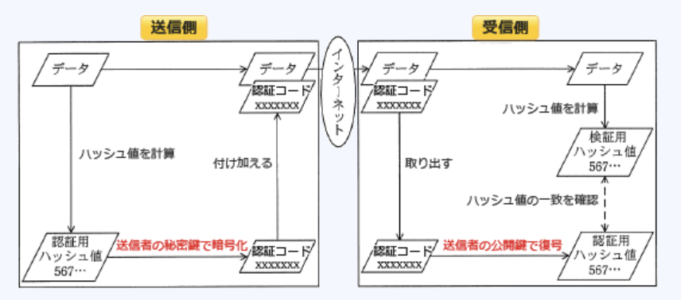
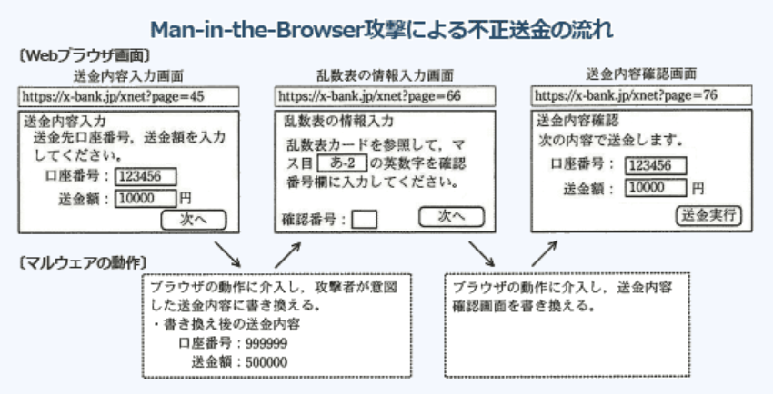

### 予想問題7

---
1.手順に示すクライアントとサーバの処理と通信で可能になること  
[手順]  
1.サーバはクライアントから要求があるたびに異なる予測困難な値(チャレンジ)を生成して保持するとともに、クライアントへ送る  
2.クライアントは利用者が入力したパスワードのメッセージダイジェストを計算し、1でサーバから送られた“チャレンジ”と合わせたものから、さらにメッセージダイジェスト(レスポンス)を計算する。この"レスポンス"と利用者が入力した利用者IDをサーバに送る  
3.サーバは、クライアントから受け取った利用者IDで利用者情報を検索して、取り出したパスワードのメッセージダイジェストと1で保持していた"チャレンジ"を合わせたものから、メッセージダイジェストを計算する(レスポンス照合データ)。この"レスポンス照合データ"とクライアントから受け取った"レスポンス"とを比較する

- A.**ネットワーク上でのパスワードの、漏洩防止とリプレイ攻撃の防御**  
チャレンジレスポンス方式は、秘密にしている固定パスワードをネットワーク中に流さないようにすることで、パスワードの盗聴・リプレイ攻撃を防止する仕組み。以下の利点がある  
・平文のパスワードがネットワークを流れることがない  
・ネットワークに送信されるレスポンスは、ハッシュ関数によって生成されたメッセージダイジェストなので盗聴されても元のパスワードを再現することが困難  
・サーバからクライアントに送信されるチャレンジは毎回異なるので、ある時点のレスポンスを保存して後から送信し直すことで不正な認証を試みるリプレイ攻撃が成功する可能性が非常に低い

---
3.セキュリティ関連のプロトコルに関する記述

- A.**SSL(*Secure Sockets Layer*)は、Webサーバとブラウザとの間でデータを暗号化して転送する場合に使用することができるプロトコルである**  
主にWebブラウザとWebサーバ間でデータを安全にやり取りするための業界標準プロトコルとして使用される

- IPsecは、PPPの認証用のプロトコルの1つである  
IPを拡張してセキュリティを高め、改竄の検知・通信データの暗号化・送信元の認証などの機能をOSI基本参照モデルのネットワーク層レベル(TCP / IPモデルのインターネット層)で提供するプロトコル

- PAP(*Password Authentication Protocol*)は、LAN間接続やダイヤルアップ接続を行う際のユーザー認証に、暗号を使用したプロトコルである  
CHAP(*Challenge Handshake Authentication Protocol*)とともに、PPPの認証で使用されるプロトコル

- PPP(*Point-to-Point Protocol*)は、暗号技術を導入してセキュリティを強化した電子メールシステムのプロトコルである  
電話回線を通じてコンピュータをネットワークに接続するダイヤルアップ接続でよく使われる、2点間を接続してデータ通信を行うための通信プロトコル

---
4.デジタルフォレンジックスでハッシュ値を利用する目的

- A.**証拠と原本との同一性を証明する**  
不正アクセスや情報漏洩などのセキュリティインシデントの発生時に、原因究明や法的根拠を明らかにするために対象となる電子的記録を収集・解析すること。ハッシュ関数は、長い文章やデータを固定長のビット列に圧縮する一方向性の関数で、ハッシュ値にデジタル署名を付けて、本人性と文書の真正性の証明に利用したり、証拠の保全・開示に広く利用されている

- 一方向性関数によってパスワードを変換して保存する  
パスワードは平文ではなくハッシュ値に変換して保存するのは盗聴や漏洩などにより第三者に知られても解読できないようにするための対策

- 改変された証拠を復元する  
ハッシュ関数は一方向性なのでハッシュ値から元のデータを復元はできない

- パスワードの盗聴の有無を検証する  
ハッシュ値には盗聴の有無を検知する仕組みはない

---
6.JIQ Q 2001:2001に規定されたリスク算定の定量的評価を、組織のセキュリティ対策の優先度を検討するリスク分析に適用したもの

- A.**被害が発生する確率と被害額で評価する**  
リスクの大きさを金額(数字)で表す評価手法。定性的評価はランク付けやレベルなどの金額以外で表す手法。被害想定を数字で表しているので定量的評価

- 過去に発生した被害件数と対策の難易度で評価する
- 攻撃に対する対処時間と被害の顕在性で評価する
- 攻撃もとの特定可否と攻撃手法の新しさで評価する  
いずれも定性的評価

---
7.ハッシュ関数を利用したメッセージ認証に関する記述

- **受信者は、ハッシュ関数を用いてメッセージからハッシュ値を生成し、送信者の公開かぎで復号したハッシュ値と比較する**  
1.送信者は、メッセージにハッシュ関数を適用してハッシュ値を生成する  
2.送信者は、`自分の秘密鍵で`ハッシュ値を暗号化しメッセージ認証コードを得る  
3.送信者は、メッセージと認証コードを合わせて受信者に送信する  
4.受信者は、送信者の公開鍵に付された認証局の公開鍵を用いて、正当性を確認する(`送信者の正当性を確認`)  
5.受信者は、`送信者の公開鍵`を用いてメッセージ認証コードを復号する  
6.受信者は、受け取ったメッセージに(送信者と同じ)ハッシュ関数を適用してハッシュ値を生成する  
7.受信者は、復号された認証コードと自分が生成したハッシュ値を比較し、同一であれば改竄がないと判断する(`改竄の検知`)

- 受信者は、送信者の公開かぎとハッシュ関数を用いてハッシュ値からメッセージを復号する  
ハッシュ値は一方向性の関数なので、ハッシュ値から元のメッセージは取得できない

- 送信者は、自分の公開かぎとハッシュ関数を用いてメッセージからハッシュ値を生成し、メッセージとともに送信する  
ハッシュ値の生成には送信者の秘密鍵を使用する

- 送信者は、ハッシュ関数を用いて送信者の秘密かぎのハッシュ値を生成し、メッセージとともに送信する  
ハッシュ値は元のメッセージをハッシュ化したもの

---
8.毎回参加者が変わる100名程度の公開セミナにおいて、参加者が持参する端末に対して無線LAN接続環境を提供する。参加者の端末以外からのアクセスポイントへの接続を防止するために効果があるセキュリティ対策

- A.**アクセスポイントがもつ暗号化機能において、参加者の端末とアクセスポイントとの間で事前に共有する鍵をセミナごとに変更する**  
無線LANにおいてはアクセスポイントと子機のもつ暗号化キーが一致した場合のみ通信を開始する。セミナ参加者の正規の端末にだけ正しい暗号化キーを設定することでアクセスポイントへの不正アクセスを遮断できる

- アクセスポイントがもつDHCPサーバ機能において、参加者の端末に対して動的に割り当てるIPアドレスの範囲をセミナごとに変更する  
参加者のものではない端末に対して、DHCPからIPアドレスが割り振られるのを防ぐことはできない

- アクセスポイントがもつURLフィルタリング機能において、参加者の端末に対する条件をセミナごとに変更する  
特定のWebサイトへのアクセスを遮断する機能。アクセスポイント自体への接続を拒否はできない

- アクセスポイントがもつプライバシーセパレータ機能において、参加者の端末へのアクセス制限をセミナごとに変更する  
同じアクセスポイントに接続している子機同士のアクセスを禁止する機能。アクセスポイント自体への接続は拒否できない

---
10.リスクマネジメントの実施内容

- A.**リスク分析では純粋リスクにとどめず、投機的リスクも対象にする**  
情報セキュリティのためのリスク分析では純粋リスクのみを対象としているが、経営主体の立場で行うリスク分析では投機的リスクも対象にする

- 将来の損失発生の危険性は不確実なものであり、対策費の予算ではなく損失額を見積もる  
リスクへの対応方法を判断するための情報として損失額、対策費の両方を見積もる必要がある

- 投機的リスクとは経営主体の管理外で発生するリスクなので、内在するリスクは管理対象外とする  
リスクマネジメントでは特質に関わらずあらゆる種類のリスクを管理対象とする

- リスクファイナンスでは、リスク分析、リスクコントロールなどのリスクマネジメントにかかる一切の費用の手当をする  
リスクファイナンスでは、リスクが顕在化した時の損失額や回復費用を他社に負担させる

---
12.VBScript(*Visual Basic Script*)で作られたコンピュータウイルスの特徴

- A.**HTML形式の電子メール本文などに埋め込まれたスクリプトによって動作する**  
プログラム言語*Visual Basic*の簡易版で*Microsoft Windows*上で動作するスクリプト言語。VBScriptで作られたコンピュータウイルスは、メール本文やWebページなどのHTML形式の文書に埋め込まれ、閲覧と同時に実行されるスクリプトによってコンピュータを感染させるという特徴を持っている

- 感染対象が実行形式ファイルであるか文書ファイルであるかにかかわらず、すべてのOSで動作する  
感染対象は*Microsoft Windows*がインストールされたコンピュータのみ

- 実行ファイルはなくワープロの文書ファイルなどに感染し、関連するアプリケーションソフトを利用して動作する  
マクロウイルスの特徴

- ブートセクタに感染して、通常のプロセス起動前にウイルスが呼び出されて動作する  
ブートセクタウイルスの特徴

---
13.JIS Q 31000:2010(リスクマネジメント - 原則及び指針)における、残留リスクの定義

- A.**リスク対応後に残るリスク**  
保有リスクとも呼ぶ

- 監査手続を実施しても監査人が重要な不備を発見できないリスク  
発見リスクの説明

- 業務の性質や本来有する特性から生じるリスク  
固有リスクの説明

- 利益を生む可能性に内在する損失発生の可能性として存在するリスク  
投機リスクの説明

---
14.JIS Q 27002における情報資産に対する脅威の説明

- A.**情報資産に害をもたらすおそれのある事象の原因**  
情報セキュリティマネジメントシステム(ISMS)を立ち上げ、実装し、運用するための情報セキュリティ管理に関するベストプラクティスを提供する。脅威(*threat*)は`システムまたは組織に損害を与える可能性があるインシデントの潜在的な原因`として定義している

- 情報資産に内在して、リスクを顕在化させる弱点  
脆弱性の説明

- リスク対策に費用をかけないでリスクを許容する選択  
リスク保有の説明

- リスク対策を適用しても解消しきれず残存するリスク  
残存リスクの説明

---
16.A社のWebサーバは、認証局で生成したWebサーバ用のデジタル証明書を使ってSSL / TLS通信を行っている。A社のWebサーバにSSL/TLSを用いてアクセスしたときのPCが、サーバのデジタル証明書を入手した後に、認証局の公開鍵を利用して行うもの

- A.**デジタル証明書の正当性を認証局の公開鍵を使って検証する**  
デジタル証明書は、公開鍵暗号方式の仕組みを利用し、公開鍵の正当性を証明するために第三者機関である認証局(CA)が発行する電子証明書。  
デジタル証明書の中には、通信を開始しようとする相手の公開鍵やそれに付随する情報などが含まれており、認証局のデジタル署名が付されている。利用者は認証局の公開鍵を使用してデジタル証明書に付されたデジタル署名を検証することで改竄の有無や公開鍵の正当性を確認する。  
SSL / TLSではその後、共通鍵を生成し、正当性を確認した公開鍵を使用して相手と共有する。そして実際の暗号化通信にはこの共通鍵が使用されるため公開鍵を用いた暗号化通信と比較して処理負荷が軽減されるようになっている

---
18.あるコンピュータセンターでは、インシデントを6タイプに分類した  
`Scan` : プローブ、スキャン、その他の不審なアクセス  
`Abuse` : サーバプログラムの機能を悪用した不正中継  
`Forged` : 送信ヘッダを詐称した電子メールの配送  
`Intrusion` : システムへの侵入  
`DoS` : サービス運用妨害につながる攻撃  
`Other` : その他  
この時、次の3つのインシデントに対するタイプの組み合わせ  
インシデント1 : ワームの攻撃が試みられた形跡があるが、侵入されていない  
インシデント2 : ネットワークの輻輳による妨害を受けた  
インシデント3 : DoS用の踏み台プログラムがシステムに設置されていた

- A.**インシデント1 : `Scan`**  
ネットワーク内部への侵入を許したわけではなく、サーバの機能を悪用した不正中継でもないので、不審なアクセスの項目に分類される

- A.**インシデント2 : `DoS`**  
ネットワークの混雑がひどくなるとサービス提供に支障をきたす可能性がある

- A.**インシデント3 : `Instruction`**  
不正なプログラムがシステムに設置されていたということは、システムへの侵入を許したことを示している

---
19.ISMS適合性評価制度における詳細管理策の基となった国際規格

- A.**ISO / IEC17799**  
情報セキュリティ対策を行う際の実践規範を記したもので、ベストプラクティスとして様々な管理策が記載されている。ISO / IEC17799 : 2000は、JIS X 5080 : 2002としてJIS化され、ISMS適合性評価制度におけるISMS認証基準のベースになった。その後JIS Q 27002としてJIS規格化されている

- ISO 9001  
組織の品質マネジメントシステムの要求事項を定めた国際標準規格

- ISO 14001  
組織の環境マネジメントシステムの要求事項を定めた国際標準規格

- ISO / IEC 15408  
情報技術の製品及びシステムのセキュリティ特性を評価するための標準を定めた国際規格

---
21.Webサーバにおいて、機密情報を記載したページが第三者に不正利用されることを防止するためのセキュリティ対策のうち、最も適切なもの

- A.**機密情報を記載したページでは、アクセス時に利用者認証を要求する**  
第三者の不正利用を防止するには、正当な権限をもつユーザのみに対して情報資産の利用を許可するような仕組みが実装されていることが重要。これ以外の対策だと攻撃者がWebサーバへのアクセスを困難にすることができるが、正当な権限を持たない者がアクセスできてしまう

---
23.クロスサイトスクリプティングの手口に該当するもの

- A.**攻撃者が用意したスクリプトを、閲覧者のWebブラウザを介して脆弱なWebサイトに送り込み、閲覧者のWebブラウザ上でスクリプトを実行させる**  
動的にWebページを生成するアプリケーションのセキュリティ上の不備を意図的に利用し、サイト間を横断して悪意のあるスクリプトを混入させることでユーザのクッキーを盗むなどの攻撃を行う行為。脆弱性のあるWebアプリケーションでは、以下の影響を受ける可能性がある  
1.サイト攻撃者のブラウザ上で、攻撃者の用意したスクリプトの実行によりクッキー値を盗まれ、利用者が被害にあう  
2.ブラウザ上でスクリプトを実行され、サイト利用者の権限でWebアプリケーションの機能を利用される  
3.Webサイト上に偽の入力フォームが表示され、フィッシングにより利用者が個人情報を盗まれる

- 攻撃者が、スクリプトを用いてWebサイトのOSコマンドを呼び出し、任意のファイルの読出しや変更・削除などの不正操作をする  
OSコマンドインジェクションの手口

- 攻撃者が、スクリプトを用いて特定のPCへ大量に接続要求を送り出し、通信機能を停止させる  
DoS攻撃の手口

- 攻撃者が用意したスクリプトでWebサイトのサービスポートに順次アクセスし、各ポートに対応するサービスに存在するセキュリティ上の弱点を探し出す  
ポートスキャンの手口

---
24.*Man-in-the-Browser*攻撃に該当するもの

- A.**PCに侵入したマルウェアが、利用者のインターネットバンキングへのログインを検知して、Webブラウザから送信される振込先などのデータを改竄する**  
ユーザPC内でプロキシとして動作するトロイの木馬によってWebブラウザ - Webサーバ間の送受信をブラウザベースで盗聴・改竄する攻撃。インターネットバンキングへのログインを検知して、セッションを乗っ取り、振込先口座番号を差し替えることで、預金を不正送金するなどの攻撃例がある。送受信を改竄する*Man-in-the-Middle*攻撃と異なり、クライアント内で書換えが行われるためWebサーバ側で不正処理を拒否することが難しい

- DNSサーバのキャッシュを不正に書き換えて、インターネットバンキングに見せかけた偽サイトをWebブラウザに表示させる  
DNSキャッシュッポイズニング攻撃に該当する

- インターネットバンキングから送信されたように見せかけた電子メールに偽サイトのURLを記載しておき、その偽サイトに接続させて、Webブラウザから口座番号やクレジットカード番号を入力させることで情報を盗み出す  
フィッシング攻撃に該当する

- インターネットバンキングの正規サイトに見せかけた中継サイトに接続させ、Webブラウザから入力された利用者IDとパスワードを正規サイトに転送し、利用者になりすましてログインする  
情報の搾取に中継サイトを使う*Man-in-the-Middle*攻撃(中間者攻撃)に該当する

---
26.利用者PCがボットに感染しているかどうかを*hosts*ファイルの改竄の有無で確認するとき、*hosts*ファイルが改竄されていないと判断できる設定内容はどれか。*hosts*ファイルには設定内容が1行だけ書かれており、利用者及びシステム管理者は、これまでに*hosts*ファイルを変更していないものとする

- A.**設定内容 : 127.0.0.1, 説明 : *localhost*は利用者PC自身を表す**  
*hosts*ファイルは、TCP / IPを利用するコンピュータにおいてIPアドレスとホスト名の対応を記述するファイル。*hosts*ファイルでは、`IPアドレス ホスト名`の形式で1つの行につき1つの対応を記述する  
IPアドレスの中で`127.0.0.1`は現在使用している自分自身のコンピュータ(*localhost*)を指定するローカル・ループバック・アドレスなので、`127.0.0.1`の対応ホストに*localhost*以外が設定されている場合は改竄が行われた可能性が高いと判断できる。  
Windows環境ではDNSの設定よりも*hosts*ファイルの設定が優先されるので、攻撃者により*hosts*ファイルが改竄されると不正なURLへ誘導されたり、攻撃の踏み台にされたりするなどの被害が発生する可能性がある

---
31.ICカードの情報の解読や偽造に対して、物理的に情報を保護するために機能を示すもの

- A.**耐タンパ性**  
ハードウェアやソフトウェアのセキュリティレベルを表す指標で、外部からの物理的接触により機器内部の構造を不当に解析・改変したり、重要データを取り出そうとする行為に対してどの程度の体制を有するか表す

- SECE(*Secure Electronic Commerce Environment*)  
オンライン決済の通信を行う際の国際標準的プロトコルであるSET(*Secure Electronics Transaction*)を日本独自に拡張したプロトコル

- インターロック  
誤操作や確認不足から機器に生じる誤作動を防止する安全機構。すべての扉が閉まっていなければ機械が動作を開始しない仕組みにする、などが例

- インボリューション  
共通鍵暗号のブロック暗号方式において、解読されにくい暗号文を生成するためのデータランダム化のテクニック

---
33.ビヘイビア法のウイルス検査手法に当たるもの

- A.**検査対象をメモリ上の仮想環境下で実行して、その挙動を監視する**  
ウイルスの実際の感染・発病動作を監視して検出する手法。感染・発病動作として書込み・複製・破壊動作等の動作そのものの異常を検知する場合だけでなく、感染・発病動作によって起こる環境の様々な変化を検知することによる場合も、この手法に分類される。例外ポート通信・不完パケット・通信量の異常増加・エラー量の異常増加、送信時データと受信時データの量的変化・質的変化等がそれに該当する

- あらかじめ検査対象に付加された、ウイルスに感染していないことを保証する情報と、検査対象から算出した情報とを比較する  
チェックサム法 / インテグリティチェック法の説明

- 検査対象と安全な場所に保管してあるその原本とを比較する  
コンペア法の説明

- 検査対象のハッシュ値と既知のウイルスファイルのハッシュ値とを比較する  
ハッシュ値を使用した検出手法

---
34.クロスサイトスクリプティングによる攻撃へのセキュリティ対策

- A.**Webアプリケーションで、クライアントに入力データを再表示する場合、情報内のスクリプトを無効にする処理を行う**  
動的にWebページを生成するアプリケーションのセキュリティ上の不備を意図的に利用し、サイト間を横断して悪意のあるスクリプトを混入させることでユーザのクッキーを盗むなどの攻撃を行う行為。ユーザからの入力データ内に含まれる引用符やHTMLタグを無効にせずにそのまま表示してしまうことが原因で生じるので、出力時にHTMLの特殊文字を適切にエスケープ(無効化)することで防ぐことが可能

---
35.完全一致によるパターンマッチング方式のウイルス対策ソフトは、ウイルス単体の特徴あるコード列を照合に用いる。コード列の長さと検出の関係

- A.**コード列が短いほど、正常なプログラムを誤検出する可能性が高くなる**  
コンピュータウイルスやワームを検出するための代表的な方式で、そのウイルスが持つ特徴的なコードをパターン(シグネチャコード | ウイルス定義ファイル)として検査対象のファイルを比較することでウイルスの検出を試みる。検出できるウイルスはパターンファイルに定義されているものに限るので、定義されていないものや亜種が作られるもの、未知のウイルスなどを検出するのは困難。パターンのコード列が短いとウイルスの亜種を検出できる可能性は上がるが誤報が多く、コード列が長いと誤報は少なくなるが、亜種や未知のウイルスを検出することが困難になる

---
37.SSLの利用に関する記述

- A.**SSLで使用する個人認証用のデジタル証明書は、ICカードなどに格納できるので、格納場所を特定のPCに限定する必要はない**  
通信の暗号化・デジタル証明書を利用した改竄検出・ノード認証を含む統合セキュアプロトコル。主にWebブラウザとWebサーバ間でデータを安全にやり取りするための業界標準プロトコルとして使用されている。  
デジタル証明書の内容はデジタルデータなので様々な媒体に格納できる。個人認証用デジタル証明書は電子証明書と呼ばれ、公的認証サービスなどを利用すると電子証明書が記録されたICカードの発行を受けることができる

- SSLは特定利用者間の通信のために開発されたプロトコルであり、Webサーバ提供者への事前の利用者登録が不可欠である  
インターネット上で安全に情報をやり取りするために開発されたプロトコルで、事前の利用者登録は不要

- デジタル証明書にはIPアドレスが組み込まれているので、SSLを利用するWebサーバのIPアドレスを変更する場合は、デジタル証明書を再度取得する必要がある  
証明書が有効なサーバ(コモンネーム)を記述するのにIPアドレスだけでなくFQDNも使用できる。FQDNで指定した場合にはIPアドレスが変わっても再発行は不要

- 日本国内では、SSLで使用する共通鍵の長さは、128ビット未満に制限されている  
SSLでは鍵帳40 - 256ビットの共通鍵で暗号化通信を行う。国内においても256ビットまでの鍵帳を制限なく選択できる

---
39.サーバへのログイン時に用いるパスワードを不正に取得しようとする攻撃とその対策の組み合わせ

- A.辞書攻撃 : **ランダムな値でパスワードを設定する**  
辞書に載っている英単語、人名、パスワードによく使われる文字列などを大量にとろくしたリスト(辞書ファイル)を用意して、1つずつ試すことでパスワードの解読を試みる攻撃手法

- A.スニッフィング : **パスワードを平文で送信しない**  
通信経路上を流れるパケットを盗聴して、内容からパスワードの不正取得を試みる攻撃手法

- A.ブルートフォース攻撃 : **ログインの試行回数に制限を設ける**  
パスワードとして設定可能な文字数と文字種の組み合わせを全て試すことで、パスワードの不正取得を試みる攻撃手法。パスワード帳が長く、使用可能な文字種が少ない場合、この手法で破られる可能性が高くなってしまう

---
40.サーバにバックドアを作り、サーバ内で侵入の痕跡を隠蔽するなどの機能がパッケージ化された不正なプログラムやツール

- A.***rootkit***
攻撃者がシステムへ不正侵入した後に侵入した痕跡を隠蔽したり、再侵入するためのバックドアを設置するための機能をまとめたソフトウェア群。存在を検知されないようにしたり特定の操作をさせない権限を自身に付与する機能があり、組み込まれたコンピュータは第三者に乗っ取られる危険性が高くなる

- RFID(*Radio Frequency IDentification*)  
ID情報を埋め込んだRFタグ(ICタグ)から電磁界や電波を用いて情報のやり取りを行う技術で、ICカードなどで使用されている

- TKIP(*Temporal Key Integrity Protocol*)  
無線ネットワーク規格で使われているセキュリティプロトコル。使用する鍵を一定時間ごとに更新することで暗号解読に対する耐性を高めた方式

- *web beacon*  
Webページに埋め込んだ見えないほどの小さな画像のことで、ユーザの利用環境や滞在時間・ページ遷移などの情報を得るために設置される。情報の多くはアクセス解析などのために使用される

---
42.Webアプリケーションにおけるセキュリティ上の脅威と対策の適切な組み合わせ

- A.**SQLインジェクションを防ぐために、Webアプリケーション内でデータベースへの問い合わせを作成する際にバインド機構を使用する**  
バインド機構は、変数部分にプレースホールダと呼ばれる特殊文字を使用したSQLの雛形を用意し、ユーザからの入力値を変数に割り当てて最終的なSQL文とする仕組み。ユーザからの入力値は文字列または変数として扱われるため、SQLインジェクションを狙った文字が含まれていたとしてもエスケープ処理され単なる文字列として認識されるため安全性が高まる。  
SQLインジェクションは、入力データとしてDBへの命令分を構成するデータを入力し、Webアプリケーションが想定していないSQL文を意図的に実行させることでDBを攻撃する手法

- OSコマンドインジェクションを防ぐために、Webアプリケーションが発行するセッションIDを推測困難なものにする  
セッションハイジャックを防ぐための対策。  
OSコマンドインジェクションは、ユーザの入力をもとにOSのコマンドを実行して処理を行うWebアプリケーションに対して、不正なコマンドを渡すことで任意のファイルに対する読出し・変更・削除・パスワード取得などを行う攻撃手法。OSコマンドの呼び出しに使われる関数は、C, Perl, PHPなどの`exec`, `system`、入力値としてコマンドを許しているPerlの`open間数`などがある

- クロスサイトスクリプティングを防ぐために、外部から渡す入力データをWebサーバ内のファイル名として直接指定しない  
ディレクトリトラバーサル攻撃を防ぐための対策。  
クロスサイトスクリプティングは、動的にWebページを生成するアプリケーションのセキュリティ上の不備を意図的に利用し、サイト間を横断して悪意のあるスクリプトを混入させることで、ユーザのクッキーを盗むなどの攻撃を行う手法

- セッションハイジャックを防ぐために、Webアプリケーションからシェルを起動できないようにする  
OSコマンドインジェクションを防ぐための対策。  
セッションハイジャックは、認証が完了してセッションを開始しているブラウザとWebサーバ間の通信において、*Cookie*やセッションIDなどの情報を盗むことで、対象セッションを通信当事者以外が乗っ取る攻撃手法

---
43.ファイアウォールの方式に関する記述

- A.**アプリケーションゲートウェイ方式では、アプリケーションのプロトコルごとにゲートウェイ機能の設定が必要である**  
`アプリケーション層レベルでコネクションを中継する`ため、HTTP, FTP, SMTPなどアプリケーションプログラムごとに別々の中継プログラムを用意する必要がある

- サーキットゲートウェイ方式では、コマンドの通過可否を制御する  
`ペイロード部をチェックしない`ためアプリケーション層レベルの情報であるコマンドによるフィルタリングには対応していない

- トランスポートゲートウェイ方式では、アプリケーションのプロトコルに依存するゲートウェイ機能を提供する  
`トランスポート層レベルでコネクションを中継する`ため、アプリケーションプログラムの形式には依存しない

- パケットフィルタリング方式では、電子メールの中に含まれている単語によるフィルタリングが可能である  
パケットのヘッダ部の内容に基づいてフィルタリングを行う方式。`電子メールの内容はパケットのペイロード部に格納されている`ため、パケットフィルタリングでは内容をチェックできない

---
44.SSHの説明

- A.**リモートログインやリモートファイルコピーのセキュリティを強化したツール及びプロトコル**  
公開鍵暗号や認証の技術を利用して、安全にリモートコンピュータと通信するためのプロトコルで、SSLと同様にトランスポート層とアプリケーション層で通信を暗号化する。rlogin、rshやtelnetを安全に利用する手段だったが、ポートフォワーディング機能(ローカルの任意のポートに送信したデータをリモートの特定のポートへ転送する)によって`POP3`や`FTP`などネットワーク上に平文のパスワードが流れてしまう既存のプロトコルを安全に利用する技術として利用されている

- MIMEを拡張した電子メールの暗号化とデジタル署名に関する標準  
S / MIME(*Secure Multipurpose Internal Mail Extensions*)の説明

- オンラインショッピングで安全にクレジット決済を行うための仕様  
SET(*Secure Electronic Transaction*)の説明

- 対称暗号技術と非対称暗号技術を併用して電子メールの暗号化、復号の機能をもつツール  
PGP(*Pretty Good Privacy*)の説明

---
45.SMTP - AUTHにおける認証の動作

- A.**SMTPサーバは、クライアントがアクセスしてきた場合に利用者認証を行い、認証が成功したとき電子メールを受け付ける**  
メール投稿にあたってユーザ認証の仕組みがないSMTPにユーザー認証機能を追加した方式。メールサーバとクライアントの双方が対応していなければならず、メールを送信するときに「ユーザ名とパスワード」「チャレンジレスポンス」などで認証を行い、認証されたユーザのみからのメール送信を許可することで不正な送信要求を遮断することができる

- サーバは認証局のデジタル証明書をもち、クライアントから送信された認証局の署名付きクライアント証明書の妥当性を確認する  
*SMTP over SSL*(TLS)によるサーバ / クライアントの相互認証

- 電子メールを受信した際にパスワード認証が成功したクライアントのIPアドレスは、一定時間だけSMTPサーバへの電子メールの送信が許可される  
*POP before SMTP*による認証動作

- パスワードを秘匿するために、パスワードからハッシュ値を計算して、その値で利用者が電子メールを受信する際の利用者認証を行う  
APOP(*Authenticated POP*)による認証動作

---
47.重要情報の取扱いを委託する場合における、委託元の情報せキュリティ管理

- A.**情報の安全管理に必要な事項を事前に確認し、それらの事項を盛り込んだ上で委託先との契約書を取り交わす**  
JIS Q 27001 : 2014では、「組織の資産に対する供給者のアクセスに関連するリスクを軽減するための情報セキュリティ要求事項について、供給者ち合意し、文書化しなければならない」としている。委託元組織は、委託先による組織の情報へのアクセスに具体的に対処するため、適切な情報セキュリティ管理策を定め、委託先に義務付けることが重要

- 委託先が再委託を行うかどうかは委託先の判断に委ね、事前報告も不要とする  
重要情報にアクセスする組織や要因の範囲が変更される場合、委託元の許可を得る様な手順を定めるべき

- 委託先の情報セキュリティ対策が確認できない場合は、短期間の業務に限定して委託する  
情報セキュリティの要求事項について委託先と合意できない場合は契約すべきではない

- 委託先の情報セキュリティ対策が適切かどうかは、契約開始前ではなく契約終了時に評価する  
誤解がないことを確実にするため、情報セキュリティ対策の評価は契約開始前に行うべき

---
セキュリティ対策の`予防`に該当するもの

- A.**セキュリティに関する社内教育を実施し、個人の意識を高める**  
物理的環境・人・情報システムなどの脆弱な部分に対して、事前にセキュリティ対策を行うことで被害が発生しにくい強固な状態を作り出すこと

- アクセスログをチェックし、不正なアクセスがないかどうかを監視する  
以上を検知し被害を最小限に抑える対策なので、セキュリティ対策の`検知・追跡`に該当する

- コンティンジェンシープランを策定し、訓練を実施する
- 重要ファイルのバックアップ処理を定期的に行う  
被害発生時に正常な状態に復旧させるための対策なので、セキュリティ対策の`回復`に該当する

---
50.以下の手順の処理を行った時、検証できること  
1.送信者Aはファイルのハッシュ値を計算して、信頼できる第三者機関に送信する  
2.第三者機関は、信頼できる日時を保持しており、受信したハッシュ値とその受信日時を結合し(結合データ)、そのデジタル署名を生成し、デジタル署名と結合データの組(デジタル署名済みの結合データ)を送信者Aに返信する  
3.送信者Aはファイルと第三者機関から送られてきたデジタル署名済みの結合データを受信者Bに送信する  
4.受信者Bは第三者機関のデジタル署名を確認し、ファイルから計算したハッシュ値と、デジタル署名済みの結合データから取り出されたハッシュ値を照合する。そして、結合データから取り出された日時を確認する

- A.**当該日時にファイルが存在し、それ以降改竄されていないこと**  
タイムスタンプの仕組みの説明。対象とする電子文書に対して、信頼できる第三者機関である時刻認証局(*Time Stamp Authority*)が発行する時刻情報を含んだ電子データ。付与時点での`存在性`と、その時刻以後の`完全性を証明する`ことを目的としている。  
結合データに付されたデジタル署名が正当なものであるということは、結合データが第三者機関によって作成され、改竄されていないことを意味するため、結合データ内のハッシュ値に対応するファイルがその日時に存在し、その日時以降に改竄されていないことが証明される。  
タイムビジネス推進協議会ガイドラインではタイムスタンプを「特定の電子情報と時刻情報を結合する事により、その時刻以前にその電子データが存在していたことの証明(存在証明)とその時刻までの間にその電子情報が変更・改竄されていないことの証明(非改竄証明)することができる手段、およびその証拠に結びつく情報」と定義している
