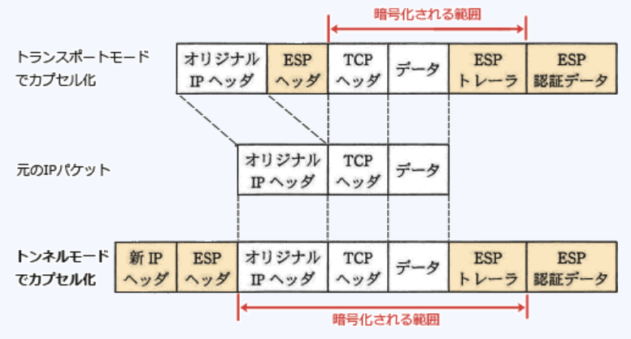
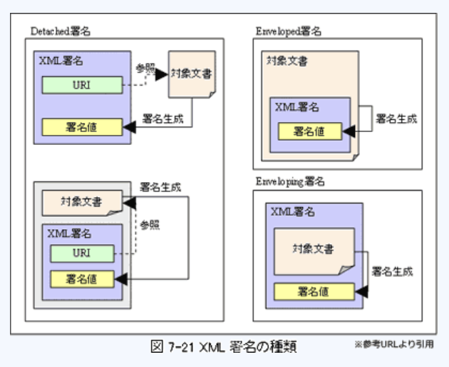
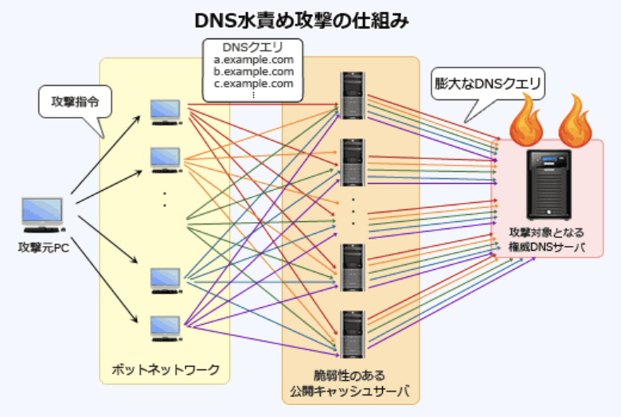
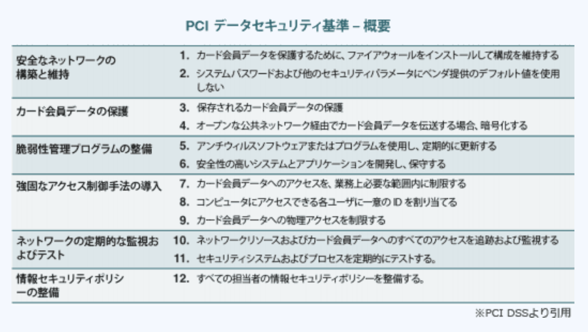

### 予想問題10

---
2.OAuth2.0において、WebサービスAの利用者Cが、WebサービスBにリソースDを所有している。利用者Cの承認の下、WebサービスAが、リソースDへの限定的なアクセス権限を取得するときのプロトコルOAuth2.0の動作

- **WebサービスBが、アクセストークンを発行する**  
異なるドメインやプラットフォーム間で、サードパーティアプリケーションによるHTTPサービスへの限定的なアクセスを可能にするオープンな認可フレームワーム。Webサイトにおいて、SNSアカウントでログインする方法で用いられる。  
ユーザ本人の認可の下、サードパーティアプリケーションに対してWebサービス側からアクセストークン(委任状のようなもの)が発行され、サードパーティアプリケーションがユーザに代わりそれを使用して、Webサービス(API)にアクセスできるようにする仕組み。3種類のロールがある  
*Resource owner* : リソースサーバ内の保護されたじょうお方へのアクセスを許可するエンドユーザで、クライアントの利用者。利用者Cが該当する  
*resource server* : 保護された情報を保持し、Webサービスを提供するアプリケーションのこと。リソースオーナを認証し、クライアントにアクセストークンを発行する認可サーバ(*authorization server*)の役割を兼ねることが多い。WebサービスBが該当する  
*client* : リソースオーナの認可を得てリソースサーバにアクセスするサードパーティアプリケーションのこと。WebサービスAが該当する  
1.利用者Cが、WebサービスAにアクセスする  
2.WebサービスAは、利用者CをWebサービスBにリダイレクトし、認証・認可手続きを促す  
3.**WebサービスBは、利用者Cの認証に成功すると、WebサービスAに対してアクセストークンを発行する**  
4.WebサービスAは、アクセストークンなどを含めたHTPリクエストをWebサービスBに送信する  
5.WebサービスBは、HTTPリクエストが正当なものであるか検証し、妥当であればリソースDを含むHTTPレスポンスをWebサービスAに返す

---
3.迷惑メールの検知手法であるベイジアンフィルタリングの説明

- A.**利用者が振り分けた迷惑メールから特徴を学習し、迷惑メールであるかどうかを統計的に解析して判定する**  
ユーザが迷惑メールに指定した電子メールの特徴を解析し、学習した内容と同等の迷惑メールを受信した時は、迷惑メールとして分類するフィルタリング。フィルタが振り分けを間違えた場合にはユーザがただいい判定をし直すことで記憶されている学習内容を更新でき、学習量が増えるほど検出制度が増す自己学習機能を備えている

- 信頼できるメール送信元を許可リストに登録しておき、許可リストにない送信元からの電子メールは迷惑メールと判定する  
ホワイトリストによる対策

- 電子メールが正規のメールサーバから送信されていることを検証し、迷惑メールであるかどうかを判定する  
SPFやDKIMによる対策

- 電子メールの第三者中継を許可しているメールサーバを登録したデータベースに掲載されている情報を基に、迷惑メールであるかどうかを判定する  
迷惑メールの発信・中継元のIPアドレスをまとめたRBL(*Realtime Blackhole List*)による対策

---
4.メールサーバ(SMTPサーバ)の不正利用を防止するために行う設定

- A.**第三者中継を禁止する**  
SMTPを使用した一部のメールサーバソフトウェアは、誰からのメールでも受け付ける初期設定になっており、当紅茶を認証する仕組みがないためネットワーク外の第三者から別の第三者へのメールを不制限に受け付け中継してしまう。第三者中継を禁止することで、迷惑メールの発信者などの不正利用からメールサーバを防ぐことができる

- ゾーン転送のアクセス元を制御する  
不正なゾーン転送を防ぐためにプライマリDNSサーバに行う設定

- ディレクトリに存在するファイル名の表示を禁止する  
Webサーバでディレクトリにアクセスした時にファイルの一覧が表示されてしまうのを防ぐための対策

- 特定のディレクトリ以外でのCGIプログラムの実行を禁止する  
Webサーバに行うパーミッション(アクセス権)の設定の説明

---
5.リモートアクセス環境において、認証情報やアカウンティング情報をやり取りするプロトコル

- A.**RADIUS**(*Remote Authentication Dial In User Service*)  
認証・利用ログの記録を単一のサーバに一元化することを目的としたプロトコル。常時接続方式のインターネット接続サービス・無線LAN・VLAN・コンテンツ提供サービスなどのサービス提供側設備において、認証とアカウンティング(利用事実の記録)を実現するプロトコルとして広く利用されている

- CHAP(*Challenge Handshake Authentication Protocol*)  
PPPで利用できる認証プロトコルで、チャレンジレスポンス方式で認証を受ける方式。認証情報をやり取りするが、アカウンティング情報に関しては規定されていない

- PAP(*Password Authentication Protocol*)  
PPPで利用できる認証プロトコルで、IDとパスワードを平文で送って認証を受ける方式。CHAPと同様に認証情報をやり取りするが、アカウンティング情報に関しては規定されていない

- PPTP(*Point - to - Point Tunneling Protocol*)  
PPPパケットをIPデータグラムでカプセル化してVPNを作り出す技術

---
6.作成者によってデジタル署名された電子文書に、タイムスタンプ機関がタイムスタンプを付与した。この電子文書を公開する場合のタイムスタンプの効果

- A.**電子文書が、タイムスタンプの時刻以前に存在したことを示すことによって、作成者が電子文書の作成を否認することを防止する**  
対象とする電子文書に対して、信頼できる第三者機関である時刻認証局(*Time Stamp Authority*)が発行する時刻情報を含んだ電子データ。付与時点での`存在性`とその時刻以後の`完全性`を証明することを目的としている

- タイムスタンプを付与した時刻以降に、作成者が電子文書の内容をほかの電子文書へコピーして流用することを防止する
- タイムスタンプを付与した時刻以降に、第三者が電子文書の内容をほかの電子文書へコピーして流用することを防止する  
電子文書の複製は防止できない

- 電子文書が、タイムスタンプの時刻以前に存在したことを示すことによって、第三者が電子文書を改ざんすることを防止する  
改竄の防止ではなく、改竄の有無を検知する

---
8.IPv4におけるIPsecのデータ形式を示している。ESPトンネルモードの電文中で、暗号化される箇所  
`新IPヘッダ | ESPヘッダ | オリジナルヘッダ | TCPヘッダ | データ | ESPトレーラ | ESP認証データ`

- A.**オリジナルIPヘッダからESPトレーラまで**  
ESP(*Encapsulating Security Payload*)は、IPsecにおいてペイロード部を暗号化するためのプロトコル。IPsecでは、トランスポートモードとトンネルモードの2つの通信モードがあり、トンネルモードでは元のIPパケットの先頭に新しいIPヘッダとESPヘッダを付加してカプセル化したパケットをIPsec対応機器同士でやり取りする方式。  
**新IPヘッダ・ESPヘッダ・ESPトレーラ・ESP認証データ**はカプセル化によって追加された情報。基本的には元のIPパケットが暗号化の対象だが、暗号処理をする際に暗号化アルゴリズムに求められるバイト長を満たすためのパディングをデータに付加しなくてはならない場合がある。このパディング部分がESPトレーラで、暗号化は元のIPパケットにESPトレーラを含めた部分を対象に行われる

---
9.ISP"A"管理下のネットワークから別のISP"B"管理下の宛先へSMTPで電子メールを送信する。電子メール送信者がSMTP - AUTHを利用していない場合、スパムメール対策OP25B(*Outbound Port 25 Blocking*)によって遮断される電子メール

- A.**ISP"A"管理下の動的IPアドレスからISP"A"のメールサーバを経由せずに送信された電子メール**  
外向き(インターネット方向)のポート25番宛(SMTP)パケットを遮断することでスパムメールを防ぐ仕組み。ISP管理下の動的IPアドレスからの電子メール送信について、管理外ネットワークのメールサーバへSMTP通信を禁止することで、ISPのメールサーバを介さずに送信側のメールサーバと直接コネクションを確立して送信されるスパムメールを防ぐ。OP25Bでは、動的IPアドレスからの送信である、ISPのメールサーバを経由しない、の2条件を満たした場合のみTCP / 25宛のパケットを遮断する。ISPのメールサーバを経由しない場合であっても、固定IPからの送信、SMTP - AUTHで認証済ノードからの送信についてはOP25Bの影響を受けない

---
11.XMLデジタル署名の特徴

- A.**XML文書中の、指定したエレメントに対して署名することができる**  
署名の対象として任意のデータファイルやXML文書全体だけでなく、XML文書の一部を対象とすることもできる。デジタル署名と同様に完全性・認証・否認防止などのセキュリティ機能を提供する。署名要素と署名対象要素の関係によって、デタッチ署名・エンベロープ署名・エンベローピング署名に分かれる

- エンベローピング署名(Enveloping Signature)では一つの署名対象に必ず複数の署名を付ける  
署名要素の中に対象文書が格納されるので複数の署名を付することができない。複数の署名を付するのに適するのはエンベロープ署名

- 署名形式として、CMS(*Cryptographic Message Syntax*)を用いる  
XML署名として標準化された形式を用いる。CMSはインターネット標準として標準化されている電子署名の形式で、デジタル署名で使用される

- 署名対象と署名アルゴリズムをASN . 1によって記述する  
署名対象と署名アルゴリズムはXML構文で記述する。ASN . 1はプロトコル規定するために使われるデータ構造の定義言語で、デジタル署名で使用される

---
12.VLAN機能をもった1台のレイヤ3スイッチに複数のPCを接続している。スイッチのポートをグループ化して複数のセグメントに分けると、セグメントを分けない場合に比べて、どのようなセキュリティ上の効果が得られるか

- A.**スイッチが、PCからのブロードキャストパケットの到達範囲を制限するので、アドレス情報の不要な流出のリスクを低減できる**  
スイッチに接続された端末を物理的な構成に関係なくグループ化する機能、またはその機能で形成されたネットワーク。セグメントの分割を基準に幾つかの方式がある  
`ポートベースVLAN` : スイッチの接続ポート単位でグルーピング  
`アドレスベースVLAN` : MACアドレスやIPアドレスを基準にグルーピング  
`ポリシーベースVLAN` : IP, IPX, AppleTalkなどのネットワークプロトコルごとにグルーピング  
`タグVLAN` : パケット内の拡張タグに指定された情報によってグルーピング  
通常は同じスイッチに接続されているPCは同じブロードキャストドメインに属しているが、VLAN同士は異なるセグメントとして扱われるため直接の通信ができない。ブロードキャストパケットの到達範囲は同じVLANのみに限定されることになり、内部情報が異なるVLANへ流出するのを防止するセキュリティ効果が期待できる

- スイッチが、PCから送出されるICMPパケットを全て遮断するので、PC間のマルウェア感染のリスクを低減できる  
ICMPパケットはインターネット層(ネットワーク層)で動作する。PCはレイヤ3スイッチで接続されているので、ICMPパケットはレイヤ3スイッチの内部ルータを介して異なるVLAN同士に伝達される

- スイッチが、PCのMACアドレスから接続可否を判別するので、PCの不正接続のリスクを低減できる
- スイッチが、物理ポートごとに、決まったIPアドレスのPC接続だけを許可するので、PCの不正接続のリスクを低減できる  
アドレスベースVLANにおけるセキュリティ効果。ポートベースVLANでは、アドレス情報をセグメント分割の判断基準に使用しない

---
16.ダウンローダ型マルウェアが内部ネットワークのPCに感染したとき、そのマルウェアによってインターネット経由で他のマルウェアがダウンロードされることを防ぐ対策として、最も有効なもの

- A.**URLフィルタを用いてインターネット上の危険なWebサイトへの接続を遮断する**  
Webアクセスに対してフィルタリングを行う怪しいサイトへの接続を遮断することで、さらなるウイルスのダウンロードを防止できる。  
感染したコンピュータのユーザに気付かないようにインターネット上の悪意のあるWebサイトに接続し、他のマルウェアをダウンロードして感染を拡散させるタイプのウイルス。ダウンロードの際のHTTPセッションは、組織内部の感染したPCから通常のインターネットアクセスと同じようにWeb上のサーバに対して確立され、そのセッションのレスポンスとしてウイルスがダウンロードされる流れになるため、ファイアウォールで善悪を区別して遮断することは困難

- インターネットから内部ネットワークに向けた要求パケットによる不正侵入行為をIPSで破棄する  
ワームのダウンロード要求は内部から外部向けに行われる。内部向けのパケットは、そのリクエストに対する応答パケットになるため効果がない

- スパムメール対策サーバでインターネットからのスパムメールを拒否する
- メールフィルタで他サイトへの不正メール発信を遮断する  
メールを介してダウンロードされるわけではないため、メールの拒否だけでは対策として不十分

---
17.暗号化や認証機能を持ち、遠隔にあるコンピュータを操作する機能をもったもの

- A.**SSH**(*Secure SHell*)  
公開鍵暗号や認証の技術を利用して、安全にリモートコンピュータと通信するためのプロトコル。ネットワークを介して遠隔地のコンピュータを操作するrloginやrshなどのUNIX系コマンドやtelnetなどを安全に利用するための方式。ポートフォワーディング機能を使って、FTP, POP, SMTPなどの暗号化機能をもたないプロトコルを安全に利用する手段としても使用されている

- IPsec(*Security Architecture for IP*)  
IPを拡張してセキュリティを高め、改竄の検知・通信データの暗号化・送信元の認証などの機能をOSI基本参照モデルのネットワーク層レベル(TCP / IPモデルのインターネット層)で提供するプロトコル

- L2TP(*Layer 2 Tunneling Protocol*)  
OSI参照モデルの第2層におけるトンネリングプロトコル。暗号化の機能はないため必要に応じてIPsecと併用する必要がある

- RADIUS(*Remote Authentication Dial In User Service*)  
認証・利用ログの記録を単一のサーバに一元化することを目的としたプロトコル

---
18.DNSの再帰的な問合せを使ったサービス不能攻撃(*DNS amp*)の踏み台にされることを防止する対策

- A.**DNSキャッシュサーバとコンテンツサーバに分離し、インターネット側からDNSキャッシュサーバに問合せできないようにする**  
脆弱性のある公開DNSキャッシュサーバを踏み台として悪用することで行われる分散型サービス妨害型(DDoS)攻撃の一種。DNS amp攻撃に加担する踏み台にならないためには、利用可能なホストのIPアドレスの範囲を設定するなど、DNSキャッシュサーバが不要なクエリを拒否するようにアクセス制限を施す必要がある  
1.攻撃者は、脆弱性のある複数の公開DNSキャッシュサーバに対して、送信元を攻撃対象としたDNSクエリをボットを介して発行する(このとき応答パケットのサイズができるだけ多くなるようにする)  
2.クエリを受け取ったDNSキャッシュサーバは、クエリの送信元に設定されている攻撃対象に対して応答パケットを一斉に送信する  
3.大量の応答パケットを受け取った攻撃対象やそれが属するネットワークは過負荷状態となり正常なサービスの提供ができなくなる

---
19.2011年に経済産業省が公表した"クラウドサービス利用のための情報セキュリティマネジメントガイドライン"が策定された目的

- A.**JIS Q 27002の管理策を補完し、クラウドサービス利用者が情報セキュリティ対策を円滑に行えるようにする**  
`クラウド利用者`が、経済産業省により策定されたガイドラインで、クラウドサービス利用の際に情報セキュリティ対策の観点から活用することを企図して策定されたもの。クラウド利用者がクラウドサービスを全面的に利用する際の以下の事項について記載されている  
・クラウド利用者自ら行うべきこと  
・クラウド事業者に対して求める必要のあること  
・クラウドコンピューティング環境における情報セキュリティマネジメントの仕組み  
情報セキュリティマネジメントシステムの実践規範であるJIS Q 27002の管理策に「クラウド利用者のための実施の手引」と「クラウド事業者の実施が望まれる事項」を追加している

---
20.サイドチャネル攻撃の手法であるタイミング攻撃の対策

- A.**演算アルゴリズムに対策を施して、演算内容による処理時間の差異が出ないようにする**  
対象の動作を観察し、漏洩電磁波・電力消費等のサイドチャネル情報から暗号鍵推定等を行う非破壊型攻撃の総称。故障利用攻撃・タイミング攻撃・電力解析攻撃・電磁波解析攻撃などがある。  
タイミング攻撃では、暗号処理のタイミングが暗号鍵の論理値に依存して変化することに着目し、暗号化や復号に要する時間の差異を統計的に解析して暗号鍵を推定する手法。暗号アルゴリズムの実装方法に対する攻撃方法なので、次のような対策が有効  
・全ての演算がデータによらず一定時間で終わるようにする  
・時間計測を正確に行えないようにする  
・ブラインド署名のアルゴリズムの応用

- 故障を検出する機構を設けて、検出したら機密情報を破棄する  
故障利用攻撃(フォルトアタック)への対策

- コンデンサを挿入して、電力消費量が時間的に均一となるようにする  
電力解析攻撃への対策

- 保護層を備えて、内部のデータが不正に書き換えられないようにする  
破壊を伴う攻撃への対策

---
24.米国NISTが制定した、AES(*Advanced Encryption Standard*)における鍵長の条件

- A.**128, 192, 256ビットから選択する**  
米国の次世代暗号方式として規格化された共通鍵暗号方式。ブロックと呼ばれる固定長のデータを単位として扱うブロック暗号に分類され、ブロック長は128ビット

---
26.IPsecのAH(*Authentication Header*)に関する説明

- A.**データの暗号化は行わず、SPI, シーケンス番号, 認証データを用い、完全性の確保と認証を行う**  
IPsecにおいて通信データの認証のために使用されるプロトコルで暗号化の機能はない。AHヘッダに含まれるパラメータは以下の通り  
`SPI(セキュリティパラメータインデックス)` : データを通信するためのコネクションであるIPsecSAを識別するのに使用される情報  
`シーケンス番号` : リプレイアタックを防止するために各パケットごとに付与される順序番号  
`認証データ` : IPヘッダも含めたパケット全体の完全性をチェックするデータで、HMACを用いて生成される

---
30.AES(*Advanced Encryption Standard*)の暗号化方式を説明したもの

- A.**鍵長によって、段数が決まる**  
米国の次世代暗号方式として規格化された共通鍵暗号方式。ブロックと呼ばれる固定長のデータを単位として扱うブロック暗号に分類され、ブロック長は128, 192, 256ビットから選択が可能。段数(ラウンド数)は鍵長によって10, 12, 14段の3種類に変化する

- 段数は、6回以内の範囲で選択できる  
10段以上

- データの暗号化・復号・暗号化の順に3回繰り返す  
暗号化の際には段数の分だけ暗号化処理を繰り返し、複合処理は行われない

- 同一の公開鍵を用いて暗号化を3回繰り返す  
共通鍵暗号方式なので公開鍵は使用しない

---
31.PKIを構成するOCSP(*Online Certificate Status Protocol*)を利用する目的

- A.**デジタル証明書の失効情報を問い合わせる**  
リアルタイムでデジタル証明書の失効情報を検証し、有効性を確認するプロトコル。クライアントは、確認対象となるデジタル証明書のシリアル番号をOCSPレスポンダに送信し、有効性検証の結果を受け取る。この仕組みで、クライアント自身がCRLを取得・検証する手間を省くことができる

---
32.DNSキャッシュサーバに対して外部から行われるキャッシュポイズニング攻撃への対策

- A.**再帰的な問合せに対しては、内部ネットワークからのものだけに応答するように設定する**  
DNSキャッシュサーバに偽のDNS情報をキャッシュとして登録させることで利用者を偽のWebサイトに誘導する攻撃。`再帰的な問い合わせ`では、リゾルバから名前解決要求を受けた他のDNSサーバに代理して問合せを行い、最終的な結果をリゾルバに返す必要のある問合せのことで、`反復問合せ`は、リゾルバから再帰的問合せを受けたDNSサーバが、解決できるまで繰り返し他のDNSサーバに行う問い合わせのこと。  
DNSキャッシュポイズニングは、外部から攻撃目的で送られた再帰的な問合せをキャッシュサーバが処理してしまうことから始まる。再帰的問合せは、`内部ネットワークのホストが外部ネットワークに接続する際の名前解決`であり、外部からの再帰的な問合せに応じる必要はないため、再帰的な問合せを受け付けるホストを内部ネットワークだけに限定することが対策となる

- 外部ネットワークからの再帰的な問合せに応答できるように、コンテンツサーバにキャッシュサーバを兼ねさせる  
キャッシュサーバは外部からの再帰的な問合せに応じない設定にする必要がある

- 再帰的な問合せを行う際の送信元のポート番号を固定する
- 再帰的な問合せを行う際のトランザクションIDを固定する  
外部からの再帰的な問い合わせに対して効果はない

---
34.テンペスト(*tempest*)攻撃の説明

- A.**処理中に機器から放射される電磁波を観測し解析する**  
モニタやキーボード、ネットワークケーブルなどから放射されている微弱な電磁波を傍受し解析することで、元の情報の再現を試みる攻撃手法

- 故意に暗号化演算を誤動作させて正しい処理結果との差異を解析する  
故障利用攻撃の説明

- 処理時間の差異を計測し解析する  
タイミング攻撃の説明

- チップ内の信号線などに探針を直接当て、処理中のデータを観測し解析する  
プロービングの説明

---
36.CRYPTREC(*Cryptography Research and Evaluation Committees*)の活動内容

- A.**暗号技術の安全性・実装性・利用実績の評価・検討を行う**  
電子政府推奨暗号の安全性を評価・監視し、暗号技術の適切な実装法・運用法を調査・検討するプロジェクト。暗号の安全性に関する情報を提供することを目的として、共通鍵暗号・公開鍵暗号・ハッシュ関数・疑似乱数生成系の4種類の暗号技術に対して国内外の暗号研究者による評価を行い、評価レポートや推奨可能な暗号のリストを作成することを主な活動内容としている

- 情報セキュリティ政策に係る基本戦略の立案、官民における統一的・横断的な情報セキュリティ政策の推進に係る企画などを行う  
内閣サイバーセキュリティセンターの活動内容

- 組織の情報セキュリティマネジメントシステムについて評価し認証する制度を運用する  
情報マネジメントシステム認定センター(ISMS - AC)の活動内容

- 認証期間から貸与された暗号モジュール試験報告書作成支援ツールを用いて暗号モジュールの安全性についての評価試験を行う  
独立行政法人情報処理推進機構(IPA)により運用されている暗号モジュール試験及び認証制度(*Japan Cryptographic Module Validation Program*)の活動内容

---
37.標準化団体OASISが、Webサイト間で認証・属性及び認可の情報を安全に交換するために策定したフレームワーク

- A.**SAML**(*Security Assertion Markup Language*)  
XMLベースのメッセージのやり取りによって、複数のシステムやサービスの間で認証情報・属性情報・権限の認可情報を交換するための仕様。OASISによって策定されていて、2022年の最新バージョンは2005年にリリースのSAML2.0。主に複数のドメインにまたがったセキュアなシングルサインオンを実現するための仕組みとして使用されている

- SOAP  
ネットワークを介して、他のコンピュータ上にあるアプリケーションやサービスを遠隔呼出しするためのXMLベースのRPCプロトコル

- XKMS(*XML Key Management Specification*)  
W3Cで標準化された、PKIの機能をWebサービスとして利用するための方法が規定された仕様

- XML Signature  
XML文書にデジタル署名を埋め込むための標準化仕様

---
38.通信を要求したPCに対し、ARP(*Address Resolution Protocol*)の仕組みを利用して実現できる通信可否の判定方法

- A.**PCのMACアドレスを確認し、事前に登録されているMACアドレスをもつ場合だけ通信を許可する**  
IPアドレスから対応する機器のMACアドレスを取得するプロトコル。無線LANルータなどでは、予めMACアドレスを登録しておいた機器からのみの接続を許可する、`MACアドレスフィルタリング`の機能を備えている。無線LANルータ側では接続を要求するPCのIPアドレスからARPを用いることで対応するMACアドレスを取得し、それを登録済みMACアドレスと比較することで正規の利用者以外からの接続を防止している

---
39.セキュリティプロトコルのSSL / TLSの機能

- A.**FTPなどの様々なアプリケーションに利用されて、アプリケーション層とトランスポート層(TCP)との間で暗号化する**  
HTTP, SMTP, POP, FTPなどの通信を平文で行うプロトコルに暗号化の機能を提供する

- MIMEをベースとして、電子署名とメッセージの暗号化によって電子メールのセキュリティを強化する  
S / MIMEの機能

- PPPとL2Fが統合された仕様で、PPPをトンネリングする  
PPTPの機能

- 特定のアプリケーションの通信だけでなく、あらゆるIPパケットをIP層で暗号化する  
IPsecの機能

---
40.XML署名において署名対象であるオブジェクトの参照を指定する表記形式

- A.**URIの形式**  
XML文書にデジタル署名を埋め込むための技術で、RFC3075として標準化されている。任意のデータファイルに対する署名の他にも、指定したエレメントなどのXML文書の一部に対しても署名を付することが可能。XML署名は、*Signature*要素といくつかの子要素を組合わせて記述されるが、オブジェクトの参照を指定するのが*Reference*要素であり、この要素には署名されるリソースを`URIによって`指定する

---
42.PCI(*Payment Card Industry*)データセキュリティ基準(*PCI DSS Version2.0*)の要件のうち、詳細要件の選択肢として、WAF(*Web Application Firewall*)の導入を含むもの

- A.**要件6 : 安全性の高いシステムとアプリケーションを開発し、保守すること**  
カード会員のデータセキュリティを強化し、均一なデータセキュリティ評価基準の採用をグローバルに推進するためにクレジットカードの国際ブランド大手5社共同により策定された基準。クレジットカード関連サービスを提供する企業は、カード会員データを保護するためにPCI DSSに規定された技術面および運用面の要件をセキュリティ基準のベースラインとして利用できる。12の要件が定義され、これらの要件を満たすための詳細要件テスト基準が規定されている。  
WAFはパケットのIPアドレスやポート番号だけでなくペイロード部分(データ部分)をチェックすることで、ウェブアプリケーションに対するXSSやSQLインジェクション、OSコマンドインジェクションなどの攻撃を検知・遮断するソフトウェア(ハードウェア)。アプリケーションの脆弱性を防御する目的で設置される

