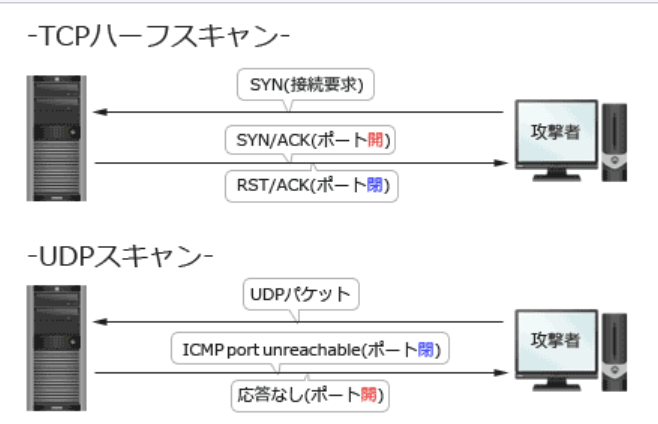
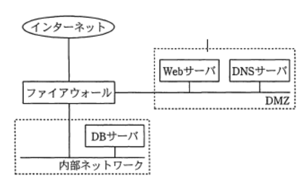
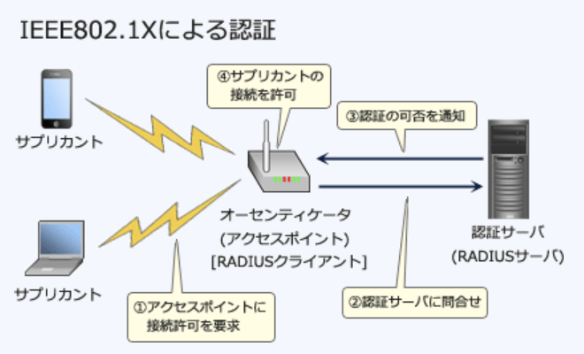

### 予想問題8

---
1.デジタル証明書に関する記述

- A.**デジタル証明書は、SSL / TLSプロトコルにおいて通信データの暗号化のための鍵交換や通信相手の認証に利用されている**

- S / MIMEやTLSで利用するデジタル証明書の規格は、ITU-T X.400で規定されている  
ITU - T勧告のX.509で標準仕様

- 認証局が発行するデジタル証明書は、申請者の秘密鍵に対して認証局がデジタル署名したものである  
申請者の公開鍵に認証局のデジタル署名を付与したもの

- ルート認証局は、下位層の認証局の公開鍵にルート証明書の公開鍵でデジタル署名したデジタル証明書を発行する  
ルートCAを最上位とする上位CAが下位CAを認証して証明書を発行するという階層構造になっているため、下位CAの証明書は必ずしもルートCAのデジタル証明書がなされている必要はない

---
2.コンピュータフォレンジクスの説明

- A.**不正アクセスなどコンピュータに関する犯罪の法的な証拠性を確保できるように、原因究明に必要な情報を保全、収集して分析すること**  
デジタルフォレンジクスとも呼ぶ。セキュリティインシデントの発生時に、原因究明・法的根拠を保全するために電子的記録を収集・解析する

- あらかじめ設定した運用基準に従って、メールサーバを通過する送受信メールをフィルタリングすること  
電子メールフィルタリングの説明

- 磁気ディスクなどの書換え可能な記憶媒体を単に初期化するだけではデータを復元される可能性があるので、覆い隠すように上書きすること  
上書きによる物理フォーマットの説明

- ホストに対する外部からの攻撃や不正なアクセスを防御すること  
ファイアウォールなどの説明

---
3.SSLに対するバージョンロールバック攻撃

- A.**SSL実装の脆弱性を用いて、通信経路に介在する攻撃者が弱い暗号化通信方式を強制することによって、暗号化通信の内容を解読して情報を得る**  
攻撃者が意図的に通信で利用するプロトコルのバージョンを低下させ、古いバージョンに残る脆弱性を利用して行われる攻撃。SSLでは、特定のOpenSSLのバージョン(0.9.8以前)において、既知の弱点がある旧バージョンのSSL2.0が強制され、盗聴や改竄等のMITM(*Man In The Middle*)攻撃が行われてしまう脆弱性が知られている

---
4.脆弱性検査で、対象ホストに対してポートスキャンを行った。対象ポートの状態を判定する方法

- A.**対象ポートにUDPパケットを送信し、対象ホストからメッセージ`port unreachable`を受信するとき、対象ポートが閉じていると判定する**

- 対象ポートにSYNパケットを送信し、対象ホストから`RST / ACK`パケットを受信するとき、対象ポートが開いていると判定する  
記述の場合、対象ポートは`閉じている`と判定する

- 対象ポートにSYNパケットを送信し、対象ホストから`SYN / ACK`パケットを受信するとき、対象ポートが閉じていると判定する  
記述の場合、対象ポートは`開いている`と判定する

- 対象ポートにUDPパケットを送信し、対象ホストからメッセージ`port unreachable`を受信するとき、対象ポートが開いていると判定する  
記述の場合、対象ポートは`閉じている`と判定する

---
5.DNSサーバに格納されるネットワーク情報のうち、第三者に公開する必要のない情報が攻撃に利用されることを防止するための、プライマリDNSサーバの設定

- A.**ゾーン転送を許可するDNSサーバを限定する**  
DNSサーバが停止すると、外部からのWebアクセスやメール送信アドの公開サービスがほぼ全て利用不能になったり、下位ドメインが名前解決できなくなるなどの影響が出る。その予防のため、DNSサーバは障害対策や分散負荷のためにドメインごとで最低2台体制で運用することが求められている。  
2台のDNSサーバにはその役割から、`実際にゾーン情報が記録されている`プライマリサーバ、プライマリからゾーン情報のコピーを取得し、その情報をもとに`名前解決を行う`セカンダリサーバがあり、通常はプライマリサーバはユーザ側、セカンダリサーバはISP側に設置されていている。  
プライマリからセカンダリへのゾーン情報のコピー(同期処理)は、ゾーン転送(53 / TCP)という機能で行われるが、制限していなければセカンダリサーバ以外のホストからの要求でも実行可能なので、プライマリサーバからゾーン情報やサーバ / ネットワーク構成を不正に取得されてしまう可能性がある

- SOA(*Start Of Authority*)レコードのシリアル番号を更新する  
DNSサーバの動作を制御するための設定情報が記述されているファイル。シリアル番号はSOAレコードの改訂番号を設定する項目なので対策としては不適切

- 外部のDNSサーバにリソースレコードがキャッシュされる時間を短く設定する  
ゾーン転送には無関係

- ラウンドロビン設定を行う  
1つのドメイン名に複数のIPアドレスを割り当てる負荷分散技術なので、対策としては不適切

---
6.総務省及び経済産業省が策定した"電子政府における調達のために参照すべき暗号のリスト(CRYPTREC 暗号リスト)"を構成する暗号リストの説明

- A.**電子政府推奨暗号リストとは、CRYPTRECによって安全性及び実装性能が確認された暗号技術のうち、市場における利用実績が十分であるか今後の普及が見込まれると判断され、当該技術の利用を推奨するもののリストである**  
暗号技術検討会及び関連委員会(以下CRYPTREC)により安全性及び実装性能が確認された暗号技術について、市場における利用実績が十分であるか今後の普及が見込まれると判断され、当該技術の利用を推奨するもののリスト

CRYPTREC暗号リストは、暗号技術検討会及び関連委員会(CRYPTREC)により電子政府での使用に際しての安全性及び実装性能が確認された暗号のリスト。情報セキュリティ政策会議で決定された「政府機関の情報セキュリティ対策のための統一基準」では、政府機関の情報システムに使用する電子暗号及び電子署名のアルゴリズムとして可能な限りCRYPTREC暗号リストにあるアルゴリズムを採用する運用ルールを定める必要があることが明記されている。電子政府推奨暗号リスト、推奨候補暗号リスト、運用監視暗号リストで構成されている

- 推奨候補暗号リストとは、CRYPTRECによって安全性及び実装性能が確認された暗号技術のうち、市場における利用実績が十分であるか今後の普及が見込まれると判断され、当該技術の利用を推奨するもののリストである  
今後の電子政府推奨候補であるアルゴリズムのリスト。CRYPTRECにより安全性及び実装性能が確認され、今後、電子政府推奨暗号リストに掲載される可能性のある暗号技術のリスト

- 推奨候補暗号リストとは、候補段階に格下げされ、互換性維持目的で利用する暗号技術のリストである
- 電子政府推奨暗号リストとは、推奨段階に格下げされ、互換性維持目的で利用する暗号技術のリストである  
互換性維持目的で利用する暗号技術のリストは`運用管理暗号リスト`。実際に解読されるリスクが高まるなど、推奨すべき状態ではなくなった暗号技術のうち、互換性維持のために継続利用を容認するリスト。互換性維持以外の目的での利用は推奨しない

---
7.*ICMP Flood*攻撃に該当するもの

- A.**pingコマンドを用いて大量の要求パケットを発信することによって、攻撃対象のサーバに至るまでの回線を過負荷にしてアクセスを妨害する**

- HTTP GETコマンド繰り返しを送ることによって、攻撃対象のサーバにコンテンツ送信の負荷を掛ける  
*HTTP GET Flood*攻撃に該当する

- コネクション開始要求に当たるSYNパケットを大量に送ることによって、攻撃対象のサーバに、接続要求ごとに応答を返すための過大な負荷を掛ける  
*SYN Flood*攻撃に該当する

- 大量のTCPコネクションを確立することによって、攻撃対象のサーバに接続を維持させ続けてリソースを枯渇させる  
*Connection Flood*攻撃に該当する

---
9.シングサインオン(*Single Sign-On*)の説明

- A.**リバースプロキシを使ったシングルサインオンの場合、利用者認証においてパスワードの代わりにデジタル証明書を用いることができる**  
IDとパスワードの組み合わせの他にデジタル証明書が使用可能

ユーザ認証を1度受けるだけで許可された複数のサーバへのアクセスについても認証する技術。利用するシステムが変わっても認証情報をぬ入力しなくて良いので、ユーザの利便性の向上が期待できる。*Cookie*を使うもの、リバースプロキシ型、SAMLによるものなどがある

- クッキーを使ったシングルサインオンの場合、サーバごとの認証情報を含んだクッキーをクライアントで生成し、各サーバ上で保存、管理する  
クッキーはサーバで生成され、クライアントのコンピュータに保存される

- クッキーを使ったシングルサインオンの場合、認証対象の各サーバを異なるインターネットドメインに配置する必要がある  
クッキーの有効範囲は限られている。異なるドメインに配置されたシステムは他のドメインで生成されたクッキーにアクセスできないため認証できない

- リバースプロキシを使ったシングルサインオンの場合、認証対象の各Webサーバを異なるインターネットドメインに配置する必要がある  
リバースプロキシ型ではクッキーを用いた方式のようにドメインによる制限がないため、Webサーバの設置は同一ドメイン内で無くても良い。ただWebサーバへアクセスする時には必ず認証サーバを経由しなければならないというネットワーク構成上の制限や、マルチドメイン間での安全な認証情報の送受という課題があるためマルチドメインSSOの実現は困難

---
10.DMZ上に公開しているWebサーバで入力データを受け付け、内部ネットワークのDBサーバにそのデータを蓄積するシステムがある。インターネットからDMZを経由してなされるDBサーバへの不正侵入対策の1つとして、DMZと内部ネットワークとの間にファイアウォールを設置するとき、最も有効な設定

- A.**DBサーバの受信ポート番号を固定し、WebサーバからDBサーバの受信ポート番号への通信だけをファイアウォールで通す**  
DMZ上の公開サーバが不正侵入された場合の被害を最小限に止めるため、DMZから内部ネットワークへ通過させるパケットは最小限の種類である必要がある。必要なのはWebサーバからDBサーバへの通信のみなので、ファイアウォールでは発信元がWebサーバ、宛先がDBサーバであるパケットのみ許可するのが適切

- DMZからDBサーバへの通信だけをファイアウォールで通す  
WebサーバだけでなくDMZ上に設置されているDNSサーバからもDBサーバにアクセス可能となるため不適切

- Webサーバの発信ポート番号は任意のポート番号を使用し、ファイアウォールでは、いったん終了した通信と同じ発信ポート番号を使った通信を拒否する
- Webサーバの発信ポート番号を固定し、その発信ポート番号からの通信だけをファイアウォールで通す  
Webサーバから内部ネットワーク内の任意の端末にアクセス可能なので不適切

---
11.無線LANで用いられるSSID(*Service Set Identifier*)の説明

- A.**最長32オクテットのネットワーク識別子であり、接続するアクセスポイントの選択に用いられる**  
無線LAN802.1Xシリーズにおいて、混信を避けるためにアクセスポイントと端末に設定される識別子(任意の最長32文字の英数字)。有線LANと異なり、複数のアクセスポイントと通信が可能になってしまう混信状態が発生する可能性がある。これを回避するため、アクセスポイントと端末にSSIDを設定し、一致する機器同士しか通信ができないようにアクセス制御を行う

- 48ビットのネットワーク識別子であり、アクセスポイントのMACアドレスと一致する
- 48ビットのホスト識別子であり、有線LANのMACアドレスと同様の働きをする  
BSSID(*Basic Service Set Identifier*)の説明

- 最長32オクテットのホスト識別子であり、ネットワーク上で一意である  
異なるホストでも同じアクセスポイントに接続する場合には同じSSIDを共有する

---
14.FIPS(*Federal Information Processing Standardization*) 140-2を説明したもの

- A.**暗号モジュールのセキュリティ要求事項**  
米国連邦政府の省庁等各機関が利用する、ハードウェア及びソフトウェア両方を含む"暗号モジュール"に関する要件を規定した米国連邦標準規格で、2014年1月時点の最新版

- 情報セキュリティマネジメントシステムに関する認証基準  
ISMSの説明

- デジタル証明書や証明書失効リストの標準仕様  
X.509の説明

- 無線LANセキュリティ技術  
WPA(*Wi-Fi Protected Access*)などの説明

---
15.サイバー情報共有イニシアティブ(J-CSIP)の説明

- A.**検知したサイバー攻撃の情報を公的機関に集約し、高度なサイバー攻撃対策につなげていく取組み**  
公的機関であるIPAを情報ハブ(集約点)の役割として、参加組織間で情報共有を行い、高度なサイバー攻撃対策に繋げていく取り組み。IPAと各参加組織(あるいは参加組織を束ねる業界団体)間で締結したNDAのもと、参加組織およびそのグループ企業において検知されたサイバー攻撃等の情報をIPAに集約。情報提供元に関する情報や機微情報の匿名化を行い、IPAによる分析情報を付加した上で、情報提供元の承認を得て共有可能な情報とし、参加組織間での情報共有を行う

- 暗号技術の調査を行い、電子政府における調達のために参照すべき暗号のリストを公表するためのプロジェクト  
CRYPTRECの説明

- 制御システムにおけるセキュリティマネジメントシステムの認証制度  
制御システムのセキュリティマネジメントシステム国際標準IEC 62443に基づいて認証を行う、CSMS認証の説明

- 脆弱性関連情報の発見から公表に至るまでの対処プロセス  
JPCERT / CCが公開している脆弱性関連情報取扱いガイドラインの説明

---
16.ポリモーフィック型ウイルス(*Polymorphic Virus*)の説明

- A.**感染するごとにウイルスのコードを異なる鍵で暗号化し、同一のパターンで検知されないようにする**  
パターンマッチングによる検出を免れるため、感染の度に異なる暗号化 / 複合ルーチンを生成し、ウイルスコードを暗号化する特徴のウイルス(`ミューティング型ウイルス`とも呼ぶ)。ウイルス対策ソフトの定義ファイルによるパターンマッチングでは検知できないので、ウイルスの活動を監視して判定を行うヒューリスティック法やビヘイビア法などの行動検知型の手法を利用する必要がある

- インターネットを介して、攻撃者がPCを遠隔操作する  
ボットの説明

- 複数のOSで利用できるプログラム言語でウイルスを作成することによって、複数のOS上でウイルスが動作する  
マルチプラットホーム型ウイルスの説明

- ルートキットを利用してウイルスに感染していないように見せかけることによって、ウイルスを隠蔽する  
ステルス型ウイルスの説明

---
17.A社のWebサーバは、認証局で生成したWebサーバ用のデジタル証明書を使ってSSL / TLS通信を行っている。PCがA社のWebサーバにSSL / TLSを用いてアクセスしたときにPCが行う処理のうち、サーバのデジタル証明書を入手した後に、認証局の公開鍵を利用して行うもの

- A.**デジタル証明書の正当性を認証局の公開鍵を使って検証する**  
デジタル証明書は、個人や企業(のサーバ)に対する電子式の証明書で、認証局(CA)と呼ばれる第三者機関によって発行される。送信した`サーバの公開鍵`と、信頼性を保証するため`認証局のデジタル署名`が格納されている  
1.Webサーバからクライアントに対してクライアントに対してデジタル署名とルートCAまでの証明書のリストを送る  
2.クライアントは証明書に付された認証局のデジタル署名を`認証局の公開鍵`で検証する  
3.証明書の正当性が確認できた場合、Webサーバ(の公開鍵)の認証を行う

---
20.企業のDMZ上で1台のDNSサーバをインターネット公開用と社内用で共用している。このDNSサーバが、DNSキャッシュポイズニングの被害を受けた結果、引き起こされ得る現象

- A.**社内の利用者が、インターネット上の特定のWebサーバを参照しようとすると、本来とは異なるWebサーバに誘導される**  
DNSサーバからの名前解決要求があった場合に正常な応答に加えて偽の名前解決情報を付加して送信することで、サーバのキャッシュに偽の情報を登録させるという攻撃手法。フィッシング詐欺などの手法で汚染されたDNSサーバに誘導されたユーザが、偽のキャッシュ情報をもとに悪意のあるサイトに誘導され、機密情報を盗まれるなどの被害が生じる可能性がある

- DNSサーバのハードディスク上のファイルに定義されたDNSサーバ名が書き換わり、外部からの参照者が、DNSサーバに接続できなくなる  
DNSサーバ名の書き換えは行わない

- DNSサーバのメモリ上にワームが常駐し、DNS参照元に対して不正プログラムを送り込む  
ワームを感染させる攻撃ではない

- 社内の利用者間で送信された電子メールの宛先アドレスが書き換えられ、正常な送受信ができなくなる  
偽のキャッシュ情報が登録されることで別のメールサーバに誘導され、メールの盗聴・改竄を受ける可能性はあるが、電子メールの宛先アドレスが書き換えられることはない

---
21.ISMSにおけるリスク分析手法の1つである"詳細リスク分析"で行う作業

- A.**リスクの評価**  
情報資産を洗い出し、それぞれの情報資産に対して資産価値・脅威・脆弱性及びセキュリティ要件を識別し、リスクを評価する手法

- 情報セキュリティポリシーの作成  
作成しない

- セーフガードの選択
- リスクの容認  
リスク対応で行う作業

---
22.CSIRT(*Computer Security Incident Response Team*)の説明

- A.**国レベルや企業・組織内に設置され、コンピュータセキュリティインシデントに関する報告を受け取り、調査し、対応活動を行う組織の総称である**  
組織など限られた範囲のサイトに関するセキュリティインシデントについて対応するチームや組織の総称。国内のサイトにインシデントに関する報告の受付、対応の支援、発生状況の把握、手口の分析、再発防止のための対策の検討や助言などを、技術的な立場から行う機関`JPCERT`もCSIRT組織

- IPアドレスの割当て方針の決定、DNSルートサーバの運用監視、DNS管理に関する調整などを世界規模で行う組織である  
ICANN(*The Internet Corporation for Assigned Names and Numbers*)の説明

- インターネットに関する技術文書を作成し、標準化のための検討を行う組織である  
IETF(*Internet Engineering Task Force*)の説明

- 情報技術を利用し、信教や政治的な目標を達成するという目的をもった人や組織の総称である  
ハックティビスト(*Hacktivist*)の説明

---
23.無線LAN環境に複数台のPC、複数台のアクセスポイント及び利用者認証情報を管理する1台のサーバがある。利用者認証とアクセス制御にIEEE802.1XとRADIUSを利用する場合の特徴

- A.**アクセスポイントにはIEEE802.1Xのオーセンティケータを実装し、RADIUSクライアントの機能をもたせる**  
`IEEE802.1X`は、LAN内のユーザ認証の方式を定めたIEEE規格で、正当な端末以外がLANに参加することを防ぐ技術。有線LAN向けとして策定されていたが、その後にEAP(*Extensible Authentication Protocol*)として実装され、現在では無線LAN環境(IEEE802.11X)における標準の認証機構として利用されている。検疫ネットワークを実現するための中核技術となっている。  
認証を受けるクライアントである`サプリカント`(*supplicant*)、RADIUSなどの`認証サーバ`(*authentication server*)、RADIUSクライアントの機能を持ち、認証サーバ間の認証プロセスを相互に中継する認証装置(認証スイッチ)である`オーセンティケータ`(*authenticator*)の3つの要素で構成される

- PCにはIEEE802.1Xのサプリカントを実装し、RADIUSクライアントの機能をもたせる  
RADIUSクライアントの機能はアクセスポイントにもたせる

- アクセスポイントにはIEEE802.1Xのサプリカントを実装し、RADIUSサーバの機能をもたせる  
サプリカントはクライアントPCに実装し、RADIUSサーバの機能は認証サーバにもたせる

- サーバにはIEEE802.1Xのオーセンティケータを実装し、RADIUSサーバの機能をもたせる  
オーセンティケータはアクセスポイントに実装する

---
24.Webのショッピングサイトを安全に利用するため、WebサイトのSSL証明書を表示して内容を確認する。Webサイトが、EV SSL証明書を採用している場合、存在するサブジェクトフィールドの*Organization Name*に記載されているもの

- A.**Webサイトの運営団体の組織名**  
CAとWebブラウザベンダーで構成される、CA / Browserフォーラムが定めたEV証明書ガイドラインに基づき審査・発行が行われたWebサーバの公開鍵証明書。  
従来のSSL公開鍵証明書はCAごとに認証審査基準にばらつきがあり、Webサイトの所有者などに対する審査基準が緩いCAから取得された証明書がフィッシングサイトに悪用されるなど、信頼性の問題が指摘されていた。  
EV SSL証明書は、この問題に対処するために従来のものよりも発行にあたっての審査を厳格化したものであり、これを取得している法人(Webサーバ)は通常よりも信頼性が高いと言える。  
WebブラウザもEV SSL証明書に対応してきており、最新版の主要なブラウザであればEV SSL証明書が検出されるとブラウザのアドレスバーを緑色にして利用者へ通知する仕様が概ね実装されている。  
subject(認証対象者)フィールドの*Organization Name*は、組織名が記述される部分。通常のSSL証明書ではドメインの認証のみであったため*Organization Name*フィールドが記載されていないものもあるが、EV SSL証明書ではこのフィールドに完全な法的組織名を記載することが必須となっている

---
25.認証にクライアント証明書を用いるプロトコル

- A.**EAP - TLS**(*Extensible Authentication Protocol - Transport Layer Security*)  
認証にTLSの機構を用いる。サーバ - クライアント間でデジタル証明書を用いた相互認証を行う。無線LANのセキュリティの主流

IEEE802.1規格に基づきPPPの認証機能を拡張したプロトコル。主に無線LANなどのリモートアクセスの標準認証機構として使用されている。EAPではTLS, S / key, MD5によるチャレンジレスポンスなど様々な認証方式がサポートされている

- EAP - MD5  
ユーザ名とパスワードを用いたチャレンジレスポンスなど様々な認証方式がサポートされている

- EAP - PEAP  
TLSによりサーバ認証を行い、その後確立されたEAPトンネルを使用し、`EAP準拠の方法`のみに限定されている方式

- EAP - TTLS(EAP - Tunneled TLS)  
TLSを用いたEAPトンネルを使用するのはEAP - PEAPと同様。その後、`各種の認証方法`でクライアントを認証する

---
26.スパムメールの対策として、宛先ポート25番のメールに対しISPが実施するOP25B(*Outbound Port 25 Blocking*)の説明

- A.**動的IPアドレスを割り当てたネットワークからISP管理外のネットワークに直接送信されたメールを遮断する**  
第三者中継を悪用することなく、送信先のメールサーバと直接TCPコネクションを確立してスパムメールを送る手法を防ぐための対策。正規のメールは端末が契約するISPのメールサーバを経由して送信されるためパケットの宛先としてISPのメールサーバがセットされているが、上記のスパムメールは宛先として外部のメールサーバがセットされている。OP25Bでは、ISP管理下の動的IPアドレスからISPのメールサーバを経由せずに`外向き(インターネット方向)に発信されるSMTP通信(ポート25番)を遮断する`ことでスパムメールの投稿制限を行う

- ISP管理外のネットワークからの受信メールのうち、スパムメールのシグネチャに該当するメールを遮断する  
迷惑メールフィルタリングにおけるシグネチャマッチング方式の説明

- メール送信元のメールサーバについてDNSの逆引きができない場合、そのメールサーバからのメールを遮断する  
DNS逆引きチェックによるスパムメール対策

- メール不正中継の脆弱性をもつメールサーバからの受信メールを遮断する  
RBL(*Real-time Blackhole List*)を使用したしスパムメール対策
