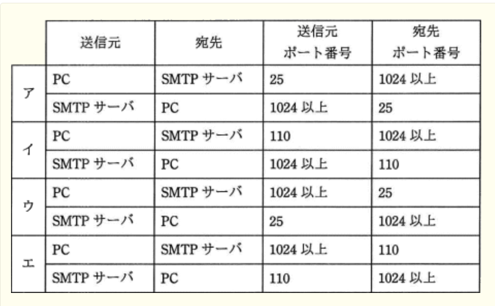
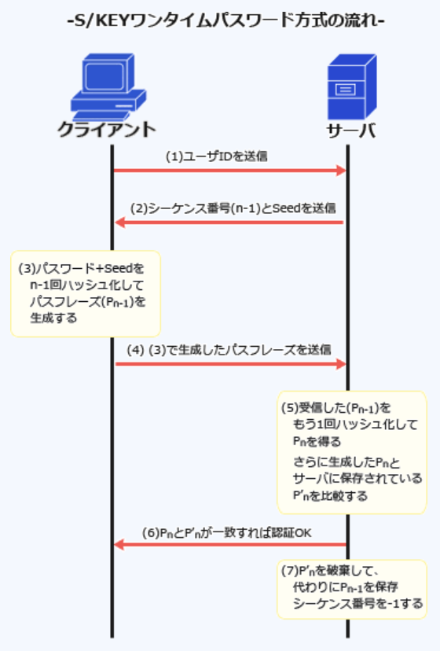

### 予想問題9

---
1.特定の認証局が発行したCRL(*Certificate Revocation List* : 証明書執行リスト)に関する記述

- A.**CRLには、有効期限内のデジタル証明書のうち失効したデジタル証明書と破棄された日時の対応が提示される**  
有効期限内であるにも関わらず、秘密鍵の漏洩・紛失・証明書の被発行者の規則違反などの理由で認証の役に立たなくなったため、失効した(信用性のない)公開鍵証明書のシリアル番号が列挙されたリスト

- CRLには、失効したデジタル証明書に対応する秘密鍵が登録される  
有効期限に関わらず失効したデジタル証明書のシリアル番号などが登録される

- CRLは、鍵の漏えい、破棄申請の状況をリアルタイムに反映するプロトコルである  
OCSP(*Online Certificate Status Protocol*)に関する記述

- 有効期限切れで失効したデジタル証明書は、所有者が新たなデジタル証明書を取得するまでの間、CRLに登録される  
登録されている証明書は有効期限が満了となった時点でCRLから抹消される

---
3.NISTの定義によるクラウドコンピューティングのサービスモデルにおいて、パブリッククラウドサービスの利用企業のシステム管理者が、仮想サーバのゲストOSに係る設定作業及びセキュリティパッチ管理作業を実施可かどうかの組合せ

- A.IaaS(*Infrastructure as a Service*) : **実施可**  
ユーザは、基盤にあるインフラストラクチャを管理したりコントロールしたりすることはないが、OS・ストレージ・実装されたアプリケーションに対してコントロール権をもつ

- A.PaaS(*Platform as a Service*) : **実施不可**  
ユーザは、基盤にあるインフラストラクチャを、ネットワーク・サーバ・OS・ストレージを管理したりコントロールしたりすることはない

- A.SaaS(*Software as a Service*) : **実施不可**  
ユーザは、基盤にあるインフラストラクチャを、ネットワーク・サーバ・OS・ストレージ・各アプリケーション機能を管理したりコントロールすることはない

---
5.RLO(*Right - to - Left Override*)を利用した手口

- A.**文字の表示順を変える制御文字を利用し、ファイル名の拡張子を偽装する**  
*Unicode*で定義されている制御文字で、ファイル名の並びの左右を変える働きを持つ。本来は右から左へ読むアラビア語などで使用される制御文字だが、日本語や英語で悪用するとファイル名を偽造することが可能となる

- "コンピュータウイルスに感染している"といった偽の警告を出して利用者を脅し、ウイルス対策ソフトの購入などを迫る  
クライアントのPCで動作するアドウェアや、広告業者を介してWebサイトに掲載される詐欺広告の説明

- 脆弱性があるホストやシステムをあえて公開し、攻撃の内容を観察する  
ハニーポットの説明

- ネットワーク機器のMIB情報のうち監視項目の値の変化を感知し、セキュリティに関するイベントをSNMPマネージャに通知するように動作させる  
SNMPにおいてエージェントからマネージャに対して通知するTrapメッセージの説明

---
6.サイドチャネル攻撃の説明

- A.**暗号アルゴリズムを実装した攻撃対象の物理デバイスから得られる物理量(処理時間や消費電流など)やエラーメッセージから、攻撃対象の機密情報を得る**  
漏洩電磁波・電力消費等のサイドチャネル情報から暗号鍵推定等を行う、非破壊攻撃での総称

- 企業などの機密情報を詐取するソーシャルエンジニアリングの手法の1つであり、不用意に捨てられた機密情報の印刷物をオフィスの紙ゴミから探し出す  
スキャベンジングの説明

- 通信を行う2者間に割り込んで、両者が交換する情報を自分のものとすり替えることによって、気付かれることなく盗聴する  
MITM(*Man in the middle attack*)攻撃、中間者攻撃の説明

- データベースを利用するWebサイトに入力パラメータとしてSQL文の断片を与えることによって、データベースを改竄する  
SQLインジェクションの説明

---
7.SSLを使用して通信を暗号化する場合、SSL - VPN装置に必要な条件

- A.**SSL - VPN装置は、FQDN又はIPアドレスを含むデジタル証明書を組み込む必要がある**  
SSLの仕組みを利用してVPNを構築する技術。SSL通信ではサーバ認証が必須になっているため、同一ドメイン内に設置する場合でも、装置ごとに固有のデジタル証明書を組み込む必要がある。  
使用するアプリケーションがHTTPSで通信を行う場合はブラウザのみで使用可能であるため、クライアント側への影響が少なく、容易に導入できる。`企業内ネットワークとインターネットの境`に設置され、クライアントからの要求を受け付けサーバへの要求を代理するリバースプロキシの役割をもつ機器

- SSL - VPN装置は、装置メーカーが用意した機器固有のデジタル証明書を組み込む必要がある  
SSL - VPN装置に組み込むデジタル証明書は独自に用意できる

- SSL - VPN装置は、装置メーカーから提供される認証局を利用する必要がある  
使用する認証局は任意に指定できる

- 同一ドメイン内で複数拠点にSSL - VPN装置を設置する場合は、同一のデジタル証明書を利用する必要がある  
SSL - VPN装置ごとに固有のデジタル証明書を組み込む必要がある

---
8.JVN(*Japan Vulnerability Notes*)などの脆弱性対策ポータルサイトで採用されているCWE(*Common Weakness Enumeration*)

- A.**ソフトウェアの脆弱性の種類の一覧**  
ソフトウェアにおけるセキュリティ上の脆弱性の種類を識別するための共通の基準。多種多様な脆弱性の種類を脆弱性タイプとして分類し、それぞれにCWE識別子(CWE - ID)を付与して階層構造で体系化している。脆弱性タイプは、*View*, *Category*, *Weakness*(脆弱性), *Compound Element*(複合要因)の4種類に分類される。現在、*View*として22個、*Category*として105個、*Weakness*として638個、*Compound Element*として12個、合計777個の脆弱性タイプが分類され一覧となっている

- 基本評価基準・現状評価基準・環境評価基準の3つの基準でIT製品の脆弱性を評価する手法  
CVSS(*Common Vulnerability Scoring System*)の説明

- 製品を識別するためのプラットフォーム名の一覧  
CPE(*Common Platform Enumeration*)の説明

- セキュリティに関連する設定項目を識別するための識別子  
CCE(*Common Configuration Enumeration*)の説明

---
9.JIS Q 27001:2006における情報システムのリスクとその評価に関する記述

- A.**リスクの特定では、脅威が管理策の脆弱性に付け込むことによって情報資産に与える影響を特定する**  
リストアップされた脅威と脆弱性の関連性を分析し、リスクを洗い出す作業

- 脅威とは、脆弱性が顕在化する源のことであり、情報システムに組み込まれた技術的管理策によって脅威のレベルと発生の可能性が決まる  
脅威は、情報システムに悪影響を与える要因

- 脆弱性とは、情報システムに対して悪い影響を与える要因のことであり、自然災害、システム障害、人為的過失及び不正行為に大別される  
脆弱性は、組織や情報システムに内在する欠点や弱点

- リスク評価では、リスク回避とリスク低減の2つに評価を分類し、リスクの大きさを判断して対策を決める  
リスクが顕在化した場合の損害の大きさ、およびその発生確率などの情報をもとにリスクの大きさ(強度)を決定する作業。リスク評価には定量的評価・定性的評価の2つの評価方法がある。リスクへの対策を決定する作業はリスク対応にあたる

---
10.PCなどに内蔵されるセキュアチップ(*Trusted Platform Module*)がもつ機能

- A.**鍵ペアの生成**  
PCのマザーボード上に直付けされ、RSA暗号の暗号・復号や鍵ペアの生成、SHA-1ハッシュ値の計算、デジタル署名の生成・検証などの機能を有したセキュリティチップのこと。TGC(*Trusted Computing Group*)によって策定されている

---
11.ワームの侵入に関する記述

- A.**ワームは、アプリケーションソフトの脆弱性を突いて侵入できる**  
OSや電子メールの他、Webブラウザ上で動作する*Adobe Flash*やPDFソフトなどのアプリケーションの不備をついて感染活動を行う

- 公開サーバへのワームの侵入は、IDSでは検知できない  
IDS(*Instruction Detection System* : 侵入検知システム)で検知可能

- 未知のワームの侵入は、パターンマッチング方式で検知できる  
既知のウイルスのシグネチャと一致するか否かを検出するので未知のウイルスに対しては効果を期待できない

- ワームは、仮想OS環境内のゲストOSに侵入できない  
仮想環境にも感染する

---
12.送信元を詐称した電子メールを拒否するために、SPF(*Sender Policy Framework*)において受信側が行うこと

- A.**SMTP通信中にやり取りされる`MAIL FROM`コマンドで与えられた送信ドメインと送信サーバのIPアドレスの適合性を検証する**  
SMTP接続してきたメールサーバのIPアドレスを基に、正規のサーバから送られた電子メールかどうか検証する技術。受信メールサーバ側で電子メールの送信元ドメインが詐称されていないか検査できる  
1.送信側は、送信側ドメインのDNSサーバのSPFレコード(又はTXTレコード)に正当なメールサーバのIPアドレスやホスト名を登録し、公開しておく  
2.送信側から受信側へ、SMTPメールが送信される  
3.受信側メールサーバは、受信側ドメインのDNSサーバを通じて、`MAIL FROM`コマンドに記載された送信者メールアドレスのドメインを管理するDNSサーバに問い合わせ、SPF情報を取得する  
4.SPF情報との照合でSMTP接続してきたメールサーバのIPアドレスの確認に成功すれば、正当なドメインから送信されたと判断する

- `Resent - Sender:`、`Resent - From:`、`Sender:`、`From:`などのメールヘッダーの送信者メールアドレスを基に送信メールアカウントを検証する  
SPFでは`送信元のIPアドレス情報`を元に正当性を確認する

- SMTPが利用するポート番号25の通信を拒否する  
OP25Bの仕組み

- 電子メールに付加されたデジタル署名を検証する  
DKIM(*DomainKeys Identified Mail*)で受信側が行うこと

---
13.無線LANにおけるWPA2(*Wi - Fi Protected Access 2*)の特徴

- A.**暗号化アルゴリズムにAESを採用したCCMP(*Counter-mode with CBC-MAC Protocol*)を使用する**  
無線LANのセキュリティプロトコルWPAの脆弱性を改善した次期バージョン。暗号化アルゴリズムがWEP、WPAで使用されていた脆弱性のあるRC4からNIST標準のAESに変更され、解読攻撃に対する耐性が高められている

- AHとESPの機能によって認証と暗号化を実現する  
AHとESPを使用するのはIPsec

- 端末とアクセスポイントの間で通信を行う際に、*SSL Handshake Protocol*を使用して、お互いが正当な相手かどうかを認証する  
SSLを使用する規定はない

- 利用者が設定する秘密鍵と、製品で生成するIV(*Initialization Vector*)とを連結した数字を基に、データをフレームごとにRC4で暗号化する  
暗号化には128ビット以上のAESが使用される

---
14.ブラウザがWebサーバとの間でSSLで通信する際、デジタル証明書に関する警告メッセージが表示される原因となり得るもの

- A.**ルートCAのデジタル証明書について、Webサーバのデジタル証明書のものがブラウザで保持しているどのものとも一致しなかった**  
OSやブラウザには信頼できるルートCA証明書があらかじめインストールされており、Webサーバから提示されたデジタル証明書が正規のものであれば、`発行元を遡っていくとインストールされているルートCA証明書のいずれかに行き当たる`。ルートCAのデジタル証明書がブラウザのものと一致しない場合、Webサーバから提示されたデジタル証明書が不正なものである可能性が生じるためブラウザは警告メッセージを表示しユーザーに確認を行う。他にも証明書の有効期限切れ・失効・コモンネームとアクセス先の不一致があると警告が表示される

- Webサーバが、SSL通信の暗号化方式として、ハンドシェイク終了後に共通鍵暗号化方式でSSLセッションを開始した  
SSLではハンドシェイクプロトコルによるサーバ・クライアントの相互確認・鍵交換を公開鍵暗号方式で行い、セッション確立後は認証時に交換した共通鍵によって通信を行うため、警告の原因にはならない

- ブラウザがCRLの妥当性をVA(*Validation Authority* : 電子証明書検証機関)に問い合わせる際に、OCSP(*Online Certificate State Protocol*)やSCVP(*Simple Certificate Validation Protocol*)が用いられた  
VAはデジタル証明書の執行情報の管理やCRL(証明書失効リスト)の確認などの役割を担う機関。OCSPやSCVPは、証明書の有効性をリアルタイムで検証する仕組みで、これらのプロトコルを用いた問い合わせは正当な流れで行われるので警告の原因にはならない

- ブラウザがWebサーバのデジタル証明書の検証に成功した後に、WebサーバからSSLセッションを確立した  
Webサーバのデジタル証明書は検証済みなのでWebサーバの正当性は確認されている。WebサーバからのSSLセッション開始は問題ない

---
15.有料の公衆無線LANサービスにおいて実施される、ネットワークサービスの不正利用に対するセキュリティ対策の方法・目的

- A.**利用者ごとに異なる利用者IDを割り当て、パスワードを設定することによって、契約者以外の利用者によるアクセスを防止する**  
無線LANは電波の届く範囲であれば誰でも通信ができてしまう。講習の無線LANアクセスポイントにサービス契約者のみを接続させるためには、利用者の認証が必要。無線LANの接続時認証に使用する規格IEEE 802.1Xでは、ID・パスワード・デジタル証明書などのいくつかの認証方式を選択できるが、公衆無線LANで利用者PCの全てにデジタル証明書を組み込むのは困難であるため、IDとパスワードによる認証を行うことで不正利用を防ぐのが最良の方法

---
16.ステガノグラフィ(*Steganography*)の機能

- A.**画像データなどにメッセージを埋め込み、メッセージの存在そのものを隠す**  
音声や画像などのデータの中に、別のデータ(多くが文字列)を秘密裏に埋め込む技術・考え方のこと。著作物に著作者名や利用者の情報などを埋め込む、電子透かし技術として応用されている

- メッセージの改ざんやなりすましを検出し、否認の防止を行う  
デジタル署名とタイムスタンプの機能

- メッセージの認証を行って改ざんの有無を検出する  
MAC(*Message Authentication Code*)の機能

- メッセージを決まった手順で変換し、通信途中での盗聴を防ぐ  
暗号化通信の機能

---
17.表に示すテーブルX, Yへのアクセス要件に関して、JIS Q 27001 : 2006(ISO / IEC 27001 : 2005)が示す完全性の観点からセキュリティを脅かす恐れのあるアクセス権付与  
`テーブルX(注文テーブル)`  
1.調達課の利用者Aが注文データを入力するために、又は内容を確認するためにアクセスする  
2.管理課の利用者Bはアクセスしない  
`テーブルB(仕入先マスタテーブル)`  
1.調達課の利用者Aが仕入先データを紹介する目的だけでアクセスする  
2.管理課の利用者Bが仕入先データのマスタメンテナンス作業を行うためにアクセスする

- A.**`grant insert on Y to A`**  
grant文は表などのオブジェクトに対して`権限を付与する`SQL。`insert`は表に行を挿入する、`select`は表を参照する権限。利用者AはテーブルYに対して参照目的だけでアクセスするのでinsert権限の付与は不要

- `grant insert on Y to B`  
利用者BはテーブルYのデータメンテナンスを行う必要があるので、必要な権限付与

- `grant select on X to A`
- `grant select on X to B`  
参照権限のみではテーブルの内容を書き換えられないため、完全性は損なわれない

---
18.社内とインターネットの接続点にパケットフィルタリング型ファイアウォールを設置したネットワーク構成において、社内のPCからインターネット上のSMTPサーバに電子メールを送信するとき、ファイアウォールで通過許可とするTCPパケットのポート番号の組合せ

- A.**ウ**  
SMTP(*Simple Mail Transfer Protocol*)は、電子メールを転送するプロトコルで通信に`TCP / 25`ポートを使用する。電子メールを送信するのに必要となる通信は、  
1.PCからSMTPサーバへの発信パケット  
2.SMTPサーバからPCへの応答パケット  
PC(クライアント)は*well-known*ではない1024番以降のポートを通信に使用するので、  
1.PC(1024以上) => SMTPサーバ(25)  
2.SMTPサーバ(25) => PC(1024以上)  
この2種類のパケットだけを通信許可すればSMTP通信を行うことができる(TCP / 110)は、メール受信のPOP(*Post Office Protocol*)で使用するポート番号

---
21.WebサーバがHTTPS通信の応答でcookieにSecure属性を設定した時のブラウザの処理

- A.**ブラウザは、cookieの"Secure"を参照し、HTTPS通信時だけそのcookieを送信する**  
cookieの動作を制御する属性の1つで、これが設定されたcookieはHTTPS通信の場合のみブラウザからサーバに送信されるようになる。`Path`ではcookieを送信するURLディレクトリを指定、`HttpOnly`ではJavaScriptからアクセスできなくなる

- ブラウザは、cookieの"Secure = "に続いて指定された時間を参照し、指定された時間を過ぎている場合にそのcookieを削除する  
Secure属性はcookieの有効期限とは無関係。Expires属性についての記述。有効期限を指定でき、指定しなければブラウザの終了時まで有効

- ブラウザは、cookieの"Secure = "に続いて指定されたホスト名を参照し、指定されたホストにそのcookieを送信する  
Domain属性についての記述。cookieを送信するドメインを指定する

- ブラウザは、cookieの"Secure"を参照し、ブラウザの終了時にそのcookieを削除する  
Secure属性はcookieの有効期限とは無関係

---
22.WAF(*Web Application Firewall*)のブラックリスト・ホワイトリストの説明

- A.**ブラックリストは、問題のある通信データパターンを定義したものであり、該当する通信を遮断するか又は無害化する**  
パケットを全て許可する初期状態に、通信を拒否するルールを記述したリスト、ホワイトリストはパケットを全て拒否する初期状態に、通信を許可するルールを記述したリスト

---
23.経済産業省"ソフトウェア管理ガイドライン"に定められた、ソフトウェアを使用する法人、団体などが実施すべき基本的事項の記述

- A.**ソフトウェアの違法複製などの有無を確認するため、全てのソフトウェアを対象として、使用状況についての監査を実施する**  
ソフトウェアを使用するに当たって実施されるべき事項をとりまとめたもので、ソフトウェアの違法複製の防止が目的

- ウイルスからソフトウェアを保護するため、関係法令や使用許諾契約などについて利用者の教育啓発を行う
- セキュリティ対策に責任を負うセキュリティ管理責任者を任命し、適切な管理体制を整備する
- ソフトウェアの脆弱性を突いた不正アクセスから保護するため、ソフトウェアの使用手順や管理方法などを定めたソフトウェア管理規則を制定する  
情報セキュリティ管理基準で記述されている事項

---
26.情報システムのリスク分析に関する記述

- A.**リスク分析では、現実に発生すれば損失をもたらすリスクが、情報システムのどこに、どのように潜在しているかを識別し、その影響の大きさを測定する**  
`投機的リスク` : 相場などのように利益と損失のどちらかが生じる可能性のある不確実性のこと  
`純粋リスク` : 損失のみが生じる可能性のある不確実性のこと

- リスクには、投機的リスクと純粋リスクとがある。情報セキュリティのためのリスク分析で対象とするのは、投機的リスクである  
リスク分析の対象となるのは純粋リスク

- リスクの予想損失額は、損害予防のために投入されるコスト、復旧に要するコスト、及びほかの手段で業務を継続するための代替コストの合計で表される  
予防のために豆乳されるコストは予想損失額に含まれない

- リスクを金額で測定するリスク評価額は、損害が現実になった場合の1回当たりの平均予想損失額で表される  
1回あたりの平均損失額にリスクの発生確率を加味して計算される

---
27.インターネットVPNを実現するために用いられる技術であり、ESP(*Encapsulating Security Payload*)やAH(*Authentication Header*)などのプロトコルを含むもの

- A.**IPsec**  
カプセル化したパケットをAHやESPなどの認証・暗号化プロトコルを用いてIPsecプロトコル上で安全にやり取りすることができ、VPNの構築に用いられる

- MPLS(*Multi Protocol Label Switching*)  
IP - VPNで使用される技術で、IPルーティングによるパケット転送よりも高速な転送処理を実現する

- PPP(*Point - to - Protocol*)  
2点間を接続してデータ通信を行うための通信プロトコル

- SSL  
インターネットVPNを構築できるが、ESPやAHなどのプロトコルは使われない

---
29.マルウェアの活動傾向などを把握するための観測用センサが配備されるダークネット

- A.**インターネット上で到達可能、かつ、未使用のIPアドレス空間**  
通常のインターネット利用を考えれば特定のホストに割り当てられていない未使用のIPアドレス宛にパケットが送信されることは稀だが、実際にダークネットを観測すると相当数のパケットが未使用のIPアドレス宛に送信されている。マルウェアが次の感染対象を探すためのスキャン・マルウェアが脆弱性を攻撃するためのパケット・送信元IPアドレスが詐称されたパケットへの応答パケットなどの不正な活動を目的とするパケットによるもの。ダークネットを観測することで、インターネット上で行われている不正活動を把握することが可能。基本的に到達するパケットは不正なものであり、観測された全てのパケットを不正として分析できる点が利点

- 組織に割り当てられているIPアドレスのうち、コンピュータで使用されているIPアドレス空間  
ライブネットの説明で、ダークネットと対比して使われる言葉

- 通信事業者が他の通信事業者などに貸し出す光ファイバ設備  
ダークファイバの説明

- マルウェアに狙われた制御システムのネットワーク  
産業制御システム(ICS)、遠隔制御・監視システム(SCADA)のこと

---
30.APT(*Advanced Persistent Threats* : 持続的標的型攻撃)の説明

- A.**攻撃者は特定の目的をもち、特定組織を標的に複数の手法を組み合わせて気付かれないよう執拗に攻撃を繰り返す**  
情報窃盗やシステムへの不正侵入などの目的で行われる攻撃。複数の攻撃方法を組み合わせて、特定の組織や個人に対して長期間にわたり持続的に行われるサイバー攻撃の総称。単なる標的型攻撃と異なり、準備や攻撃が長い期間を通じて持続的に行われる。最初にメールや外部メディア等で組織内部の従業員の端末への不正侵入を試みから、組織の内部へ更に入り込んでいくなど目的達成のために数か月から数年にわたって攻撃が継続する。最終的には組織にとって非常に重要な情報(知財情報や個人情報)を盗み出すことなどを目的としている

- 攻撃者はDoS攻撃及びDDoS攻撃を繰り返し組み合わせて、長期間にわたって特定組織の業務を妨害する  
過負荷によるサービス停止を引き起こす攻撃ではない

- 攻撃者は興味本位で場当たり的に、公開されている攻撃ツールや脆弱性検査ツールを悪用した攻撃を繰り返す  
場当たり的ではなく、特定の目的をもって攻撃を繰り返す

- 攻撃者は不特定多数への感染を目的として、複数の攻撃を組み合わせたマルウェアを継続的にばらまく  
攻撃対象の特定の組織や個人に絞って行われる

---
31.ISO / IEC 15408を評価基準とする、ITセキュリティ評価及び認証制度の説明

- A.**情報技術に関連した製品のセキュリティ機能の適切性、確実性を第三者機関が評価し、その結果を公的に認証する制度**  
IT関連製品のセキュリティ機能の適切性･確実性を、セキュリティ評価基準の国際標準であるISO / IEC 15408に基づいて第三者(評価機関)が評価し、評価結果を認証機関が認証する制度。主に政府調達などにおいて調達者が求めるセキュリティの要件を満たしていること、想定される脅威に対し適切な対抗となっていること、その対抗手段が正確に実装されていることを、第三者が評価･認証を行うもの

- 暗号モジュールに暗号アルゴリズムが適切に実装され、暗号鍵などが確実に保護されているかどうかを評価及び認証する制度  
暗号モジュール試験及び認証制度(JCMVP)の説明

- 主に無線LANにおいて、RADIUSなどと連携することで、認証されていない利用者を全て排除し、認証された利用者だけの通信を通過させることを評価及び認証する制度  
WPA(*Wi - Fi Protected Access*)の説明

- 情報セキュリティマネジメントシステムが、基準にのっとり、適切に組織内に構築、運用されていることを評価及び認証する制度  
ISMS適合性評価制度の説明

---
32.S / KEYワンタイムパスワードに関する記述

- A.**サーバはクライアントから送られた使い捨てパスワードを演算し、サーバで記憶している前回の使い捨てパスワードと比較することによって、クライアントを認証する**  
フリーウェアとして公開されている

- クライアントは認証要求のたびに、サーバへシーケンス番号と種(Seed)からなるチャレンジデータを送信する  
ログイン要求を受け取ったサーバがシーケンス番号と種をクライアントに送信する

- 時刻情報を基にパスワードを生成し、クライアント、サーバ間でパスワードを時刻で同期させる  
時刻同期方式の説明。S / KEYでは時刻情報を利用しない

- 利用者が設定したパスフレーズは1回ごとに使い捨てる  
クライアントが設定したパスフレーズは、次回のログイン要求の際に必要な情報なのでサーバ内に保存される

---
33.DNSSEC(*DNS Security Extensions*)の機能

- A.**DNSサーバから受け取るリソースレコードに対するデジタル署名を利用して、リソースレコードの送信者の正当性とデータの完全性を検証する**  
DNSにおける応答の正当性を保証するための拡張仕様。ドメイン応答に電子署名を付加することで、正当な管理者によって生成された応答レコードであり改ざんされていないことが検証可能

---
36.SQLインジェクション対策について、Webアプリケーションの実装における対策とWebアプリケーションの実装以外の対策

- A.Webアプリケーションの実装 : **プレースホルダを利用する**
- A.Webアプリケーションの実装以外 : **データベースのアカウントがもつデータベースアクセス権限を必要最小限にする**  
SQL文中のユーザ入力を割り当てる部分に特殊文字を使用した雛形を用意し、後から実際の値を割り当てる機構。後から割り当てる値は、SQL文の特殊文字がエスケープされた完全な数値(文字列)として扱われるため安全に実行できる。DBを扱うWebアプリケーションに必要以上に権限が与えられていると、不正なSQL文が実行される可能性が高まるため最小権限のみを持たせたアカウントで処理させることも重要な対策

- Webアプリケーションの実装 : Webアプリケーション中でシェルを起動しない
- Webアプリケーションの実装以外 : *chroot*環境でWebサーバを稼働させる  
OSコマンドインジェクション対策

- Webアプリケーションの実装 : セッションIDを乱数で生成する
- Webアプリケーションの実装以外 : TLSによって通信内容を秘匿する  
セッションハイジャック対策

- Webアプリケーションの実装 : パス名やファイル名をパラメータとして受け取らないようにする
- Webアプリケーションの実装以外 : 重要なファイルを公開領域に置かない  
ディレクトリトラバーサル対策

---
41.Webサーバを使ったシステムにおいて、インターネットから受け取ったリクエストをWebサーバに中継する仕組み

- A.**リバースプロキシ**  
クライアントとWebサーバの間のWebサーバ側に位置し、Webサーバの代理でクライアントの要求を受け付け、Webサーバに受け渡す機能。クライアントからのリクエストは必ずリバースプロキシを経由するので、リバースプロキシにアクセス制御や認証などの機能をもたせることで、Webサーバのセキュリティ向上が期待できる

- DMZ(*DeMilitarized Zone*)  
公開サーバなどの外部からアクセスされる可能性のある情報資源を設置するためのファイアウォールの中でも外でもない中間的なエリアのこと

- フォワードプロキシ  
クライアントとWebサーバの間のクライアント側に位置し、クライアントの要求を受け取り、クライアントに変わってWebサーバにアクセスする機能

- プロキシARP  
あるホスト宛のARP要求に対して代理でARP応答をする機能で、ルータなどに備わっている
