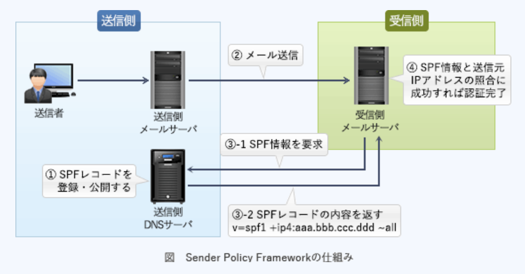

### 予想問題9

---
1.特定の認証局が発行したCRL(*Certificate Revocation List* : 証明書執行リスト)に関する記述

- A.**CRLには、有効期限内のデジタル証明書のうち失効したデジタル証明書と破棄された日時の対応が提示される**  
有効期限内であるにも関わらず、秘密鍵の漏洩・紛失・証明書の被発行者の規則違反などの理由で認証の役に立たなくなったため、失効した(信用性のない)公開鍵証明書のシリアル番号が列挙されたリスト

- CRLには、失効したデジタル証明書に対応する秘密鍵が登録される  
有効期限に関わらず失効したデジタル証明書のシリアル番号などが登録される

- CRLは、鍵の漏えい、破棄申請の状況をリアルタイムに反映するプロトコルである  
OCSP(*Online Certificate Status Protocol*)に関する記述

- 有効期限切れで失効したデジタル証明書は、所有者が新たなデジタル証明書を取得するまでの間、CRLに登録される  
登録されている証明書は有効期限が満了となった時点でCRLから抹消される

---
3.NISTの定義によるクラウドコンピューティングのサービスモデルにおいて、パブリッククラウドサービスの利用企業のシステム管理者が、仮想サーバのゲストOSに係る設定作業及びセキュリティパッチ管理作業を実施可かどうかの組合せ

- A.IaaS(*Infrastructure as a Service*) : **実施可**  
ユーザは、基盤にあるインフラストラクチャを管理したりコントロールしたりすることはないが、OS・ストレージ・実装されたアプリケーションに対してコントロール権をもつ

- A.PaaS(*Platform as a Service*) : **実施不可**  
ユーザは、基盤にあるインフラストラクチャを、ネットワーク・サーバ・OS・ストレージを管理したりコントロールしたりすることはない

- A.SaaS(*Software as a Service*) : **実施不可**  
ユーザは、基盤にあるインフラストラクチャを、ネットワーク・サーバ・OS・ストレージ・各アプリケーション機能を管理したりコントロールすることはない

---
5.RLO(*Right - to - Left Override*)を利用した手口

- A.**文字の表示順を変える制御文字を利用し、ファイル名の拡張子を偽装する**  
*Unicode*で定義されている制御文字で、ファイル名の並びの左右を変える働きを持つ。本来は右から左へ読むアラビア語などで使用される制御文字だが、日本語や英語で悪用するとファイル名を偽造することが可能となる

- "コンピュータウイルスに感染している"といった偽の警告を出して利用者を脅し、ウイルス対策ソフトの購入などを迫る  
クライアントのPCで動作するアドウェアや、広告業者を介してWebサイトに掲載される詐欺広告の説明

- 脆弱性があるホストやシステムをあえて公開し、攻撃の内容を観察する  
ハニーポットの説明

- ネットワーク機器のMIB情報のうち監視項目の値の変化を感知し、セキュリティに関するイベントをSNMPマネージャに通知するように動作させる  
SNMPにおいてエージェントからマネージャに対して通知するTrapメッセージの説明

---
6.サイドチャネル攻撃の説明

- A.**暗号アルゴリズムを実装した攻撃対象の物理デバイスから得られる物理量(処理時間や消費電流など)やエラーメッセージから、攻撃対象の機密情報を得る**  
漏洩電磁波・電力消費等のサイドチャネル情報から暗号鍵推定等を行う、非破壊攻撃での総称

- 企業などの機密情報を詐取するソーシャルエンジニアリングの手法の1つであり、不用意に捨てられた機密情報の印刷物をオフィスの紙ゴミから探し出す  
スキャベンジングの説明

- 通信を行う2者間に割り込んで、両者が交換する情報を自分のものとすり替えることによって、気付かれることなく盗聴する  
MITM(*Man in the middle attack*)攻撃、中間者攻撃の説明

- データベースを利用するWebサイトに入力パラメータとしてSQL文の断片を与えることによって、データベースを改竄する  
SQLインジェクションの説明

---
7.SSLを使用して通信を暗号化する場合、SSL - VPN装置に必要な条件

- A.**SSL - VPN装置は、FQDN又はIPアドレスを含むデジタル証明書を組み込む必要がある**  
SSLの仕組みを利用してVPNを構築する技術。SSL通信ではサーバ認証が必須になっているため、同一ドメイン内に設置する場合でも、装置ごとに固有のデジタル証明書を組み込む必要がある。  
使用するアプリケーションがHTTPSで通信を行う場合はブラウザのみで使用可能であるため、クライアント側への影響が少なく、容易に導入できる。`企業内ネットワークとインターネットの境`に設置され、クライアントからの要求を受け付けサーバへの要求を代理するリバースプロキシの役割をもつ機器

- SSL - VPN装置は、装置メーカーが用意した機器固有のデジタル証明書を組み込む必要がある  
SSL - VPN装置に組み込むデジタル証明書は独自に用意できる

- SSL - VPN装置は、装置メーカーから提供される認証局を利用する必要がある  
使用する認証局は任意に指定できる

- 同一ドメイン内で複数拠点にSSL - VPN装置を設置する場合は、同一のデジタル証明書を利用する必要がある  
SSL - VPN装置ごとに固有のデジタル証明書を組み込む必要がある

---
8.JVN(*Japan Vulnerability Notes*)などの脆弱性対策ポータルサイトで採用されているCWE(*Common Weakness Enumeration*)

- A.**ソフトウェアの脆弱性の種類の一覧**  
ソフトウェアにおけるセキュリティ上の脆弱性の種類を識別するための共通の基準。多種多様な脆弱性の種類を脆弱性タイプとして分類し、それぞれにCWE識別子(CWE - ID)を付与して階層構造で体系化している。脆弱性タイプは、*View*, *Category*, *Weakness*(脆弱性), *Compound Element*(複合要因)の4種類に分類される。現在、*View*として22個、*Category*として105個、*Weakness*として638個、*Compound Element*）として12個、合計777個の脆弱性タイプが分類され一覧となっている

- 基本評価基準・現状評価基準・環境評価基準の3つの基準でIT製品の脆弱性を評価する手法  
CVSS(*Common Vulnerability Scoring System*)の説明

- 製品を識別するためのプラットフォーム名の一覧  
CPE(*Common Platform Enumeration*)の説明

- セキュリティに関連する設定項目を識別するための識別子  
CCE(*Common Configuration Enumeration*)の説明

---
9.JIS Q 27001:2006における情報システムのリスクとその評価に関する記述

- A.**リスクの特定では、脅威が管理策の脆弱性に付け込むことによって情報資産に与える影響を特定する**  
リストアップされた脅威と脆弱性の関連性を分析し、リスクを洗い出す作業

- 脅威とは、脆弱性が顕在化する源のことであり、情報システムに組み込まれた技術的管理策によって脅威のレベルと発生の可能性が決まる  
脅威は、情報システムに悪影響を与える要因

- 脆弱性とは、情報システムに対して悪い影響を与える要因のことであり、自然災害、システム障害、人為的過失及び不正行為に大別される  
脆弱性は、組織や情報システムに内在する欠点や弱点

- リスク評価では、リスク回避とリスク低減の2つに評価を分類し、リスクの大きさを判断して対策を決める  
リスクが顕在化した場合の損害の大きさ、およびその発生確率などの情報をもとにリスクの大きさ(強度)を決定する作業。リスク評価には定量的評価・定性的評価の2つの評価方法がある。リスクへの対策を決定する作業はリスク対応にあたる

---
10.PCなどに内蔵されるセキュアチップ(*Trusted Platform Module*)がもつ機能

- A.**鍵ペアの生成**  
PCのマザーボード上に直付けされ、RSA暗号の暗号・復号や鍵ペアの生成、SHA-1ハッシュ値の計算、デジタル署名の生成・検証などの機能を有したセキュリティチップのこと。TGC(*Trusted Computing Group*)によって策定されている

---
11.ワームの侵入に関する記述

- A.**ワームは、アプリケーションソフトの脆弱性を突いて侵入できる**  
OSや電子メールの他、Webブラウザ上で動作する*Adobe Flash*やPDFソフトなどのアプリケーションの不備をついて感染活動を行う

- 公開サーバへのワームの侵入は、IDSでは検知できない  
IDS(*Instruction Detection System* : 侵入検知システム)で検知可能

- 未知のワームの侵入は、パターンマッチング方式で検知できる  
既知のウイルスのシグネチャと一致するか否かを検出するので未知のウイルスに対しては効果を期待できない

- ワームは、仮想OS環境内のゲストOSに侵入できない  
仮想環境にも感染する

---
12.送信元を詐称した電子メールを拒否するために、SPF(*Sender Policy Framework*)において受信側が行うこと

- A.**SMTP通信中にやり取りされる`MAIL FROM`コマンドで与えられた送信ドメインと送信サーバのIPアドレスの適合性を検証する**  
SMTP接続してきたメールサーバのIPアドレスを基に、正規のサーバから送られた電子メールかどうか検証する技術。受信メールサーバ側で電子メールの送信元ドメインが詐称されていないか検査できる  
1.送信側は、送信側ドメインのDNSサーバのSPFレコード(又はTXTレコード)に正当なメールサーバのIPアドレスやホスト名を登録し、公開しておく  
2.送信側から受信側へ、SMTPメールが送信される  
3.受信側メールサーバは、受信側ドメインのDNSサーバを通じて、`MAIL FROM`コマンドに記載された送信者メールアドレスのドメインを管理するDNSサーバに問い合わせ、SPF情報を取得する  
4.SPF情報との照合でSMTP接続してきたメールサーバのIPアドレスの確認に成功すれば、正当なドメインから送信されたと判断する

- `Resent - Sender:`、`Resent - From:`、`Sender:`、`From:`などのメールヘッダーの送信者メールアドレスを基に送信メールアカウントを検証する  
SPFでは`送信元のIPアドレス情報`を元に正当性を確認する

- SMTPが利用するポート番号25の通信を拒否する  
OP25Bの仕組み

- 電子メールに付加されたデジタル署名を検証する  
DKIM(*DomainKeys Identified Mail*)で受信側が行うこと

---
13.無線LANにおけるWPA2(*Wi - Fi Protected Access 2*)の特徴

- A.**暗号化アルゴリズムにAESを採用したCCMP(*Counter-mode with CBC-MAC Protocol*)を使用する**  
無線LANのセキュリティプロトコルWPAの脆弱性を改善した次期バージョン。暗号化アルゴリズムがWEP、WPAで使用されていた脆弱性のあるRC4からNIST標準のAESに変更され、解読攻撃に対する耐性が高められている

- AHとESPの機能によって認証と暗号化を実現する  
AHとESPを使用するのはIPsec

- 端末とアクセスポイントの間で通信を行う際に、*SSL Handshake Protocol*を使用して、お互いが正当な相手かどうかを認証する  
SSLを使用する規定はない

- 利用者が設定する秘密鍵と、製品で生成するIV(*Initialization Vector*)とを連結した数字を基に、データをフレームごとにRC4で暗号化する  
暗号化には128ビット以上のAESが使用される
