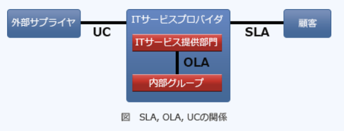

### 平成29年春期問題

---
1.JIS Q 27001:2014(情報セキュリティマネジメントシステム - 要求事項)において、ISMSに関するリーダーシップ及びコミットメントをトップマネジメントが実証する上で行う事項として挙げられているもの

- A.**ISMSの有効性に寄与するよう人々を指揮し、支援する**  
他に7つ、実証するための事項が挙げられている  
1.情報セキュリティ方針及び情報セキュリティ目的を確立し、それらが組織の戦略的な方向性と両立することを確実にする  
2.組織のプロセスへのISMS要求事項の統合を確実にする  
3.ISMSに必要な資源が利用可能であることを確実にする  
4.有効な情報セキュリティマネジメント及び ISMS 要求事項への適合の重要性を伝達する  
5.ISMSがその意図した成果を達成することを確実にする  
6.継続的改善を促進する  
7.その他の関連する管理層が席飲んの領域においてリーダーシップを実証するよう、管理層の役割を支援する

- ISMSを組織の他のプロセスと分けて運営する  
組織のプロセスへISMS要求事項を統合することが求められる

- 情報セキュリティ方針に従う  
従うのではなく、策定することが求められる

- 情報セキュリティリスク対応計画を策定する  
情報セキュリティ方針に定められた役割・権限に基づき組織が策定する

---
2.経済産業省とIPAが策定した"サイバーセキュリティ経営ガイドライン(Ver1.1)"が、自社のセキュリティ対策に加えて、実施状況を確認すべきとしている対策

- A.**自社のサプライチェーンのビジネスパートナが行うセキュリティ対策**  
サイバー攻撃から企業を守る視点で、経営者が認識する必要のある3原則、及び経営者が情報セキュリティ対策を実施する上での責任者となる担当幹部(CISO等)に指示すべき重要10項目をまとめたもの  
・セキュリティ投資にリターンは望めないので、経営者がリーダーシップをとって対策を推進すべきである  
・系列企業やサプライチェーンのビジネスパートナ等を含めたセキュリティ対策が必要である  
・平時からのセキュリティ対策に関する情報開示など、ステークホルダとの適切なコミュニケーションが必要である

---
3.組織的なインシデント対応体制の構築を支援する目的でJPCERT / CCが作成したもの

- A.**CSIRTマテリアル**  
組織内CSIRT(インシデント対応チーム)の構築を支援する目的でJPCERT / CCが作成したガイドライン。構想フェーズ・構築フェーズ・運用フェーズの3部構成で、ITセキュリティに対応するための情報・ノウハウが提示されている。JPCERT / CCのWebサイトで閲覧可能

- ISMSユーザーズガイド  
ISMS認証基準の要求事項について一定の範囲でその意味するところを説明しているガイドで、JIPDECによって作成されている

- 証拠保全ガイドライン  
電磁的証拠の保全手続きの参考として、さまざまな事案について広く利用できるように策定された指針で、デジタル・フォレンジック研究会によって作成されている

- 組織における内部不正防止ガイドライン  
組織が管理する情報と情報システムに対する内部不正の防止、不正行為発生時の早期発見と拡大防止のための体制の整備を推進するための指針で、IPAによって作成されている

---
4.ディザスタリカバリを計画する際の検討項目の1つのRPO(*Recovery Point Objective*)

- A.**システムが再稼働したときに、災害発生前のどの時点の状態までデータを復旧しなければならないかを示す指標**  
ディザスタリカバリ(*Disaster Recovery*)は、事業継続マネジメント(BCM)における概念の1つで、自然災害やサイバーテロなどの大規模災害時からシステムを素早く復旧させるための仕組みや措置、及び損害を最小限に抑えるための予防措置や体制。RPOは障害発生などの理由で業務が中断した場合に、過去の時点までの状態に戻すのかを示す指標。業務中断後いつまでに復旧させるかを示すRTO(*Recovery Time Objective* : 目標復旧時間)、BCP(*Business Continuity Planning*)を策定する際の設定事項となっている

---
6.JIS Q 31000:2010(リスクマネジメント - 原則及び指針)において、リスクマネジメントは、リスクについて組織を指揮統制するための調整された活動と定義されている。そのプロセスを構成する活動の実行順序

- A.**リスク特定, リスク分析, リスク評価, リスク対応**  
`リスク特定` : リスクを発見・認識・記述する  
`リスク分析` : リスクの特質を理解し、リスクレベルを決定する  
`リスク評価` : リスク及び／又は大きさが、受容可能か又は許容可能かを決定するために、リスク分析の結果をリスク基準と比較する  
`リスク対応` : リスクを修正する。リスク分析・リスク評価の結果明らかになったリスクに対して対応方法を講じる。リスクの大きさ、顕在化の可能性、情報 資産の重要度、予算などを踏まえて最適な対応策をとることが重要

---
7.JIS Q 27000 : 2014(情報セキュリティマネジメントシステム - 用語)におけるリスクレベルの定義

- A.**結果とその起こりやすさの組合せとして表現される、リスクの大きさ**  
現実化した時の損害額が大きいほど、現実化する確率が高いほど大きくなる。リスクの大きさは、影響度の大きさと発生確率を掛け合わせて算定する

- 脅威によって付け込まれる可能性のある、資産又は管理策の弱点  
脆弱性の定義

- 対応すべきリスクに付与する優先順位  
対応する定義はない

- リスクの重大性を評価するために目安とする条件  
リスク基準の定義

---
8.A社は情報システムの運用をB社に委託している。当該情報システムで発生した情報セキュリティインシデントについての対応で適切なもの

- A.**情報セキュリティインシデントの発生をA社及びB社の関係者に迅速に連絡するために、あらかじめ定めた連絡経路に従ってB社から連絡した**  
発生したセキュリティインシデントは、定められた連絡経路を通して、速やかに適切な管理者へ報告することが求められる

- 情報セキュリティインシデント管理を一元化するために、委託契約継続可否及び再発防止策の決定をB社に任せた  
発注者は、自組織のデータを守るために情報セキュリティ管理策を特定し、受託者に義務付ける必要がある。対応を委託者の裁量に任せているため不適切

- 情報セキュリティインシデントに迅速に対応するためにサービスレベル合意書(SLA)に緊急時のセキュリティ手続を記載せず、B社の裁量に任せた  
情報セキュリティ要求事項を満たすために、委託先との合意にはインシデントへの対応手順を含めなくてはならない

- 迅速に対応するために、特定の情報セキュリティインシデントの一次対応においては、事前に定めた対応手順よりも、経験豊かなB社担当者の判断を優先した  
事前に文書化された手順に従って対応しなければならない。対応を委託者の裁量に任せるのは不適切

---
11.JIS Q 27001:2014(情報セキュリティマネジメントシステム－要求事項)において、組織の管理下で働く人々が認識をもたなければならないとされているのは、"ISMSの有効性に対する自らの貢献"及び"ISMS要求事項に適合しないことの意味"にもう1つ

- A.**情報セキュリティ方針**  
組織の管理下で働く人々は、上記の3点について認識を持たなければならないとされている。トップマネジメントによって組織内に伝達され、従業員は内容を心得ている必要がある

---
17.1台のファイアウォールによって、外部セグメント・DMZ・内部ネットワークの3つのセグメントに分割されたネットワークがある。Webサーバと、重要なデータをもつDBサーバから成るシステムを使って、利用者向けのサービスをインターネットに公開する場合、インターネットからの不正アクセスから重要なデータを保護するためのサーバの設置方法で最も適切なものはどれか。ファイアウォールでは、外部セグメントとDMZ間及びDMZと内部ネットワーク間の通信は特定のプロトコルだけを許可し、外部セグメントと内部ネットワーク間の通信は許可しないものとする

- A.**WebサーバをDMZに、DBサーバを内部ネットワークに設置する**  
DMZは公開サーバなどの外部からアクセスされる可能性のある情報資源を設置するための、外部内部どちらでもない中間的な位置に存在するセグメント。インターネット・内部ネットワーク・DMZはルータやファイアウォールで隔てられている。公開サーバを内部ネットワークに設置すると、攻撃を受けた際の被害が内部ネットワークの他のサーバに波及する可能性がある。Webサーバは外部からのアクセスを受け付けるので、被害発生時の影響範囲を狭めるためにDMZに設置すべき。DBサーバへのアクセスはWebサーバを介して行われるため、外部から直接アクセスさせる必要はないため、内部ネットワークに設置する

---
24.JIS Q 27000 : 2019(情報セキュリティマネジメントシステム -  用語)における真正性・信頼性に対する定義

- A.真正性(*Authenticity*) : **エンティティは、それが主張するとおりのものであるという特性**  
- A.信頼性(*Reliability*) : **意図する行動と結果とが一貫しているという特性**  
`可用性`(*Availability*) : 認可されたエンティティが要求した時に、アクセス及び使用が可能であるという特性  
`機密性`(*Confidentiality*) : 認可されていない個人・エンティティ又はプロセスに対して、情報を使用させず、開示しないという特性

---
25.何らかの理由で有効期間中に失効したデジタル証明書の一覧を示すデータ

- A.**CRL**(*Certificate Revocation List* : 証明書失効リスト)  
有効期限内にも関わらず、秘密鍵の漏洩・紛失・証明書の被発行者の規則違反などの理由で認証の役に立たなくなり失効した公開鍵証明書が列挙されたリストで、失効した証明書のシリアル番号と失効日時が登録されている。ブラウザやメールクライアントは、公開鍵の使用の際にCRLを参照し、対象の公開鍵が失効していないか確認している

- CA(*Certification Authority*)  
PKI(公開鍵基盤)において、公開鍵の正当性を保証するためのデジタル証明書を発行する機関(認証局)

- CP(*Certificate Policy*)  
CAにおける証明書の利用目的・用途を定めた規定

- CPS(*Certification Practice Statement*)  
CAの運用方法を定めた認証実施規定

---
28.OSI基本参照モデルのネットワーク層で動作し、認証ヘッダ(AH)と暗号ペイロード(ESP)の2つのプロトコルを含むもの

- A.**IPsec**(*IP Security*)  
IP(*Internet Protocol*)を拡張してセキュリティを高めたプロトコルで、改竄の検知・通信データの暗号化・送信元の認証などの機能をネットワーク層(TCP / IPモデルではインターネット層)で提供します。IPsecを用いれば上層のアプリケーションに依存せずに暗号化通信を行えるため、VPNの構築に利用される。  
IPsecはプロトコル群の総称であり、認証・暗号化・鍵交換などの複数のプロトコルを含む。認証を担うプロトコルがAH(*Authentication Header*)、認証と暗号化を担うプロトコルがESP(*Encapsulated Security Payload*)。どの規格もデータの暗号化を行うが、ネットワーク層で動作するのはIPsecのみ

- S / MIME(*Secure MIME*)  
公開鍵暗号技術を使用して、認証・改竄検出・暗号化などの機能を電子メールソフトに提供する規格

- SSH(*Secure Shell*)  
公開鍵認証や認証の技術を利用して、安全にリモートコンピュータと通信するためのプロトコル

- XML番号  
XML文書の一部分を暗号化するための規格

---
29.WAF(*Web Application Firewall*)におけるブラックリスト又はホワイトリストの説明

- A.**ブラックリストは、問題のある通信データパターンを定義したものであり、該当する通信を遮断又は無害化する**  
パケットを全て許可する初期状態に、通信を拒否するルールを記述したリスト。ホワイトリストでは、パケットを全て拒否する初期状態に、通信を許可するルールを記述したリスト。WAFはWebアプリケーションに対する攻撃を検知・遮断することなので、Webサイトへのアクセス可否はフィルタリングの対象外

- ブラックリストは、脆弱性のあるWebサイトのIPアドレスを登録するものであり、該当する通信を遮断する  
攻撃の兆候を示すデータパターンを登録する

- ホワイトリストは、暗号化された受信データをどのように復号するかを定義したものであり、復号鍵が登録されていないデータを遮断する  
復号方法ではなく、通信を許可するルールを記述する

- ホワイトリストは、脆弱性がないWebサイトのFQDNを登録したものであり、登録がないWebサイトへの通信を遮断する  
Webサイトへのアクセス拒否を制御するものではない

---
30.Webサーバのけんさにおけるポートスキャナ(*Port Scanner*)の利用目的

- A.**Webサーバで稼働しているサービスを列挙して、不要なサービスが稼働していないことを確認する**  
検査対象のコンピュータやルータの全て(一部)の通信ポートに信号を送ることで、サービスの稼働状態を外部から調査するツール。ポートを調査する行為をポートスキャンと呼び、セキュリティ上の問題のあるサービスや、既知のセキュリティホールがそのままになっているサービスの検出を目的として行われる。代表的なポートスキャナに、オープンソースソフトウェアのNmap(*Network Mapper*)がある

---
32.インターネットショッピングで商品を購入する時、売買契約が成立するタイミング

- A.**事業者からの承諾の通知が消費者に到達した時点**  
民法では、売買契約は売主と買主の双方の合意があった時に成立するとされている。商取引では買主が宗門書によって申込の意思表示を行い、受け取った売主は注文請書で承諾の意思表示をする。注文請負の連絡が飼い主に受理された時点で合意があったとみなされ、売買契約が成立する。ネットショッピングでも同様、`売主からの注文承諾メールなどが、読み取り可能な状態で注文者に届いた時点で売買契約が成立する`

---
33.不正競争防止法で保護されるもの

- A.**秘密として管理している、事業活動用の非公開の顧客名簿**  
営業秘密侵害・元産地偽装・コピー商品などの不正競争を規制する法律。非公知性・秘密管理性・有用性(事業活動に有用な技術上又は営業上の情報であること)の3要件を満たすため、保護の対象となる

- 特許権を取得した発明  
特許法の保護対象

- 頒布されている自社独自のシステム開発手順書  
非公知性(公然と知られていない)を満たさないため、営業秘密に該当しない

- 秘密として管理していない、自社システムを開発するための重要な設計書  
秘密管理性(秘密として管理されていること)を満たさないため、営業秘密に該当しない

---
34.著作権法による保護の対象となるもの

- A.**ソースプログラムそのもの**  
著作物(思想または感情を創作物に表現したもの)や、著作者の権利を保護する法律。文芸・学術・音楽・美術の創作物や、ソースプログラムやDBも著作権法による保護対象に含まれる。プログラム言語・通信規約のプロトコル・アルゴリズムは保護の対象外とされている

- プログラムに組み込まれたアイディア  
アイディアは創作物ではないため著作権法の対象外

- データ通信のプロトコル
- プログラムのアルゴリズム  
プロトコル・アルゴリズムは著作権法の保護対象外

---
35.時間外労働に関する記述で、労働基準法に照らして適切なもの

- A.**法定労働時間外の労働を労使協定(36協定)なしで行わせるのは違法である**  
従業員に法定労働時間を超えて時間外労働をさせる場合、または法定の休日に労働させる場合には、予め労使で書面による協定を締結し、所轄の労働基準監督署に届け出る手続きが必要

- 裁量労働制を導入している場合、法定労働時間外の労働は従業員の自己管理としてよい  
仕事の具体的な内容や出勤・退社の時間を従業員に委ね、実際の労働時間に関係なく労使協定によって定めた時間を働いたものとみなす労働制度。裁量労働の設定時間が1日あたり8時間・週40時間を超える場合には、36協定を締結しなければならない。法定労働時間外や休日・深夜労働の割増賃金についても支払わなければならない

- 事業場外労働が適用されている営業担当者には時間外手当の支払はない  
事業場外のみない時間制が適用されている場合にも、所定労働時間を超えて残業した場合には時間外手当を支払わなければならない

- 年俸制が適用される従業員には時間外手当の支払はない  
賃金の額を年単位で決定する給与形態。年俸制を導入した場合にも、実際の労働時間が法定労働時間を超えれば、年俸とは別に時間外手当を支払わなければならない

---
36.特権ID(システムの設定・データの操作・権限の設定が可能なID)の不正使用を発見するコントロールで最も有効なもの

- A.**特権IDの貸出し及び返却の管理簿と、特権IDのログを照合する**  
全て特権IDを適切に管理するためのコントロールだが、不正使用の発見の観点ではこの選択肢のみ

- 特権IDの使用を許可された者も、通常の操作では一般利用者IDを使用する
- 特権IDの使用を必要とする者は、使用の都度、特権IDの貸出しを受ける
- 特権IDの設定内容や使用範囲を、用途に応じて細分化する  
全て、特権IDの不正使用を予防・抑制することを目的としたもの

---
37.システムの監査におけるチェックポイント

- A.**例外ケースや異常ケースを想定したテストが行われていること**  
システム要件定義書に基づいて、システム要求事項を網羅しなければならない。例外ケースや異常ケースを想定した例外テスト・負荷テスト等も実施されるべき

システムとしての要件が満たされているか検証するために行われるテストで、システム要件定義で定められた機能・能力が全て備わっているかを確認する目的で実施される。機能テスト・性能テスト・サブシステム間の結合テスト・操作性テストなどに加え、システムの障害耐性や安全性を確認するための負荷テストや耐久テスト・例外テストなども含めた総合的なテストが実施される。管理策には以下のものがある  
・計画は、開発及びテストの責任者が承認する  
・システム要求事項を網羅してテストケースを設定して行う  
・テストデータの作成及びシステムテストは、テスト計画に基づいて行う  
・本番環境と隔離された環境で行う  
・開発当事者以外の者が参画する  
・適切なテスト手法及び標準を使用する  
・結果は、ユーザ・開発・運用及び保守の責任者が承認する  
・経過及び結果を記録及び保管する

- テスト計画は事前に利用者側の責任者だけで承認されていること  
システムテストの計画は利用者側責任者のレビューを受ける必要があるが、最終的に承認するのはプロジェクト運営委員会や開発責任者となるので、監査では`開発及びテストの責任者に承認されていること`がチェックポイントとなる

- テストは実際に業務が行われている環境で実施されていること  
システムテスト環境は本番環境と隔離し、本番環境に影響を与えないようになっていなければならず、監査では`本番環境と隔離された環境で実施していること`がチェックポイントとなる

- テストは独立性を考慮して、利用者側の担当者だけで行われていること  
利用者側の担当者もテストに参加すべきだが、システムテストは基本的に開発側の手動で実施されるので、監査では`利用者側の担当者が参画していること`がチェックポイントとなる

---
38.システム監査人が、監査報告書の原案について被監査部門と意見交換を行う目的

- A.**監査報告書に記載する指摘事項及び改善勧告について、事実誤認がないことを確認するため**  
システム監査人は、監査調書に記録されたシステム監査人の所見、当該事実を裏づける監査根拠等についての事実誤認を防止するために、監査対象部門との間で意見交換会や監査講評会を開く必要がある

- 監査依頼者に監査報告書を提出する前に、被監査部門に監査報告を行うため  
最初に監査報告を行う相手は監査依頼者。被監査部門を含む外部への開示は監査依頼者と協議した上で決定する

- 監査報告書に記載する改善勧告について、被監査部門の責任者の承認を受けるため  
システム監査の結果としての改善勧告を取り入れるかどうかは経営層が判断すべき事項のため、被監査部門に承認を受ける必要はない

- 監査報告書の記載内容に関して調査が不足している事項を被監査部門に口頭で確認することによって、不足事項の追加調査に代えるため  
監査報告書の記載内容は全て監査根拠に基づくものでなくてはならず、全ての監査根拠は監査手続き内で入手すべき。監査根拠が不足している事項に関しては監査報告書に記載すべきではない

---
39.システム障害管理の監査で判明した状況のうち、監査人が監査報告書で報告すべき指摘事項

- A.**システム障害の種類や発生箇所、影響度合いに関係なく、共通の連絡・報告ルートが定められている**  
システム障害の影響度に応じた報告体制・対応手順を明確にしなければならないため、指摘事項に該当する。発生したシステム障害には影響度・緊急性に基づき優先度が割り当てられる。重大なシステム障害に分類されたものに対しては、通常のシステム障害とは異なる連絡手順を設け、適切な処置をとることが求められる。対応が遅れると、業務継続に重大な影響を及ぼす恐れがあるため、緊急時の連絡手段は、トップマネジメントへの通知を迅速に行える仕組みになっていることが肝要

- システム障害対応マニュアルが作成され、オペレータへの周知が図られている  
システム障害対応手順などの情報セキュリティ管理ルールが作成され、関係者に周知徹底することが求められるので問題ない

- システム障害によってデータベースが被害を受けた場合を想定して、規程に従って、データのバックアップをとっている  
情報システムを確実に復旧させるため、業務の復旧目標に対応したバックアップ手順を定めていることが求められるので問題ない

- 全てのシステム障害について、障害記録を残し、責任者の承認を得ることが定められている  
システム障害の内容を記録し、責任者がその作成した記録を承認していることが求められるので問題ない

---
40.システムの利用部門の利用者と情報システム部門の運用者が合同で、システムの運用テストを実施する。利用者が優先して確認すべき事項

- A.**決められた業務手順どおりに、システムが稼働すること**  
システム利用者が業務の流れに沿ってシステムのテストを行い、実際の稼働状況において不具合が発生しないか検証するために実施されるテスト。利用手順通りに問題なく業務を行えるかを優先して確認すべき

- オンライン処理・バッチ処理などが、運用手順どおりに稼働すること  
情報システム部門の運用者が確認する

- 全てのアプリケーションプログラムが仕様書どおりに機能すること
- 目標とする性能要件を満たしていること  
情報システム部門で確認する事項

---
41.ITサービスマネジメントにおける運用レベル合意書(OLA)の説明

- A.**サービス提供者と内部グループとの間で取り交わした合意文書であり、サービス及びサービス目標を定義した文書である**  
ITサービスプロバイダと、同じ組織内の別の部署との間で交わされる合意、それを記した文書。顧客へのITサービス提供のサポート・障害発生時の活動・両当事者の責任などを定義する。UCとともに、SLAの下位要素として、SLAを裏付ける契約となる

- サービス提供者と供給者との間で取り交わした合意文書であり、サービス及びサービス目標を定義した文書である  
UC(*Underpinning Contract* : 基盤契約)の説明

- サービス提供者と顧客との間で取り交わした合意文書であり、サービス及びサービス目標を定義した文書である  
SLA(*Service Level Agreement* : サービスレベル合意書)の説明

- サービス内容を顧客に提示するための文書であり、提供する全てのサービスの種類や構成を定義した文書である  
サービス説明書の説明

---
42.ITサービスマネジメントにおける問題管理プロセスの目的

- A.**インシデントの未知の根本原因を特定し、恒久的な解決策を提案したり、インシデントの発生を事前予防的に防止したりする**  
インシデントのデータと傾向を分析することで根本原因を特定し、インシデントの発生または再発を防止するための処置を決めるプロセス。インシデントの根本原因と潜在的な予防処置を特定する・問題解決のための変更要求を提起する・サービスへの影響を低減、除去するための処置を特定する・既知の誤りを記録する、などの活動を行う

- インシデントの解決を、合意したサービス目標及び時間枠内に達成することを確実にする  
インシデント管理プロセスの説明

- 合意した目標の中で、合意したサービス継続及び可用性のコミットメントを果たすことを確実にする  
サービス継続管理プロセスの説明

- 全ての変更を制御された方法でアセスメント・承認・実施・レビューすることを確実にする  
変更管理プロセスの説明

---
44.ホットスタンバイ方式を採用したシステム構成の特徴

- A.**現用系が故障すると、動作状態にある待機系に自動で迅速に切り替える。故障が発生したことを利用者に感じさせないような切替えが実現できる**  
切り替えがほぼゼロなので`ホットスタンバイ`(即時(高速)復旧)と判断できる。予備系にも主系と同じシステムを起動しデータを同期しておくことで、障害発生時に即座に予備系に切り替えることができる方式。場所・機材・データの3つの用意が必要

- 現用系が故障すると、現用系に対応した待機系に手動で切り替える。正常時には、待機系をバッチジョブに利用できるので、高いシステム稼働率が実現できる  
待機時にも電源が入っていること、切り替えを手動で行うことから`ウォームスタンバイ`(中間的復旧)と判断できる。予約系の機材を用意してシステムの設定を済ませ電源をONにしておくが、業務システムは起動せずに待機させておく方式で、場所・機材の用意が必要となる

- システムを3重に冗長化して並列運転し、それらの処理結果の多数決をとって出力する。高い信頼性が実現できる  
三重多数決システムの説明

- ネットワークが異なる複数台の現用系マシンのいずれかが故障すると、1台の予備機を立ち上げて、ネットワークや制御を自動的に切り替える。費用を抑えながら高い可用性が実現できる  
引き継ぎ時に電源投入から始めるので`コールドスタンバイ`(段階的復旧)と判断できる。復旧用に場所だけ用意しておき、非常時には予備系の機材を持ち込んでシステムを再開する方式

---
45.ビッグデータの活用例として、大量のデータから統計学的手法などを用いて新たな知識(傾向、パターン)を見つけ出すプロセス

- A.**データマイニング**(*Data Mining*)  
データウェアハウスに築成されている対象の生データを数学的・統計的手法を用いて分析し、今まで知られていなかった有用なデータの規制や因果関係を見つけ出す手法

- データウェアハウス  
企業内に散らばっているデータの有効活用を目的に、過去から現在までの基幹系DBや外部DBを結合し、効果的な戦略的意思決定を支援するためのDBのこと

- データディクショナリ  
DBやシステム開発においてデータの属性・性質などデータに関する情報の定義を保存するための辞書

- メタデータ  
データについてのデータという意味で、データ本体に付随する情報のこと。ファイルの作成者・作成日時・ファイルサイズなど、DBなら名前・テーブル定義・フィールド属性・アクセス権限などが例となる

---
46.PCからWebサーバにHTTPでアクセスしようとしたところ、HTTPレスポンスのステータスコードが404、説明文字列が"Not Found"のエラーとなった。このエラーの説明として適切なもの

- A.**Webサーバ内に、URLで指定したページが見つからなかった**  
URLが誤って指定されている、ページが削除されている、URLが変更されているなどの理由によって、リクエストないのURLが見つからない時に返されるステータスコード

HTTPステータスコードは、Webサーバが返すレスポンスの意味を示す3桁の数字。百の位を基準に区分されていて、100番台「情報通知」、200番台「処理成功」、300番台「リダイレクト」、400番台「クライアントエラー」、500番台「サーバエラー」を表している

|ステータスコード|意味|内容|
|-------------|---|----|
|200|*OK*|正常処理された|
|301|*Moved Permanently*|指定のURLは恒久的に移動した|
|403|*Forbidden*|アクセスが禁止されている|
|404|*Not Found*|リソースが見つからない|
|500|*Internal Server Error*|サーバ内でのCGI・スクリプトエラー|
|503|*Service Unavailable*|サービスは一時的に利用できない|

- Webサーバのホスト名をDNSで検索したが、見つからなかった  
HTTPリクエスト送信前にブラウザにはDNSエラーと表示される

- WebサーバへのIPパケットの経路が見つからず、HTTPリクエストがタイムアウトになった  
408(*Request Timeout*)の説明

- Webサーバへのログイン時に指定した利用者IDが見つからず、ログインが拒否された  
401(*Unauthorized*)の説明

---
47.情報戦略の立案時に、必ず整合性を取るべき対象

- A.**中長期の経営計画**  
経営戦略の下に策定され、経営目標の達成に寄与するものでなければならない。立案時には、経営事業戦略・経営事業目標・中長期構想と整合性をとることが求められる。システム管理基準でも「情報システム全体の最適化目標を経営戦略に基づいて設定すること」「情報化投資計画は、経営戦略との整合性を考慮して策定すること」などのように経営計画との整合性の重視を強調する管理項目が挙げられている

---
48.システム企画段階において業務プロセスを抜本的に再設計する際の留意点

- A.**新たな視点から高い目標を設定し、将来的に必要となる最上位の業務機能と業務組織のモデルを検討する**  
将来のあるべき姿(ベストプラクティス)を目標として再設計を行う。BPR(*Business Process Reengineering*)を実施する際には、業務プロセス・組織・規定など全ての要素をゼロベースで見直し、十分な検討により設定された将来あるべき姿を実現するために最良のものに再構築する

- 業務改善を積み重ねるために、ビジネスモデルの将来像にはこだわらず、現場レベルのニーズや課題への対応を重視して業務プロセスを再設計する  
ビジネスモデルの将来像を検討し、それに向けて再設計を行う

- 経営者や管理者による意思決定などの非定型業務ではなく、購買・製造・販売・出荷・サービスといった定型業務を対象とする  
改革の対象には業務プロセスではなく、組織や規定の見直しも含まれる

- 現行業務に関する組織、技術などについての情報を収集し、現行の組織や業務手続に基づいて業務プロセスを再設計する  
現在の組織や業務内容に関わらずゼロベースで見直す

---
49.受注管理システムにおける要件のうち、非機能要件に該当するもの

- A.**受注管理システムの稼働率を決められた水準に維持するために、障害発生時は半日以内に回復できること**  
業務要件を実現するためにシステムに求められる機能要件以外の要件のことで、制約条件や品質要求が該当する。共通フレーム2007では、非機能要件に記述する事項の例で、JIS X 0129 - 1(ISO / IEC 9126)における6つの品質特性のほか、技術要件、運用・操作要件、移行要件、付帯作業を挙げている

- 顧客から注文を受け付けるとき、与信残金額を計算し、結果がマイナスになった場合は、入力画面に警告メッセージを表示すること
- 受注を処理するとき、在庫切れの商品であることが分かるように担当者に警告メッセージを出力すること
- 出荷できる商品は、顧客から受注した情報を受注担当者がシステムに入力し、営業管理者が受注承認入力を行ったものに限ること  
業務をシステムで実現するために必要な要求なので機能要件

---
50.企業活動におけるBCP(*Business Continuity Plan* : 事業継承計画)の説明

- A.**災害やシステム障害など予期せぬ事態が発生した場合でも、重要な業務の継続を可能とするために事前に策定される行動計画のこと**  
予期せぬ重大災害が発生した場合に、必要最低限の事業を継承しつつ、業務を早急に復旧・再開できるようにするための行動計画。自然災害・テロ・新型インフルエンザ・大規模なシステム障害などの企業活動の継続が危ぶまれる危機が世界各地で発生しているため企業のBCPへの関心は高まっている

- 企業が事業活動を営む上で、社会に与える影響に責任を持ち、あらゆるステークホルダからの要求に対し適切な説明を果たすための取組のこと  
アカウンタビリティ(企業の説明責任)の説明

- 形式知だけでなく、暗黙知を含めた幅広い知識を共有して活用することで、新たな知識を想像しながら経営を実践する経営手法のこと  
ナレッジマネジメントの説明

- 組織体の活動に伴い発生するあらゆるリスクを、統合的・包括的・戦略的に把握・評価・最適化し、価値の最大化を図る手法のこと  
リスクマネジメントの説明
