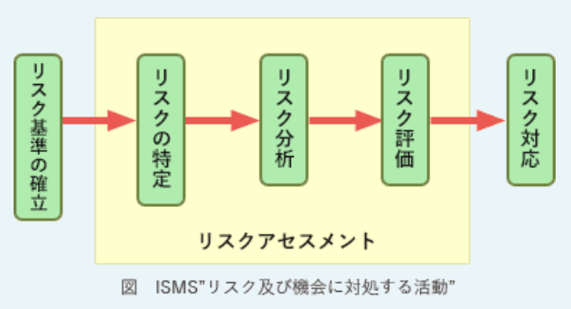
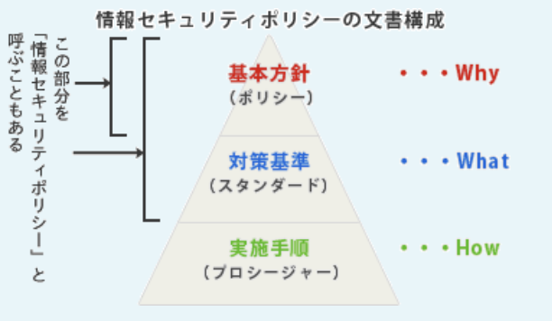
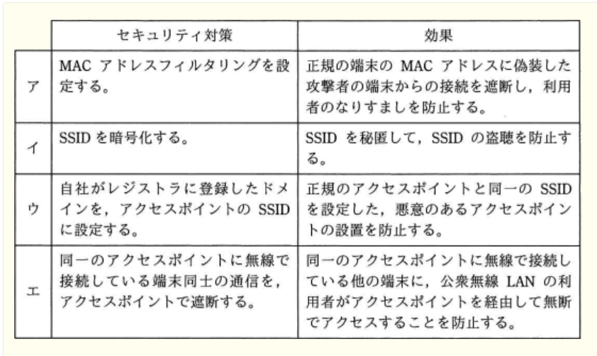
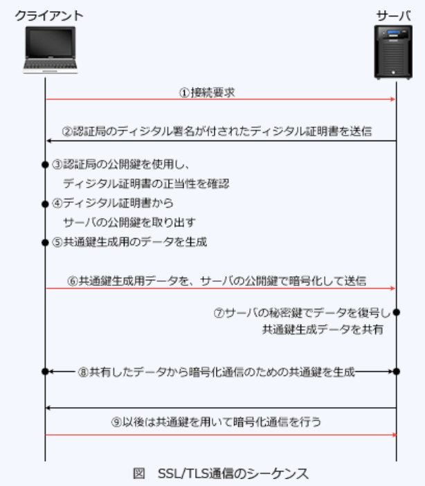
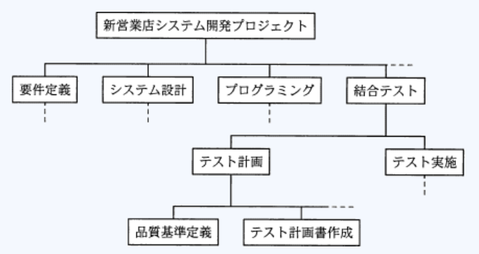

### 平成30年秋期問題

---
2.JIS Q 27000 : 2014(情報セキュリティマネジメント - 用語)における、トップマネジメントに関する記述

- A.**組織を指揮し、管理する人々の集まりとして複数名で構成されていてもよい**  
権限を委譲し、資源を提供する力を持つ。個人又は人々の集まりなので、トップマネジメントが複数人で構成されていても問題ない

- ISMS適用範囲から独立した立場であることが求められる  
組織を指揮するために、権限を委譲し、資源を提供する力もも持たなければならない

- 企業の場合、ISMS適用範囲にかかわらず代表取締役でなければならない  
情報セキュリティマネジメントシステムの適用範囲が組織の一部だけの場合、トップマネジメントは組織内の一部を指揮し、管理する人になるため代表取締役に限定されない

- 情報システム部門の長でなければならない  
情報セキュリティマネジメントシステムの適用範囲によって異なる。適用範囲が情報システム部に留まるなら情報システム部門の長がトップマネジメントになるが、そうでない場合も考えられる

---
3.JlS Q 27017 : 2016(JIS Q 27002に基づくクラウドサービスのための情報セキュリティ管理策の実践の規範)が提供する"管理策及び実施の手引"の適用に関する記述

- A.**外部のクラウドサービスを利用する事業者と、クラウドサービスを他社に提供する事業者とのどちらにも適用できる**  
クラウドサービスの提供及び利用に適用できる情報セキュリティ管理策のための指針を示した規格。管理策及び実施の手引きを、クラウドサービスプロバイダ及びクラウドサービスカスタマの双方に対して提供する。管理策及び実施の手引きは、双方の事業者に適用できる

- 外部のクラウドサービスを利用し、かつ、別のクラウドサービスを他社に提供する事業者だけに適用できる  
どちらか一方だけであっても適用できる

- 外部のクラウドサービスを利用するだけであり、自らはクラウドサービスを他社に提供しない事業者には適用できない
- 外部のクラウドサービスを利用せず、自らクラウドサービスを他社に提供するだけの事業者には適用できない  
クラウドサービスを利用・提供するだけの事業者にも適用できる

---
4.安全・安心なIT社会を実現するために創設された制度であり、IPA"中小企業の情報セキュリティ対策ガイドライン"に沿った情報セキュリティ対策に取り組むことを中小企業が自己宣言するもの

- A.***SECURITY ACTION***
中小企業自らが情報セキュリティ対策に取り組むことを自己宣言する制度

- ISMS適合性評価制度  
JIS Q 27001に基づき、組織が構築した情報セキュリティマネジメントシステムの適合性を評価する制度

- ITセキュリティ評価及び認証制度(JISEC)  
IT関連製品のセキュリティ機能の適切性・確実性ををセキュリティ評価基準の国際標準であるISO / IEC 15408に基づいて第三者(評価機関)が評価し、評価結果を認証機関が認証する制度

- *MyJVN*  
JVN iPediaの情報を、利用者が効率的に活用して頂けるように、脆弱性対策情報を効率的に収集したり、利用者のPC上にインストールされたソフトウェア製品のバージョンを容易にチェックする等の機能を提供する仕組み(フレームワーク)

---
5.SaaS(*Software as a Service*)を利用する時の企業のセキュリティ管理についての記述

- A.**システムの構築を行わずに済み、アプリケーションソフトウェア開発に必要なセキュリティ要件の定義やシステムログの保存容量の設計が不要である**  
利用者側はサービス提供事業者の構築したシステムの機能を利用することになる。したがってファイアウォールの設定や不正アクセスの管理、ソフトウェアアップデート、セキュリティパッチの適用などのシステム自体のセキュリティ管理から解放される利点がある。  
クラウドサービスの一形態で、利用者が必要とするITの機能をインターネットを経由したサービスという形で提供する仕組み。企業や個人が個別にコンピュータやアプリケーションを所有して利用するのに比べて、ITに関する開発や調達や運用･保守の負担が軽減され、コスト削減にもなる技術・サービスとして注目されている

- システム運用を行わずに済み、障害時の業務手順やバックアップについての検討が不要である  
サービス障害時に備えて利用者側で重要データのバックアップをとっておく必要がある

- システムのアクセス管理を行わずに済み、パスワードの初期化の手続や複雑性の要件を満たすパスワードポリシーの検討が不要である  
利用するサービスと利用者ごとに適切なアクセス権限の付与を行い、パスワード設定のルールなども整備する必要がある。パスワードを忘れるとサービスの利用ができないため初期化方法を用意する措置も必要

- システムの情報セキュリティ管理を行わずに済み、情報セキュリティ管理規定の策定や管理担当者の設置が不要である  
クラウドサービスの特性を理解した利用管理担当者を最低1人は確保する必要がある

---
6.JIS Q 27001 : 2014(情報セキュリティマネジメントシステム - 要求事項)では、組織が情報セキュリティリスク対応のために適用する管理策などを記した適用宣言書の作成が要求されている。適用宣言書の作成に関する記述

- A.**情報セキュリティリスク対応に必要な管理策をJIS Q 27001:2014附属書Aと比較した結果を基に、適用宣言書を作成する**  
組織が情報セキュリティマネジメントシステムに適用する管理策及びその目的を記述した文書。リスクアセスメントの結果を受けて情報セキュリティリスク対応のプロセスで作成することになっている。  
組織は必要な管理策を特定した後、付属書Aに示す管理策と比較し、必要な亜管理策が見落とされないことを検証する。必要な管理策及びそれらの管理策を含めた理由・管理策を実施しているか否か・付属書Aに規定する管理策を除外した理由を記載する

- 承認された情報セキュリティリスク対応計画を基に、適用宣言書を作成する  
適用宣言書を基に、リスク対応計画を策定する

- 適用宣言書を作成後、その内容を基に情報セキュリティリスク対応の選択肢を選定する  
情報セキュリティ対応の選択肢の選定は、リスクアセスメントの結果を考慮して行うとされている。リスクアセスメント、情報セキュリティリスク対応の選択肢の選定、適用宣言書の作成、情報セキュリティリスク対応計画の策定の順

- 適用宣言書を作成後、その内容を基に情報セキュリティリスクを特定する  
リスク特定はリスクアセスメントのプロセス。適用宣言書の作成はリスクアセスメントの実施後に行う

---
7.JIS Q 27000 : 2014(情報セキュリティマネジメントシステム - 用語)におけるリスク分析の定義

- A.**リスクの特質を理解し、リスクレベルを決定するプロセス**  
定性的な分析によって発生確率と影響度を分析したり、定量的な分析によって損失発生金額を予想したりリスクの大きさ等を明確にする

- リスクを発見、認識及び記述するプロセス  
リスク特定の定義

- リスクが受容可能か又は許容可能かを決定するために、リスク及びその大きさをリスク基準と比較するプロセス  
リスク評価の定義

- 適切な管理策を採用し、リスクを修正するプロセス  
リスク対応の定義

---
8.JIS Q 27014 : 2015(情報セキュリティガバナンス)における、情報セキュリティガバナンスの範囲とITガバナンスの範囲に関する記述

- A.**情報セキュリティガバナンスの範囲とITガバナンスの範囲は重複する場合がある**  
コーポレートガバナンスと、それを支えるメカニズムである内部統制の仕組みを情報セキュリティの観点から企業内に構築・運用すること。組織内には情報セキュリティガバナンスとITガバナンスなど複数のガバナンスモデルが存在する場合がある。これら個々のガバナンスモデルはどれもコーポレートガバナンスの構成要素で、ガバナンスモデル全体の一部であることが望ましいとしている。複数のガバナンスモデルの範囲は互いに重複する場合がある

---
9.IPA"中小企業の情報セキュリティ対策ガイドライン(第2.1版)"に記載されている、基本方針・対策基準・実施手順から成る組織の情報セキュリティポリシーに関する記述

- A.**組織の規模が小さい場合は、対策基準と実施手順を併せて1階層とし、記法方針を含めて2階層の文書構造として策定してもよい**  
ガイドラインでは、中小企業などの規模の小さい組織を対象として、対策基準と実施手順を1階層に簡素化したポリシーの策定を紹介している

`基本方針` : 情報セキュリティ対策に対する根本的な考え方を表すもので、組織がどのような情報資産をどのような脅威からなぜ保護しなければならないのかを明らかにし、組織の情報セキュリティに対する取組姿勢を示すもの  
`対策基準` : 基本方針に定められた情報セキュリティを確保するために遵守すべき行為・判断等の基準、基本方針を実現するために何をやらなければいけないか示すもの  
`実施手順` : 対策基準に定められた内容を具体的な情報システム・業務において、どのような手順に従って実行するかを示すもの

- 基本方針と対策基準は適用範囲を経営者とし、実施手順は適用範囲を経営者を除く従業員として策定してもよい  
情報セキュリティの適用範囲は経営者と全従業員

- 組織の取り扱う情報資産としてシステムソフトウェアが複数存在する場合は、その違いに応じて、複数の基本方針、対策基準及び実施手順を策定する  
扱う業務や管理する情報システムが多い組織では実施手順が複数になることもあるが、基本方針と対策基準は常に1つ

- 初めに具体的な実施手順を策定し、次に実施手順の共通原則を対策基準としてまとめて、最後に、対策基準の運用に必要となる基本方針を策定する  
情報セキュリティポリシーは、まず共通原則として基本方針を定め、対策基準、実施手順と追って具体化していく

---
10.情報セキュリティ管理を推進する取組みのうち、IPA"中小企業の情報セキュリティ対策ガイドライン(第2.1版)"において、経営者がリーダーシップを発揮し自ら行うべき取組みとして示されているもの

- A.**情報セキュリティ対策の有効性を維持するために、対策を定期又は随時に見直す**
- A.**情報セキュリティ対策を組織的に実施する意思を明確に示すために、方針を定める**
- A.**情報セキュリティの新たな脅威に備えるために、最新動向を収集する**  
他にも、資源(予算、人材など)の確保・対策の検討、実行の指示・責任範囲を明確にする・緊急時の連絡先や対象についての準備を含む、7つの取り組みが示されている

- 情報セキュリティ監査の目的を有効かつ効率的に達成するために、監査計画を立案する  
経営者ではなく監査人の役割

---
11.情報の取扱基準の中で、社外秘情報の持出しを禁じ、周知した上で、従業員に情報を不正に持ち出された場合に、"社外秘情報とは知らなかった"という言い訳をさせないことが目的の1つになっている対策

- A.**情報の管理ラベルについてのラベル付け**  
顧客名簿や技術ノウハウ等の重要情報とそれ以外の情報を区別しないと、役職員は保護する必要のある重要情報が分からず、重要情報を知らずに漏らしてしまう可能性がある。これらの管理ができていないと、不正を犯した内部者の責任を追及できないことがあり、企業や団体の管理責任を問われることもある。社外秘情報等の重要情報を把握して重要度に合わせてラベル付けし、区分に応じて取扱可能な役職員の範囲(職位、職種等)を定めなければならない

---
15.マルウェア*Wanna Cryptor*(*WannaCry*)に関する記述

- A.**SMBv1の脆弱性を悪用するなどして感染し、PC内のデータを暗号化してデータの復号のための金銭を要求したり、他のPCに感染を拡大したりする**  
ワームの感染拡大機能を有するランサムウェア。Microsoftネットワークのファイル共有通信に用いられていたSMBv1の脆弱性を悪用して感染を拡大する。感染したローカルPC内の多数のファイルを勝手に暗号化し、拡張子を.WNCRYに書き換え脅迫画面を表示して復号のための金銭を要求する

- ファイル共有など複数の感染経路を使って大量のPCに感染を拡大し、更にPC内の電子メールアドレスを収集しながらインターネット経由で感染を拡大する  
BAGLEワームに関する記述

- ランダムにIPアドレスを選んでデータベースの脆弱性を悪用した攻撃を行うことによって多数のPCに感染を拡大し、ネットワークトラフィックを増大させる  
SQLスラマに関する記述

- 利用者が電子メールに添付されたVBScriptファイルを実行すると感染し、PC内のパスワードを攻撃者のWebサイトへ送信したり、マルウェア付きの電子メールを他者へばらまいたりする  
*VBS.LoveLetter*に関する記述

---
17.セキュアブートの説明

- A.**PCの起動時にOSやドライバのデジタル署名を検証し、許可されていないものを実行しないようにすることによって、OS起動前のマルウェアの実行を防ぐ技術**  
BIOSに代わる新仕様であるUEFI(*Unified Extensible Firmware Interface*)で規定されていて、WindowsではWindows8以降が対応している。セキュアブートを行うことで、HDDのブートセクタに感染するタイプのマルウェアの実行も防止できる

- BIOSにパスワードを設定し、PC起動時にBIOSのパスワード入力を要求することによって、OSの不正な起動を防ぐ技術  
BIOSパスワードの説明

- HDDにパスワードを設定し、PC起動時にHDDのパスワード入力を要求することによって、OSの不正な起動を防ぐ技術  
HDDパスワードの説明

- マルウェア対策ソフトをスタートアッププログラムに登録し、OS起動時に自動的にマルウェアスキャンを行うことによって、マルウェアの被害を防ぐ技術  
セキュアブートはOS起動時のマルウェア実行を防ぐ技術

---
20.公衆無線LANのアクセスポイントを設置するときのセキュリティ対策と効果の組み合わせで適切なもの

- A.**エ**  
無線LANの`プライバシーセパレータ機能`(アクセスポイントアイソレーション)についての記述。同一の無線LANに接続された子機同士の通信を禁止する機能。店舗内Wi-fiや公衆無線LANサービスのように見知らぬ他人同士が同じ無線LANに接続する場面で、利用者のセキュリティ保護のために設定される

- ア  
MACアドレスフィルタリングは、無線LANのアクセスポイントに正当な機器のMACアドレスを登録しておくことで、正当な機器以外からのアクセスを拒否する機能。MACアドレスを正当なものに偽装している端末からの接続を遮断することはできない

- イ  
SSIDは暗号化できない。SSIDを秘匿にするためにはアクセスポイントにSSIDステルスの設定を行う。これにより、アクセスポイントから発せられるビーコンにSSIDの情報が含まれなくなるため、第三者にアクセスポイントのSSIDを知られてしまう危険性を低くできる

- ウ  
ドメイン名は公開されていて、悪意のあるアクセスポイントのSSIDとして他者のドメインを設定することも可能なので、対策として意味がない。不正なアクセスポイントの設置に対しては、SSIDや暗号化キーを類推できないものにすることがある程度の対策になる

---
22.A社のWebサーバは、サーバ証明書を使ってTLS通信を行っている。PCからA社のWebサーバへのTLSを用いたアクセスにおいて、当該PCがサーバ証明書を入手した後に、認証局の公開鍵を利用して行う動作

- A.**サーバ証明書の正当性を、認証局の公開鍵を使って認証する**  
暗号化通信の開始の際にサーバからクライアントに送られる公開鍵に対する電子式の証明書で、認証局(CA : 第三者機関)によって発行されている。認証を受けた公開鍵が含まれていて、信頼性を担保するために認証局のデジタル署名が付されている。サーバ証明書を提示された利用者は、暗号化通信の開始に際し「認証局の公開鍵」を使用してサーバ証明書に付された「認証局のデジタル署名」を検証する。デジタル署名の検証に成功したら同封されている公開鍵が正当であり、改竄されていないことが保証される。SSl / TLSでは公開鍵の検証後、公開鍵を使って通信相手と共通鍵を共有する(RSA方式の鍵交換の場合)。以降はその共通鍵を使用して暗号化通信を行う

---
23.従量課金制のクラウドサービスにおけるEDoS(*Economic Denial of Service*, *Economic Denial of Sustainability*)攻撃の説明

- A.**クラウドサービス利用者の経済的な損失を目的に、リソースを大量消費させる攻撃**  
DoS攻撃のようにサービス停止を目的とするのではなく、標的に経済的な損失を与えることを主目的とするDoS攻撃。サービスの利用料に応じて料金を支払う従量課金の料金体制のクラウドサービスを、攻撃者が逆手に取り、外部から不正なリクエストを大量に送りつけることで意図的にトラフィックを増加させ、契約者に本来不要な多額の使用料を支払わせるように仕向ける

---
28.共通脆弱性評価システム(*Common Vulnerability Scoring System* : CVSS)の特徴

- A.**情報システムの脆弱性の深刻度に対するオープンで汎用的な評価手法であり、特定ベンダに依存しない評価方法を提供する**  
情報システムの脆弱性に対する汎用的な評価手法で、脆弱性の深刻度を同一の基準のもとで定量的に比較することが可能になる  
`基本評価基準`(*Base Metrics*) : 脆弱性自体の深刻度を評価する。機密性・可用性・完全性への影響の大きさや、攻撃に必要な条件などの項目から算出され、時間経過や利用者の環境で変化しない  
`現状評価基準`(*Temporal Metrics*) : 脆弱性の現在の深刻度を評価する。攻撃を受ける可能性・利用可能な対応策のレベルなどの項目から算出され、時間経過により変化する  
`環境評価基準`(*Environmental Metrics*) : 製品利用者の利用環境も含め、最終的な脆弱性の深刻度を評価する。二次被害の可能性や影響を受ける範囲などの項目から算出され、製品利用者ごとに変化する

- CVSSv2とCVSSv3は、脆弱性の深刻度の算出方法が同じであり、どちらのバージョンで算出しても同じ値になる  
CVSSv3では基本評価基準に変更が加えられたため、同じ脆弱性であってもCVSSv2との評価値が異なることがある

- 脆弱性の深刻度を0から100の数値で表す  
0.0 - 10.0で算出され、スコアが高いほど深刻度も高くなる。スコアに応じて緊急・重要・警告・注意の区分が設定されている

- 脆弱性を評価する基準は、現状評価基準と環境評価基準の2つである  
基本評価基準もある

---
29.SSH(*Secure Shell*)の説明

- A.**リモートログインやリモートファイルコピーのセキュリティを強化したプロトコル、及びそのプロトコルを実装したコマンド**  
公開鍵暗号や認証の技術を利用して、安全にリモートコンピュータと通信するためのプロトコルで、SSLと同様にトランスポート層とアプリケーション層で通信を暗号化する。rlogin, rsh, Telnetを安全に利用する手段として用いられていたが、現在ではポートフォワーディング機能(ローカルの任意のポートに送信したデータをリモートの特定のポートへ転送する)を用いることでPOP3やFTPなどネットワーク上に平文のパスワードが流れてしまう既存のプロトコルを安全に利用する技術としても広く利用されている

- MIMEを拡張した電子メールの暗号化とデジタル署名に関する標準  
S / MIME(*Secure Multipurpose Internet Mail Extensions*)の説明

- オンラインショッピングで安全にクレジットカード決済を行うための仕様  
SET(*Secure Electronic Transaction*)の説明

- 共通鍵暗号技術と公開鍵暗号技術を併用した電子メールの暗号化、復号の機能をもつ電子メールソフト  
PGP(*Pretty Good Privacy*)の説明

---
31.サイバーセキュリティ基本法において定められたサイバーセキュリティ戦略本部は、どの機関に設置されているか

- A.**内閣**  
サイバーセキュリティ基本法の規定に基づき内閣に設置することが定められた組織。サイバーセキュリティ戦略の案の作成・実施の推進を担う。サイバーセキュリティ戦略本部の組織は、本部長を内閣官房長官、副部長を国務大臣が務め、本部員として国家公安委員会委員長・デジタル大臣・総務大臣・外務大臣・経済産業大臣・防衛大臣その任命された者で構成される。サイバーセキュリティ戦略本部の事務を行うために内閣官房に設定されている組織がNISC(内閣サイバーセキュリティセンター)

---
34.Webページの著作権に関する記述

- A.**特定の分野ごとにWebページのURLを収集し、独自の解釈を付けたリンク集は、著作権法で保護され得る**  
特定の目的のために参考となるWebページを紹介するコメント付き"リンク集"などは、紹介するWebページの選定などに作成した人の創造性が表れているので編集著作物として保護される

- 営利目的でなく趣味として、個人が開設し、公開しているWebページに他人の著作物を無断掲載しても、私的使用であるから著作権の侵害にならない  
Webページ上に公開されたコンテンツは不特定多数の人がダウンロードして利用できる状態になるため、利敵利用を超えていると判断される。著作者の公衆送信権を侵害する行為

- 作成したプログラムをインターネット上でフリーウェアとして公開した場合、公開されたプログラムは、著作権法で保護されない  
著作権法ではプログラム言語・規約・アルゴリズムを保護の対象外としている。C言語、Javaなどのプログラム言語自体は保護対象外だが、プログラム言語を用いて作られたプログラム(ソースコードの集合)は保護対象外

- 試用期間中のシェアウェアを使用して作成したデータを、試用期間終了後もWebページに掲載することは、著作権の侵害になる  
特段の取り決めがない場合、作成したデータの著作権は作成者本人に帰属するので、試用期間後の掲載も著作権の侵害になることはない

---
36.金融庁"財務報告に係る内部統制の評価及び監査に関する実施基準(平成23年)"におけるITの統制目標の1つである"信頼性"について

- A.**情報が、組織の意思・意図に沿って承認され、漏れなく正確に記録・処理されること**  
情報が組織の意思・意図に沿って承認され、もれなく正確に記録・処理されること(正当性・完全性・正確性)

`有効性及び効率性` : 情報が業務に対して効果的・効率的に提供されていること

- 情報が、関連する法令や会計基準、社内規則などに合致して処理されること
`準拠性`の説明。情報が関連する法令や会計基準、社内規則等に合致して処理されていること

- 情報が、正当な権限を有する者以外に利用されないように保護されていること
`機密性`の説明。情報が正当な権限を有する者以外に利用されないように保護されていること

- 情報が、必要とされるときに利用可能であること
`可用性`の説明。情報が必要とされる時に利用可能であること

---
37.JIS Q 27001 : 2014(情報セキュリティマネジメントシステム - 要求事項)に基づいてISMS内部監査を行った結果として判明した状況のうち、監査人が指摘事項として監査報告書に記載すべきもの

- A.**リスクアセスメントを実施した後に、リスク受容基準を決めた**  
手順では、リスクアセスメントを実施する前にリスク受容基準を確立することになっている。リスクアセスメントに含まれるリスク評価プロセスにおいて、`リスク分析の結果とリスク受容基準を比較する`ことになっているため

---
38.外部委託管理の監査に関する記述

- A.**請負契約においては、委託側の事務所で作業を行っている受託側要員のシステムへのアクセスについて、アクセス管理が妥当かどうかを、委託側が監査できるように定める**  
受託側要員の情報へのアクセスに関して、要求事項が遵守されているか否かを監視するためのプロセス・手順が必要

- 請負契約においては、受託側要員に対する委託側責任者の指揮命令が行われていることを、委託側で監査する  
請負契約においては受託側要員に対する指揮命令は受託側企業によって行われていないといけない。監査すべきは、受託側要員に対する受託側責任者の指揮命令が行われていないこと

- 外部委託で開発した業務システムの品質管理状況は、委託側で調査せず、受託側で監査する  
委託業務の進捗状況、品質管理状況などは委託側が監査すべき事項

- 機密度が高い業務システムの開発を外部に委託している場合は、自社開発に切り替えるよう、監査結果の報告において改善勧告する  
コスト・納期・自社の技術などの様々な要素を勘案して決定されるべき事項なので、機密性の度合いで自社開発への切り替えを勧告すべきではない

---
39.システム監査において、電子文書の真正性の検証に電子証明書が利用できる公開鍵証明書取得日、電子署名生成日及び検証日の組合せはどれか。公開鍵証明書の有効期間は4年間とし、当該期間中の公開鍵証明書の更新や失効は考慮しない前提とする

|選択肢|公開鍵証明書取得日|電子署名生成日|検証日|
|-----|---------------|-----------|-----|
|ア|2012 / 3 / 1|2014 / 8 / 1|2018 / 12 / 1|
|イ|2016 / 1 / 1|2016 / 12 / 1|2018 / 2 / 1|
|ウ|2015 / 4 / 1|2015 / 5 / 1|2018 / 12 / 1|
|エ|2016 / 8 / 1|2014 / 7 / 1|2018 / 3 / 1|

- A.**ウ**  
証明書取得後に署名されており、検証日も証明書の有効期限内なので問題なく真正性の検証が行える

- ア
- イ  
検証日には公開鍵証明書が有効期限切れになっているため検証に使用できない

- エ  
署名の生成日が証明書取得日よりも前になっている。証明書発行前に生成された署名はその正当性が担保されないため、文書の真正性の検証には使えない

---
43.ソフトウェア開発プロジェクトにおいて、WBS(*Work Breakdown Structure*)を使用する目的

- A.**作業を階層的に詳細化して、管理可能な大きさに細分化する**  
プロジェクト目標を達成し、必要な成果物を過不足なく作成するために、プロジェクトチームが実行すべき作業を、成果物を主体に階層的に要素分解したもの。作業の漏れや抜けを防ぎ、プロジェクトの範囲を明確にし、作業単位ごとに内容・日程・目標を設定することでコントロールしやすくする目的がある

- 開発の期間と費用がトレードオフの関係にある場合に、総費用の最適化を図る  
EVM(*Earned Value Management*)やトレンドチャートを使用する目的

- 作業の順序関係を明確にして、重点管理すべきクリティカルパスを把握する  
アローダイアグラムを使用する目的

- 作業の日程を横棒(バー)で表して、作業の開始や終了時点、現時点の進捗を明確にする  
ガントチャートを使用する目的

---
44.信頼性設計に関する記述で、フェールセーフ(*Fail safe*)の説明

- A.**システムの一部が故障しても、危険が生じないような構造や仕組みを導入する設計のこと**  
システムの不具合や故障時にも、障害の影響範囲を最小限にとどめ、常に安全に最優先にして制御を行う設計方針。工業用機械で侵入禁止区域をセンサで監視し、人や物の侵入検知時に機械を緊急停止する・信号機の故障時には交差点内の信号機を全て赤信号にする、などの安全最優先の設計が実践例

- 故障が発生した場合、一部のサービスレベルを低下させても、システムを縮退して運転を継続する設計のこと  
フェールソフトの説明

- システムに冗長な構成を組み入れ、故障が発生した場合、自動的に待機系に切リ替えて運転を継続する設計のこと  
フォールトトレランスの説明

- 人聞が誤った操作や取扱いができないような構造や仕組みを、システムに対して考慮する設計のこと  
フールプルーフの説明

---
49.企画、要件定義、システム開発、ソフトウェア実装、ハードウェア実装、保守から成る一連のプロセスにおいて、要件定義プロセスで実施すべきもの

- A.**システムに関わり合いをもつ利害関係者の種類を識別し、利害関係者のニーズ、要望及び課せられる制約条件を識別する**  
システムライフサイクルの2番目のプロセスで、利害関係者要求の明確化と制約事項の定義に関わる作業を実施するプロセス。新たに構築する業務・システムの仕様・システム化の範囲と機能を明確にし、システム取得者側の利害関係者間で合意することを目的としている。定義された内容は、要件定義書に取りまとめられシステム設計工程へ引き継がれていく

- 事業の目的、目標を達成するために必要なシステム化の方針、及びシステムを実現するための実施計画を立案する  
企画プロセスでの実施事項

- 目的とするシステムを得るために、システムの機能及び能力を定義し、システム方式設計によってハードウェア、ソフトウェアなどによる実現方式を確立する
- 利害関係者の要件を満足するソフトウェア製品又はソフトウェアサービスを得るための、方式設計と適格性の確認を実施する  
システム開発プロセスでの実施事項
