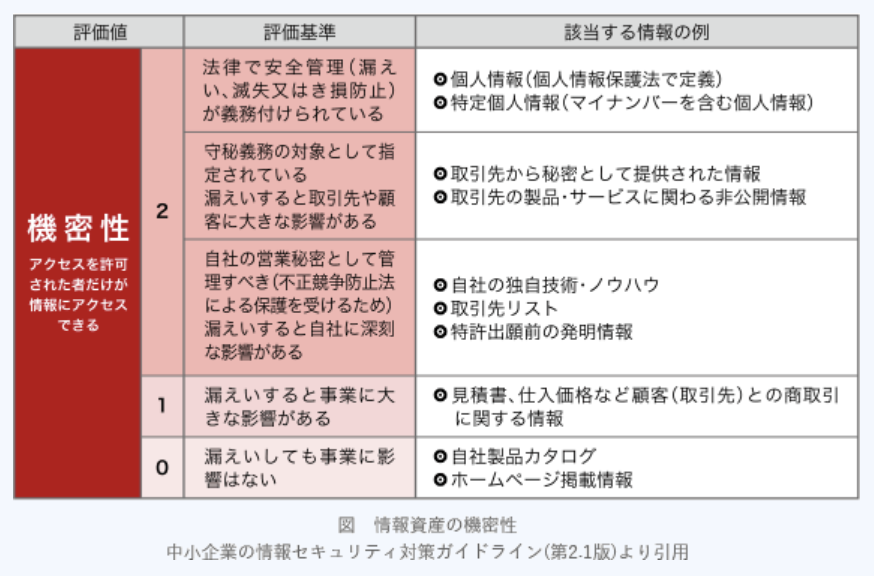

### 平成30年春期問題

---
1.サイバーレスキュー隊(J - CRAT)に関する記述

- A.**標的型サイバー攻撃の被害低減と攻撃連鎖の遮断を支援する活動を担う**  
標的型サイバー攻撃特別相談窓口にて受け付けた相談や情報に対して調査分析を実施し、JPCERT / CCやセキュリティベンダー等と連携して助言や支援・情報共有を行うことで被害の低減と攻撃の拡大防止を図るIPAの取り組み。標的型サイバー攻撃の被害逓減と拡大防止を活動目的としている

- サイバーセキュリティ基本法に基づき内閣官房に設置されている  
内閣サイバーセキュリティセンター(NISC)の説明

- 自社や顧客に関係した情報セキュリティインシデントに対応する企業内活動を担う  
CSIRTの説明

- 情報セキュリティマネジメントシステム適合性評価制度を運営する  
情報マネジメントシステム認定センターの説明

---
2.リスク対応のうち、リスクの回避に該当するもの

- A.**リスクレベルが大きいと評価した情報システムを用いるサービスの提供をやめる**  
`リスク回避`に該当する。リスク源を除去して、リスクの発生確率をゼロにすること

- リスクが顕在化する可能性を低減するために、情報システムのハードウェア構成を冗長化する  
`リスク低減`に該当する。リスクの発生確率やリスクが現実化した時の損失を低下させること

- リスクの顕在化に伴う被害からの復旧に掛かる費用を算定し、保険を掛ける  
`リスク移転`に該当する。保険への加入やリスク業務のアウトソーシングなどにより、他社にリスクを移転・分散すること

- リスクレベルが小さいので特別な対応をとらないという意思決定をする  
`リスク受容`に該当する。リスクに対して何の対策もとらないこと。発生頻度が低く被害も小さいリスクに対して選択される

---
3.JIS Q 27000 : 2014(情報セキュリティマネジメントシステム - 用語)におけるリスク評価についての説明

- A.**リスクとその大きさが受容可能か否かを決定するために、リスク分析の結果をリスク基準と比較するプロセス**  
リスク分析の成果及びリスク評価に基づき、どのリスクへの対応が必要か、対応の実践の優先順位はどうするかについて意思決定を行うプロセス(リスク基準の確立、特定、分析、評価、対応の順)

- リスクの発見、認識及び記述を行うプロセス  
リスク特定の説明

- リスクの特質を理解し、リスクレベルを決定するプロセス  
リスク分析の説明

- 対策を講じることによって、リスクを修正するプロセス  
リスク対応の説明

---
5.JIS Q 27000 : 2014(情報セキュリティマネジメントシステム - 用語)及びJIS Q 27001 : 2014(情報セキュリティマネジメントシステム - 要求事項)における情報セキュリティ事象と情報セキュリティインシデントの関係

- A.**単独又は一連の情報セキュリティ事象は、情報セキュリティインシデントに分類され得る**  
`情報セキュリティ事象` : 情報セキュリティ方針への違反または管理策の不具合の可能性、又はセキュリティに関係し得る道の状況を示す。システム・サービス又はネットワークの状態に関連する事象  
`情報セキュリティインシデント` : 望まない単独又は一連の情報セキュリティ事象、又は予期しない情報セキュリティ事象であって、事業運営を危うくする確率及び情報セキュリティを脅かす確率が高いもの  
・`情報セキュリティ事象のうち、事業運営に影響を与えたり、情報セキュリティを脅かしたりするものが情報セキュリティインシデントに分類される。`情報セキュリティインシデント管理では、報告されたセキュリティ事象を評価し、情報セキュリティインシデントに分類するかを決定する

---
6.IPA"中小企業の情報セキュリティ対策ガイドライン(第2.1版)"を参考に、情報資産の機密性を評価した。機密性が評価値2とされた情報資産と判断理由

|評価値|評価基準|
|-----|------|
|2|法律で安全管理が義務付けられている、又は漏洩すると取引先や顧客への大きな影響、自社への深刻、大きな影響がある|
|1|漏洩すると自社の事業に影響がある|
|0|漏洩しても自社の事業に影響はない|

||情報資産|判断理由|
|-|-----|-------|
|ア|自社ECサイト(電子データ)|DDoS攻撃を受けてから顧客アラアクセスされなくなると、機会損失が生じて売上が減少する|
|イ|自社ECサイト(電子データ)|ディレクトリリスティングされると、廃版となった商品情報がECサイト訪問者に勝手に閲覧される|
|ウ|主力製品の設計図(電子データ)|責任者の承諾なく設計者によって無断で変更されると、製品の機能・品質・納期・製造工程に関する問題が生じ、損失が発生する|
|エ|主力製品の設計図(電子データ)|不正アクセスによって外部に流出すると、技術やデザインによる製品の競争優位性が失われて、製品の売上が減少する|

- A.**エ**  
営業秘密の流出で競争優位性が失われ、長期的な売上減少になる可能性がある。長期的な売上減少は自社の事業編深刻な影響を及ぼすので評価値は2になる

- ア  
DDoS攻撃で低下するのは可用性なので、機密性を評価する判断理由ではない

- イ  
HP掲載情報は評価値0に分類されている。廃版となった商品を閲覧されても自社の事業に特段影響はないと考えられる

- ウ  
勝手な変更によって低下するのは完全性なので、機密性を評価する判断理由としては不適切

---
7.JIS Q 27002 : 2014(情報セキュリティ管理策の実践のための規範)でいう特権的アクセス権の管理について、情報システムの管理特権を利用した行為

- A.**システム管理者が、業務システムのプログラムにアクセスし、バージョンアップを行う**  
システム上のあらゆる作業を可能にする強力な操作権限のことで、システムを管理する役割を持つ管理者ID / 特権ユーザなどに与えられる。管理者がシステムを運用する際に使用され、一般の利用者権限では実施できない、ユーザの追加・削除、システムの設定変更、ソフトウェアのインストール・アップデート、ログの操作などの作業を行うために必要となる

---
9.ネットワーク障害の発生時に原因を調べるために、ミラーポート(LANアナライザ)を用意して、LANアナライザを使用できるようにしておく時に留意すること

- A.**LANアナライザにはネットワークを通過するパケットを表示できるので、盗聴などに悪用されないように注意する必要がある**  
LANアナライザは、LAN上を通過するパケットを監視したり記録するためのハードウェアハードウェア(ソフトウェア)のこと。悪用されると盗聴などの被害をもたらす危険があるので慎重な管理が求められる

- LANアナライザがパケットを破棄してしまうので、測定中は測定対象外のコンピュータの利用を制限しておく必要がある  
LANアナライザはミラーポートに接続されるので、通常のパケット通信に影響はない

- 障害発生に備えて、ネットワーク利用者にLANアナライザの保管場所と使用方法を周知しておく必要がある  
LANアナライザが不正に利用される可能性が高まるため不適切

- 測定に当たって、LANケーブルを一時的に切断する必要があるので、利用者に対して測定日を事前に知らせておく必要がある  
ハブやスイッチのミラーポートに接続するので切断の必要はない

---
13.サーバへの侵入を防止するのに有効な対策

- A.**サーバ上の不要なサービスを停止する**  
外部に不要なサービスを公開したままにしておくと攻撃者にセキュリティ上の弱点を知らせることになり、攻撃の標的にされやすくなる。サービスごとに外部公開の必要性を確認し、不要なサービスは停止することが重要

- サーバ上にあるファイルのフィンガプリントを保存する  
ファイルの同一性を確認するためのハッシュ値のこと。ファイルの改竄の有無を確かめるための対策なので誤り

- サーバのバックアップを定期的に取得する  
サーバに侵入された後の回復措置のための対策なので誤り

- サーバを冗長化して耐故障性を高める  
侵入防止にはつながらない

---
15.A社では、インターネットを介して提供される複数のクラウドサービスを、共用PCから利用している。共用PCの利用者IDは従業員の間で共用しているが、クラウドサービスの利用者IDは従業員ごとに異なるものを使用している。クラウドサービスのパスワードの管理方法のうち、本人以外の者による不正なログインの防止の観点から、適切なもの

- A.**各従業員が指紋認証で保護されたスマートフォンをもち、スマートフォン上の信頼できるパスワード管理アプリケーションに各自のパスワードを記録する**  
指紋認証で保護されたスマートフォンは本人以外にはアクセスできないので安全

- 各従業員が複雑で推測が難しいパスワードを1つ定め、どのクラウドサービスでも、そのパスワードを設定する  
パスワードを使い回すと、1ヶ所のサービスでパスワードの漏洩が起きた際に、他のサービスにも不正アクセスの危険が及ぶため不適切

- パスワードを共用PCのWebブラウザに記憶させ、次回以降に自動入力されるように設定する  
他の従業員がクラウドサービスを利用する際に、ブラウザのオートコンプリート機能でIDとパスワードが自動入力されてしまうので不適切

- パスワードを平文のテキストファイル形式で記録し、共用PCのOSのデスクトップに保存する  
共用PCは従業員間で共用しているので、パスワードを誰でもみられる状態にしておくと他の従業員により不正ログインされてしまう可能性がある

---
17.A社では、利用しているソフトウェア製品の脆弱性に対して、ベンダから提供された最新のセキュリティパッチを適用することを決定した。ソフトウェア製品がインストールされている組織内のPCやサーバについて、セキュリティパッチの適用漏れを防ぎたい。そのために有効なもの

- A.**ソフトウェア製品の名称やバージョン、それらが導入されている機器の所在、IPアドレスを管理するIT資産管理システム**  
組織内の全IT資産の把握・それらの一元管理を実現するシステム。機器ごとに、名称・使用者・導入されているソフトウェアやバージョン・ライセンス状態・ネットワーク接続状況などの情報を自動で収集する。IT資産管理システムを利用すれば、セキュリティパッチを適用しないといけない全機器を簡単に割り出せる

- ソフトウェア製品の脆弱性の概要や対策の情報が蓄積された脆弱性対策情報データベース(JVN iPedia)  
キーワードやベンダ名、製品名等により特定の脆弱性対策情報を効率的に検索できるWebサイト。ソフトウェア製品の既知の脆弱性を確認するのに有効

- ソフトウェア製品の脆弱性の特性や深刻度を評価するための基準を提供する共通脆弱性評価システム(CVSS)  
脆弱性の深刻度を同一の基準の下で定量的に比較するのに有効

- ソフトウェア製品のソースコードを保存し、ソースコードへのアクセス権と変更履歴を管理するソースコード管理システム  
ソフトウェア開発でバージョン管理を行うのに有効

---
18.社内ネットワークとインターネットの接続点に、ステートフルインスペクション機能をもたない、静的なパケットフィルタリング型のファイアウォールを設置している。このネットワーク構成において、社内のPCからインターネット上のSMTPサーバに電子メールを送信できるようにするとき、ファイアウォールで通過を許可するTCPパケットのポート番号の組合せはどれか。SMTP通信にはデフォルトのポート番号を使うものとする

- A.

|送信元|宛先|送信元ポート番号|宛先ポート番号|
|-----|---|--------------|-----------|
|PC|SMTPサーバ|1024以上|25|
|SMTPサーバ|PC|25|1024以上|

SMTP(*Simple Mail Transfer Protocol*)は電子メールを転送するプロトコルで通信に25 / TCPポートを使用する。下記2種類のパケットだけを通信許可をすればSMTP通信を行うことができる  
1.PCからSMTPサーバへの発信パケット(1024以上 => 25)  
2.SMTPサーバからPCへの応答パケット(25 => 1024以上)

---
20.ドメイン名ハイジャックを可能にする手口

- A.**権威DNSサーバに登録された情報を不正に書き換える**  
他人のドメインを不正に乗っ取る行為。DNSサーバに偽の対応情報を登録させる、レジストラに不正アクセスして登録情報を書き換えるなどの手口がある。乗っ取られたドメイン名にアクセスした利用者は、意図しない別のサイト(多くは不正サイト)に誘導されてしまうことになる

- PCとWebサーバとの通信を途中で乗っ取り、不正にデータを窃取する  
中間者攻撃の手口

- Webサーバに、送信元を偽装したリクエストを大量に送信して、Webサービスを停止させる  
DoS攻撃の手口

- Webページにアクセスする際のURLに余分なドットやスラッシュなどを含め、アクセスが禁止されているディレクトリにアクセスする  
ディレクトリトラバーサル攻撃の手口

---
21.ドライブバイダウンロード攻撃に該当するもの

- A.**利用者が公開Webサイトを閲覧したときに、その利用者の意図にかかわらず、PCにマルウェアをダウンロードさせて感染させる**  
Webサイトに悪意のあるプログラムを埋め込み、Webブラウザを通じて利用者が気付かないようにそのプログラムをダウンロードさせたり、自動的に実行させる攻撃。脆弱性のある利用環境だとWebページを閲覧しただけでマルウェアの被害に遭う恐れがある。単独で攻撃にしようされることも、標的型攻撃・水飲み場攻撃などで補助的に使用されることもある

- PC内のマルウェアを遠隔操作して、PCのハードディスクドライブを丸ごと暗号化する  
ランサムウェアに該当する

- 外部ネットワークからファイアウォールの設定の誤りを突いて侵入し、内部ネットワークにあるサーバのシステムドライブにルートキットを仕掛ける  
不正アクセスの一例に該当する

- 公開Webサイトにおいて、スクリプトをWebページ中の入力フィールドに入力し、Webサーバがアクセスするデータベース内のデータを不正にダウンロードする  
SQLインジェクションに該当する
