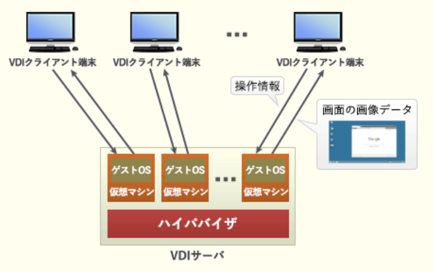
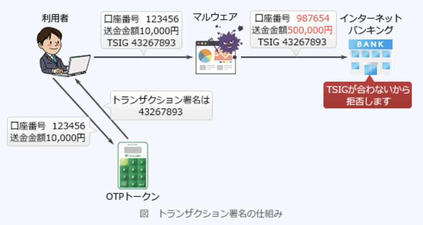
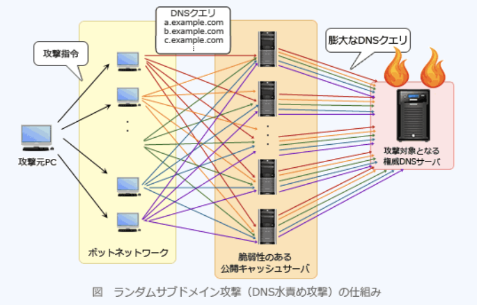
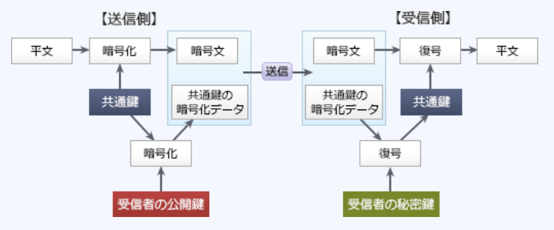

### 令和元年秋期問題

---
1.BEC(*Business E-mail Compromise*)に該当するもの

- A.**巧妙な騙しの手口を駆使し、取引先になりすまして偽の電子メールを送り、金銭を騙し取る**  
ビジネスメール詐欺と訳され、架空の総員取引などを通じて金銭を騙し取るサイバー攻撃。ソーシャルエンジニアリング敵に人の心理的な隙に漬け込んだ攻撃で、技術的対策で排除が難しいので、攻撃の手口を担当者に周知させてる必要がある

---
2.参加組織及びグループ企業において検知されたサイバー攻撃などの情報を、IPAが情報ハブになって集約し、参加組織間で共有する取組

- A.**J - CSIP**  
13の産業グループ間でサイバー攻撃の情報を共有する取り組み

- CRYPTREC  
電子政府推奨暗号の安全性を評価・監視し、暗号技術の適切な実装法・運用法を調査・検討するプロジェクト

- CSIRT  
対象とする範囲でセキュリティ上の問題が起きていないかどうか監視し、発生したセキュリティインシデントについて対応するチーム・組織の総称

- JISEC
IT関連製品のセキュリティ機能の適切性・確実性を、セキュリティ評価基準の国際基準であるISO / IEC 15408に基づいて第三者(評価機関)が評価し、評価結果を認証機関が認証する制度

---
3.JIS Q 27001 : 2014(情報セキュリティマネジメントシステム - 要求事項)において、リスクを受容するプロセスに求められるもの

- A.**受容するリスクについては、リスク所有者が承認すること**  
情報セキュリティリスク対応計画及び残留している情報セキュリティリスクの需要について、リスク所有者の承認を得ると記述されている  
リスク受容は、リスクに対して何の対策も実施しない方策。発生頻度が低く損害も小さいリスクや、リスク対策コストがリスクが顕在化した時の損害額を上回る場合などに採用される

- 受容するリスクを監視やレビューの対象外とすること  
新たなリスクが発生、既存のリスクには変化したり無くなることもあるため、全てのリスクがモニタリングやレビューの対象となる

- リスクの受容は、リスク分析前に行うこと  
リスクの受容はリスク分析の結果とリスク受容基準に基づいて決定されるため、リスクの需要が行われるのはリスク分析後

- リスクを受容するかどうかは、リスク対応後に決定すること  
リスク対応のプロセスで決定される

---
6.ネットワークカメラなどのIoT機器でTCP23番ポートへの攻撃が多い理由

- A.**TCP23番ポートはIoT機器の操作用プロトコルで使用されており、そのプロトコルを用いると初期パスワードを使って不正ログインが容易に成功し、不正にIoT機器を操作できることが多いから**  
*Telnet*に割り当てられているポート番号で、遠隔地からネットワークを通じて別のコンピュータを通じて別のコンピュータをリモート操作するためのプロトコル。外部からのメンテナンス等のために*Telnet*でサービスを待ち受けていることが多く、機器にログインするためのID・パスワードの組みが初期値のまま、若しくは安易な文字列(*root, admin, user*など)に設定されているケースが少なくない。IoT機器を狙うマルウェアは、この脆弱性に付け込み感染を広げようとする

---
8.A社では現在、インターネット上のWebサイトを内部ネットワークのPC上のWebブラウザから参照している。新たなシステムを導入し、DMZ上に用意したVDI(*Virtual Desktop Infrastructure*)サーバにPCからログインし、インターネット上のWebサイトをVDIサーバ上の仮想デスクトップのWebブラウザから参照するように変更する。この変更によって期待できるセキュリティ上の効果

- A.**インターネット上のWebサイトから、内部ネットワークのPCへのマルウェアのダウンロードを防ぐ**  
内部ネットワークのPCとインターネット上のWebサイトの直接の通信を避け、内部ネットワークのPCへのマルウェアがダウンロードされるのを防ぐ効果がある

サーバ内にクライアントごとの仮想マシンを用意して仮想デスクトップ環境を構築する技術。利用者はネットワークを通じてVDIサーバ上の仮想デスクトップ環境に接続し、クライアントPCにはVDIサーバからの操作結果画面のみが転送される仕組み。クライアントがインターネット上のサイトと直接的な通信を行わなくなるので、クライアントPCをインターネットから分離できる。利用者の操作により不正なマルウェアをダウンロードしても保存されるのはVDIサーバ上の仮想環境なので、クライアントPCへの感染を防げる。汚染された仮想環境を削除してしまえば内部ネットワークへの影響もない

- インターネット上のWebサイト利用時に、MITB攻撃による送信データの改竄を防ぐ  
改竄を防ぐ技術ではない。MITB攻撃による改竄を防ぐ技術としてはトランザクション署名が有力

- 内部ネットワークのPC及び仮想デスクトップのOSがボットに感染しなくなり、C&Cサーバにコントロールされることを防ぐ  
仮想デスクトップのOSはボットに感染することがある

- 内部ネットワークのPCにマルウェアが侵入したとしても、他のPCに感染するのを防ぐ  
内部ネットワークのPCにマルウェアが侵入するのを防ぐ仕組み。マルウェアに感染したPCからの感染拡大を防ぐ技術ではない

---
9.JIS Q 27002 : 2014には記載されていないが、JIS Q 27017 : 2016において記載されている管理策

- A.**クラウドサービス固有の情報セキュリティ管理策**  
JIS Q 27017は、情報セキュリティマネジメントシステム(JIS Q 27002)のサブセットで、クラウドサービス固有の情報セキュリティ管理策及び実施の手引きが規定されたJIS規格。クラウドサービスカスタマ(利用者)及びクラウドサービスプロバイダ(提供者)のための情報セキュリティ管理策の実施を支援する指針を提示している。業務でクラウドサービスに係る場合にはJIS Q 27002の管理策に加えて、JIS Q 27017からも適切な管理策を取捨選択して情報セキュリティマネジメントシステムを構築しなければならない

- 事業継続マネジメントシステムにおける管理策  
事業継続マネジメントシステムの要求事項を示した規格はJIS Q 22301

- 情報セキュリティガバナンスにおける管理策  
情報セキュリティガバナンスの枠組みを示した規格はJIS Q 27014

- 制御システム固有のサイバーセキュリティ管理策  
産業用オートメーション及び制御システムを対象としたサイバーセキュリティのマネジメントシステムをCSMS(*Cyber Security Management System*)と呼ぶ。CSMSの要求事項はIEC 62443 - 2 - 1に示されている

---
13.インターネットバンキングでのMITB攻撃による不正送金について、対策として用いられるトランザクション署名(*Transaction Signature*)の説明

- A.**利用者が送金取引時に、送金処理を行うPCとは別のデバイスに振込先口座番号などの取引情報を入力して表示された値をインターネットバンキングに送信する**  
振込金額・振込先口座等のトランザクション情報からトークンによって生成される署名。重要な操作を行う場面において、マルウェアの影響が及ばないハードウェアトークンで生成したワンタイムパスワードを認証情報として使用する方法で、MITB(*Man - in - the - Browser*)の被害を防止するために効果的なセキュリティ対策。金融機関から提供されるトークン(ワンタイムパスワードを生成する小型機器)は、振込先口座番号・振込金額の入力を受けて、振込情報に対する署名を生成するようになっている。利用者は、Webブラウザの画面で振込先口座番号・振込金額とともに署名文字列を入力しWebサーバに送信する。Webサーバは入力内容と署名の正当性を検証し、正しい場合にだけ処理を実行する。マルウェアはトークンで生成される署名を特定できないため、もし通信経路上で書き換えが行われたとしても、Webサーバ側で処理要求を拒否することでMITBの被害を未然に防ぐことが可能

- 携帯端末からの送金取引の場合、金融機関から携帯端末の登録メールアドレスに送金用のワンタイムパスワードを送信する  
二要素認証の技術

- 特定認証業務の認定を受けた認証局が署名したデジタル証明書をインターネットバンキングでの利用者認証に用いることによって、ログインパスワードが漏えいした際の不正ログインを防止する  
クライアント認証の説明。トランザクション署名は不正ログインを防止する技術ではない

- ログイン時に、送金処理を行うPCとは別のデバイスによって、一定時間だけ有効なログイン用のワンタイムパスワードを算出し、インターネットバンキングに送信する  
トークンを使ったワンタイムパスワードの仕組み。トランザクション署名は利用者からの要求を認証するための技術で、不正ログインを防止する技術ではない

---
14.WAFにおけるフォールスポジティブに該当するもの

- A.**HTMLの特殊文字"<"を検出したときに通信を遮断するようにWAFを設定した場合、"<"などの数式を含んだ正当なHTTPリクエストが送信されたとき、WAFが攻撃として検知し、遮断する**  
正当なリクエストを悪意のあるものとして検知してしまった事例なので`フォールスポジティブ`(*False Positive*)に該当する。本来通過させるべき外のない活動を、誤って悪意のあるものとして分類すること(過剰検知)。多くなる程正常な操作の阻害回数や管理者の負担が増える

- HTTPリクエストのうち、RFCなどに仕様が明確に定義されておらず、Webアプリケーションソフトウェアの開発者が独自の仕様で追加したフィールドについてはWAFが検査しないという仕様を悪用して、攻撃の命令を埋め込んだHTTPリクエストが送信されたとき、WAFが遮断しない
- 悪意のある通信を正常な通信と見せかけ、HTTPリクエストを分割して送信されたとき、WAFが遮断しない  
遮断すべき攻撃を通過させてしまったため`フォールスネガティブ`(*False Negative*)に該当する。本来検知すべき悪意のある活動を、誤って害のないものとして分類すること(検知漏れ)。多くなる程コンピュータに影響を与え得る攻撃を通過させてしまう可能性が高くなる

- HTTPリクエストのパラメータとして許可する文字列以外を検出したときに通信を遮断するようにWAFを設定した場合、許可しない文字列を含んだ不正なHTTPリクエストが送信されたとき、WAFが攻撃として検知し、遮断する  
適切な処理で誤検知ではない

---
16.攻撃者が用意したサーバXのIPアドレスが、A社WebサーバのFQDNに対応するIPアドレスとして、B社DNSキャッシュサーバに記憶された。これによって、意図せずサーバXに誘導されてしまう利用者はどれか。A社・B社の各従業員は自社のDNSキャッシュサーバを利用して名前解決を行う

- A.**A社WebサーバにアクセスしようとするB社従業員**  
`DNSキャッシュポイズニング`は、DNSサーバに偽のキャッシュ情報を登録させ、汚染されたDNSサーバの利用者を、攻撃者の設定した別のサイトに誘導させようとする攻撃手法。利用者の名前解決要求に対して、偽のキャッシュ情報を元にした結果が返されると、利用者は意に反して別のサイトに移動させられてしまう。  
今回は`A社WebサーバのFQDN`という名前で、`サーバXのIPアドレス`という偽のキャッシュ情報が、B社DNSキャッシュサーバに記憶されている。そのため、A社ドメインに対する名前解決要求をB社キャッシュサーバに行うと、`サーバXのIPアドレス`が返され、攻撃者の用意したサーバXにアクセスさせられてしまう。`各従業員は自社のDNSキャッシュサーバを利用する`ため、B社キャッシュサーバを利用するのはB社従業員のみ

---
18.WPA3(*Wi-Fi Protected Access 3*)はどれか

- A.**無線LANのセキュリティ規格**  
無線LANのセキュリティプロトコルWPA2の後継の次期バージョン。WPA2はKRACKsと呼ばれる4ウェイハンドシェイク時の脆弱性が見つかり、セキュリティの強化が図られている。管理フレーム暗号化を行うPMF機能の使用の必須化、パーソナルモード、エンタープライズモードそれぞれで変更が行われている

- HTTP通信の暗号化規格  
TLS(*Transport Layer Security*), HTTPS(*HTTP Secure*)の説明

- TCP / IP通信の暗号化規格  
IPsec(*IP Security Architecture*)の説明

- Webサーバで使用するデジタル証明書の規格  
ITU - T X.509の説明

---
21.情報セキュリティにおいてバックドアに該当するもの

- A.**アクセスする際にパスワード認証などの正規の手続が必要なWebサイトに、当該手続を経ないでアクセス可能なURL**  
一度不正侵入に成功したコンピュータやネットワークにいつでも際侵入できるよう攻撃者によって設けられた仕掛け。外部からの問い合わせに呼応するプログラムを潜り込ませたり、OSの設定ファイルを書き換えることで仕掛けられる。侵入に成功した際にサーバ上にCGIファイルなどを設置して、URLでアクセスできるようにすれば認証を経ずにサーバ上の様々なファイルを扱うことが可能。`IDやパスワードを使って通信を制限したり、使用権を確認するコンピュータの機能を無許可で利用する`ために、コンピュータ内に仕掛けられた通信機能はバックドアに該当する

- インターネットに公開されているサーバのTCPポートの中からアクティブになっているポートを探して、稼働中のサービスを特定するためのツール  
ポートスキャナの説明

- ネットワーク上の通信パケットを取得して通信内容を見るために設けられたスイッチのLANポート  
ミラーポートの説明

- プログラムが確保するメモリ領域に、領域の大きさを超える長さの文字列を入力してあふれさせ、ダウンさせる攻撃  
バッファオーバーフロー攻撃の説明

---
25.攻撃者が、多数のオープンリゾルバに対して、"あるドメイン"の実在しないランダムなサブドメインを多数問い合わせる攻撃(ランダムサブドメイン攻撃)を仕掛け、多数のオープンリゾルバが応答した。このときに発生する事象

- A.**"あるドメイン"を管理する権威DNSサーバに対して負荷が掛かる**  
DDoS攻撃の一種で、脆弱性のある公開キャッシュサーバ(オープンリゾルバ)や欠陥を持つホームルータに対して、実際は存在しない幾つものサブドメインに対するDNSクエリを発行することで、権威DNSサーバへの問い合わせを意図的に大量発生させる攻撃。攻撃を受けた権威DNSサーバは、過負荷状態となりサーバダウンやサービス停止に陥ってしまう可能性があり、管理下のドメインの名前解決が出来なくなるため多数のWebサイトの利用に影響を与える。

---
26.手順の電子メールの送受信によって得られるセキュリティ上の効果  
1.送信者は、電子メールの本文を共通鍵暗号方式で暗号化し(暗号文)、その共通鍵を受信者の公開鍵を用いて公開鍵暗号方式で暗号化する(共通鍵の暗号化データ)  
2.送信者は、暗号文と共通鍵の暗号化データを電子メールで送信する  
3.受信者は、受信した電子メールから取り出した共通鍵の暗号化データを、自分の秘密鍵を用いて公開鍵暗号方式で復号し、得た共通鍵で暗号文を復号する

- A.**電子メールの本文の内容の漏洩の防止**  
本文は暗号化されており、復号に用いる共通鍵も暗号化されている。通信途中で盗聴されても共通鍵の暗号化データを復号できるのは暗号化できるのは暗号化した公開鍵に対応する秘密鍵をもつ受信者のみなので、第三者に本文の内容が漏れることはない。

本文を共通鍵で暗号化するとともに、その暗号化に用いた共通鍵を受信者の公開鍵で暗号化している。共通鍵では通信当事者同士で安全に鍵を共有することに手間が掛かるが、公開鍵暗号方式の仕組みを併用することで鍵の安全な配送を実現している

- 送信者による電子メールの送達確認  
送達確認をできる仕組みはない

- 送信者のなりすましの検出  
第三者が同じ手順で送信元を偽装したメールを送信しても、なりすましの検出をできる仕組みはない

- 電子メールの本文の改竄箇所の修正  
暗号文や共通鍵の暗号化データが改竄された場合、正しく復号できないので改竄に気付けるが、改竄箇所の修正はできない

---
28.電子メールをドメインAの送信者がドメインBの宛先に送信する時、送信者をドメインAのメールサーバで認証するためのもの

- A.**SMTP - AUTH**  
メール投稿にあたってユーザ認証の仕組みがないSMTPを拡張し、ユーザ認証機能を追加した仕様。メール送信の際にユーザ名とパスワードで認証を行い、認証されたユーザのみからのメール送信を許可することで不正な送信要求を遮断できる

- APOP(*Authenticated POP*)  
メール受信の際に、チャレンジレスポンス方式の認証を行うことで平文の認証情報がネットワークに流れるのを防止するプロトコル

- POP3S(*POP3 over TLS*)  
TLSのセキュアな通信経路上でメールソフトからメールサーバ間のPOP通信を行うプロトコル

- S / MIME(*Secure MIME*)  
公開鍵暗号技術を使用して認証・改竄検出・暗号化などの機能を電子メールソフトに提供するもの。認証は`送受双方のメールソフト間`で行われる

---
36.常時10名以上の従業員を有するソフトウェア開発会社が、社内の情報セキュリティ管理を強化するために、秘密情報を扱う担当従業員の扱いを見直すこととした。労働法に照らし、適切な行為

- A.**就業規則に業務上知り得た秘密の漏えい禁止の一般的な規定があるときに、担当従業員の職務に即して秘密の内容を特定する個別合意を行う**  
包括的な秘密保持契約を就業規則で定め、個々の業務に応じた秘密保持の対象を客観的に特定した上で個別合意を行うのが適切。公序良俗に違反しない限り、個別の秘密保持契約は有効

- 就業規則には業務上知り得た秘密の漏えい禁止の規定がないときに、漏えい禁止と処分の規定を従業員の意見を聴かずに就業規則に追加する  
就業規則の作成・変更の際には労働組合に、ない場合は労働者の過半数を代表するものの意見を聴かなければならない。意見を聴かずに就業規則を変更しているので違法行為

- 情報セキュリティ事故を起こした場合の処分について、担当従業員との間で、就業規則よりも処分の内容を重くした個別合意を行う  
労働者との個別合意を行う場合、就業規定で定める基準よりも不利な労働条件を定める合意は無効となる。就業規則よりも処分が重い個別合意は違法行為となる

- 情報セキュリティに関連する規定は就業規則に記載してはいけないので、就業規則に規定を設けずに、各従業員と個別合意を行う  
就業規則に記載してはいけない法的制限はない。貸与された機器の取り扱い、セキュリティ上の義務及び守秘義務条項、ルールに違反した際の懲戒制度などを定めることができる

---
38.金融庁"財務報告に係る内部統制の評価及び監査の基準(令和元年)"に基づいて、内部統制の基本的要素を、統制環境、リスクの評価と対応、統制活動、情報と伝達、モニタリング、ITへの対応の6つに分類したときに、統制活動に該当するもの

- A.**発注業務と検収業務をそれぞれ別の者に担当させること**  
経営者の命令及び指示が適切に実行されることを確保するために定める方針・手続と定義されており、各担当の不正や誤謬等の行為が発生するリスクを減らすために、権限及び職責の適切な付与、職務分掌等の手続きが含まれる

- 経営者が自らの意思としての経営方針を全社的に明示していること  
経営者の意向・姿勢の表明は`統制環境`に該当する

- 情報システムの故障・不具合に備えて保険契約に加入しておくこと  
リスクの評価を受けて、当該リスクへの適切な対応を選択しているので`リスクの評価と対応`に該当する

- 内部監査部門が定期的に業務監査を実施すること  
内部統制が有効に機能していることを継続的に評価しているので`モニタリング`に該当する

---
39.データの生成から入力、処理、出力、活用までのプロセス、及び組み込まれているコントロールを、システム監査人が書面上で又は実際に追跡する技法

- A.**ウォークスルー法**  
他にもチェックリスト法、ドキュメントレビュー法、突合・照合法、現地調査法、テストデータ法などを定義している

- インタビュー法  
監査対象の実態を確かめるために、システム監査人が直接関係者に問い合わせ、回答を入手する技法

- 監査モジュール法  
コンピュータ支援監査技法の1つで、システム監査人が指定した抽出条件に合致したデータをシステム監査人用のファイルに記録し、レポートを出力するモジュールを、本番プログラムに組み込む技法

- ベネトレーションテスト法  
システム監査人が一般ユーザのアクセス権限又は無権限で、テスト対象システムへの侵入を試み、システム資源がアクセスから守られているかどうか確認する技法

---
40.アクセス制御を監査するシステム監査人の行為

- A.**データに関するアクセス制御の管理規程を閲覧した**  
システム監査では客観的な立場であるシステム監査人が情報システムを総合的に評価し、助言・勧告・改善活動のフォローアップまで行う。システム監査結果の改善提案等に基づき、被監査側が主体となって改善活動を実施する。改善状況をモニタリングして適切な措置が適時に工事られていることを確認することが役割

- ソフトウェアに関するアクセス制御の管理台帳を作成し、保管した
- ネットワークに関するアクセス制御の管理方針を制定した
- ハードウェアに関するアクセス制御の運用手続を実施した  
システム監査人自身が主体的に改善活動を行うことはない

---
41.ITサービスマネジメントにおいて、"サービスに対する計画外の中断"、"サービスの品質の低下"、"顧客へのサービスにまだ影響していない事象"の呼び方

- A.**インシデント**  
実際にサービス停止やサービス品質の低下の原因となった事象だけでなく、引き起こす可能性のある事象も含まれる

- 既知の誤り  
根本原因が特定されているか、回避策によってサービスへの影響を低減・除去する方法がある問題

- 変更要求  
サービス、サービスコンポーネント、又はサービスマネジメントシステムに対して行う変更についての提案。変更許可委員会や変更諮問委員会(CAB)で審議され、承認を経てリリースされる

- 問題  
1つ以上のインシデントの根本原因

---
42.ヒューマンエラーに起因する障害を発生しにくくする方法に、エラープルーフ化がある。運用作業におけるエラープルーフ化の例

- A.**画面上の複数のウィンドウを同時に使用する作業では、ウィンドウを間違えないようにウィンドウの背景色をそれぞれ異なる色にする**  
システムに施す対策なのでエラープルーフの例となる。人の記憶誤り、判断誤り、動作誤りなどの人的ミスが発生しやすい作業手順や機器のインタフェイスを見直し、ヒューマンエラーが発生しにくい仕組みに改善すること。人に施す対策ではなく、`システム、機器、書類、手順等の人以外の要素を人に合うように変える`  
`排除` : エラーが起きやすい作業をなくす  
`代替化` : システムに人が行う記憶・判断・動作を行わせる  
`容易化` : 人が行う記憶・判断・動作を簡単にできるようにする  
`異常検出` : エラー発生を検知できるようにする  
`影響緩和` : 発生したエラーの影響を小さくする

- 長時間に及ぶシステム監視作業では、疲労が蓄積しないように、2時間おきに交代で休憩を取得する体制にする  
人の注意力を高める対策なので誤り

- ミスが発生しやすい作業について、過去に発生したヒヤリハット情報を共有して同じミスを起こさないようにする  
人のリスクリテラシーを高める対策なので誤り

- 臨時の作業を行う際にも落ち着いて作業ができるように、臨時の作業の教育や訓練を定期的に行う  
人を教育訓練する対策なので誤り

---
43.プロジェクトライフサイクルの一般的な特性

- A.**リスクは、プロジェクトが完了に近づくにつれて減少する**  
プロジェクトのリスク(不確実性)は、プロジェクト開始時が最も高く、終了に近づくにつれて減少していく

- 開発要員数は、プロジェクト開始時が最多であり、プロジェクトが進むにつれて減少し、完了に近づくと再度増加する  
一般的に、プロジェクトの要員数は開発作業を実施するプロジェクト実行中が最も多く、プロジェクト開始時と終結時はそれより少なくなる

- ステークホルダがコストを変えずにプロジェクトの成果物に対して及ぼすことができる影響の度合いは、プロジェクト完了直前が最も大きくなる  
ステークホルダがコストを変えずにプロジェクトの成果物に対して及ぼすことができる影響の度合いは、プロジェクト開始時が最も大きくなる(成果物の作成に着手していないため)。一度プロジェクトが開始してしまうと成果物の変更に伴う計画修正及び追加コストの発生が見込まれるため、コストを変えずに影響を与えられる度合いはプロジェクトの進行とともに小さくなっていく

- プロジェクトが完了に近づくほど、変更やエラーの修正がプロジェクトに影響する度合いは小さくなる  
プロジェクトが完了に近づくほど、修正や手戻りに要するコストは高くなる

---
46.DBのトランザクションに関する記述

- A.**複数のトランザクション間でデッドロックが発生したので、トランザクションをDBMSがロールバックした**  
`デッドロック` : 共有資源を使用する複数尾トランザクションが、互いに相手のトランザクションが必要とする資源を排他的に使用していて、互いのトランザクションが相手が使用している資源の開放を待っている状態。永遠に待ち状態になってしまうため処理の続行ができない。発生時にはDBMSが両方のトランザクションをアポート(中止)し、ロールバックする

- 他のトランザクションにデータを更新されないようにするために、テーブルに対するロックをアプリケーションプログラムが解放した  
他のトランザクションにデータを更新されないようにする場合はデータにロックを掛ける。解放すると他のトランザクションに更新されてしまう

- トランザクション障害が発生したので、異常終了したトランザクションをDBMSがロールフォワードした  
トランザクション障害発生時には更新前ログを用いたロールバックを行ってDBをトランザクション開始時点の状態に戻す。ロールフォワード(前進復帰)はコミット済トランザクションの更新後ログを用いてDBを障害発生直前の状態に復旧する処理

- トランザクションの更新結果を確定するために、トランザクションをアプリケーションプログラムがロールバックした  
更新結果を確定する処理はコミット。ロールバックは、トランザクションの途中、プログラムのバグなどでアプリケーションが強制終了した場合に、更新前ログを用いてDBをトランザクション開始直前の状態に戻す処理
